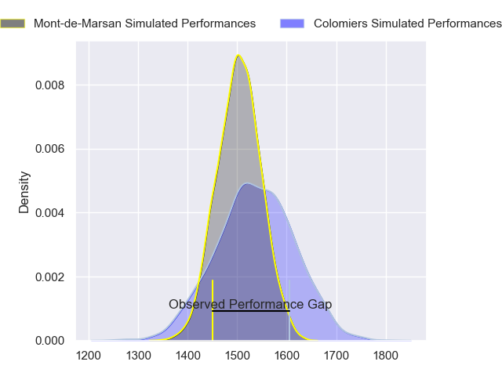
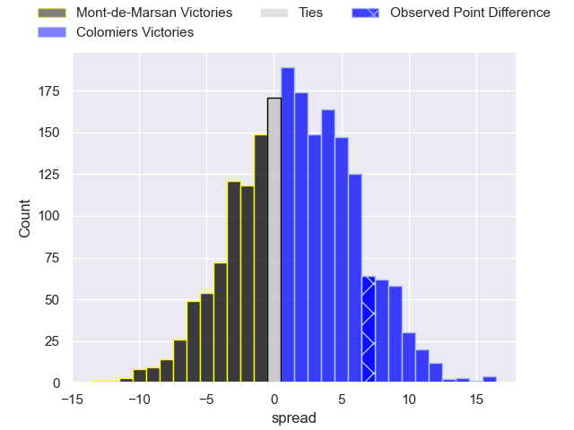
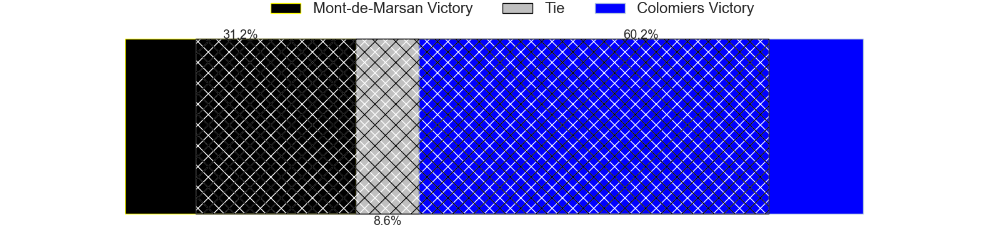
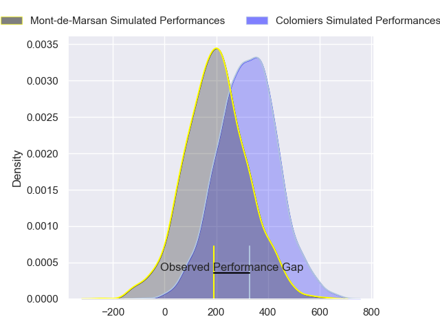
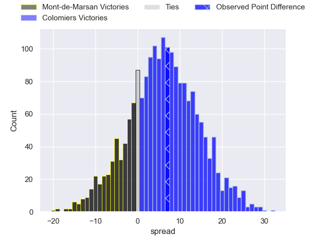
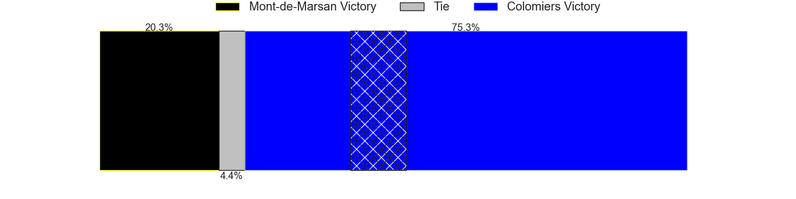

---  
layout: page  
title: Mont-de-Marsan at Colomiers; 15-22  
date: 2024-03-08 18:00:00 -0500  
categories: "Pro D2 2023" match review  
---
# Mont-de-Marsan at Colomiers; 15-22

# Club Level Predictions

The first set of predictions treats a club as the smallest object, as the club develops its members, organizes a gameplan, and deploys its players as needed for each match. This club model has a prediction of 0.547, which translates to predicting Colomiers to win by 1.7.

Our Over/Under is 40.5 - and combined with the spread above, we have a predicted scoreline of 19 to 21

Each club has a rating and a rating deviation (similar to a Glicko rating), and expected performances can be generated. This allows for simulated matches and spreads like the ones below.
## Projected Performances - Club Model

## Projected Spreads - Club Model

## Projected Results - Club Model

# Player Level Predictions - Version 2

Treating teams instead as an entity made up of the currently active players, I have ratings for each player in an altogether different system. These can be combined to form team ratings once teamsheets are announced, weighting starters a bit higher than the reserves. After the match is played, players can be weighted by their minutes on the field, allowing for an accurate measure of the team's composition. With these compiled team ratings, we can make predictions, measure inaccuracy, and update the individual player ratings.
## Prediction without Player Minutes: Colomiers by 7.4

Mont-de-Marsan by 0.4 on a neutral pitch

## Projected Performances - Player Model

## Projected Spreads - Player Model

## Projected Results - Player Model

|   Away Minutes | Away Player        |   Away Percentile |   Number |   Home Percentile | Home Player        |   Home Minutes |
|---------------:|:-------------------|------------------:|---------:|------------------:|:-------------------|---------------:|
|             47 | Jean-Luc Innocente |             15.76 |        1 |             76.59 | Hugo Djehi         |             51 |
|             65 | Florian Dufour     |             56.54 |        2 |             27.5  | Andrew Ready       |             58 |
|             56 | Mattéo Lalanne     |             63.62 |        3 |             67.63 | Hugo Pirlet        |             51 |
|             80 | Romain Durand      |             81.01 |        4 |             59.5  | Jean Thomas        |             51 |
|             51 | Andrei Ostrikov    |             71.27 |        5 |             81.97 | Maxime Granouillet |             80 |
|             65 | Aurélien Lisena    |             62.46 |        6 |             46.11 | Anthony Coletta    |             80 |
|             80 | Nicolas Garrault   |             75.2  |        7 |             92    | Aldric Lescure     |             69 |
|             80 | Raphaël Robic      |             65.94 |        8 |             47.2  | Jeremy Bechu       |             56 |
|             69 | Kevin Viallard     |             54.77 |        9 |             65.15 | Ugo Seguela        |             71 |
|             69 | Willie du Plessis  |             89.72 |       10 |              1.5  | Brett Herron       |             80 |
|             80 | Eroni Sau          |             79.54 |       11 |             96.94 | Rodrigo Marta      |             80 |
|             80 | Jules Even         |             78.3  |       12 |             66.06 | Dorian Laborde     |             56 |
|             72 | Gatien Masse       |             46.79 |       13 |             16.97 | Martin Dulon       |             80 |
|             80 | Semi Lagivala      |             67.94 |       14 |             86.54 | Vincent Pinto      |             80 |
|             80 | Théo Cortes        |             53.49 |       15 |             51.33 | Thomas Girard      |             80 |
|             33 | Dino Casadei       |             57.74 |       16 |             22.01 | Marco Fepulea'i    |             29 |
|             29 | Myles Edwards      |             28.12 |       17 |             74.72 | Guillaume Tartas   |             29 |
|             24 | Mathis Bats        |             69.31 |       18 |             53.49 | Alexandre Manukula |             29 |
|             15 | William Wavrin     |             81.4  |       19 |             46.18 | Fabien Perrin      |             24 |
|             15 | Samuel Lagrange    |             57.69 |       20 |             48.14 | Alexis Caumel      |             24 |
|             11 | Baptiste Canut     |             42.95 |       21 |            nan    | Toma Kolokilagi    |             22 |
|             11 | Joris Pialot       |             17.54 |       22 |             69.22 | Joseva Tamani      |             11 |
|              8 | Simon Desaubies    |            nan    |       23 |             46.27 | Arthur Diaz        |              9 |

