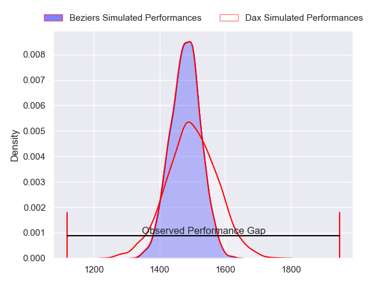
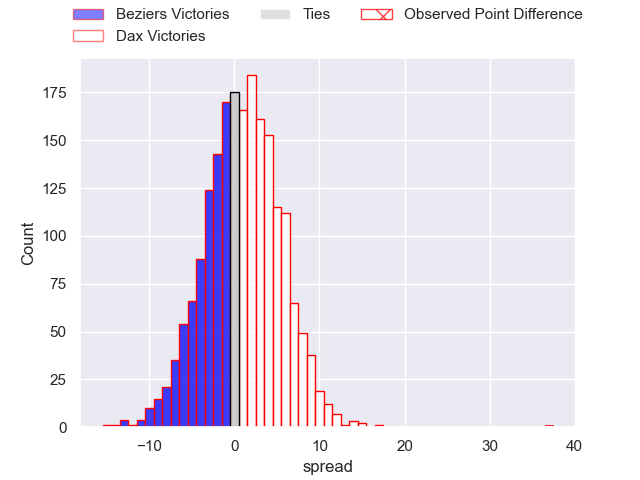
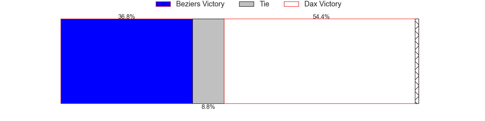
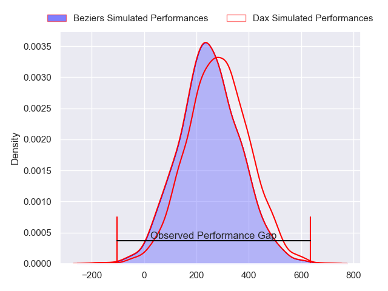
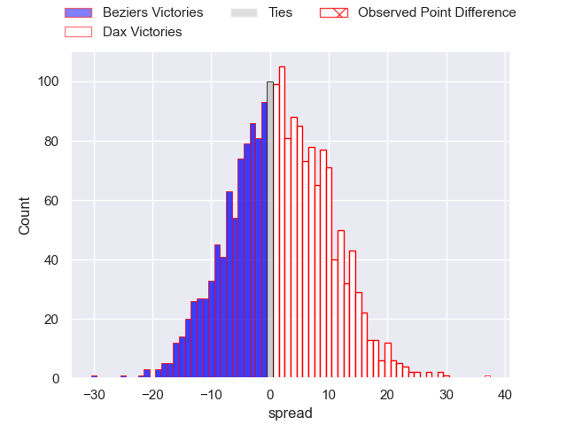
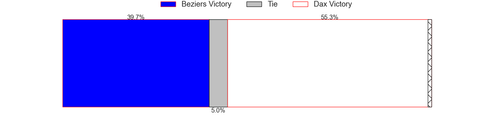

---  
layout: page  
title: Beziers at Dax; 20-57  
date: 2024-03-08 18:00:00 -0500  
categories: "Pro D2 2023" match review  
---
# Beziers at Dax; 20-57

# Club Level Predictions

The first set of predictions treats a club as the smallest object, as the club develops its members, organizes a gameplan, and deploys its players as needed for each match. This club model has a prediction of 0.523, which translates to predicting Dax to win by 0.8.

Our Over/Under is 41.5 - and combined with the spread above, we have a predicted scoreline of 20 to 21

Each club has a rating and a rating deviation (similar to a Glicko rating), and expected performances can be generated. This allows for simulated matches and spreads like the ones below.
## Projected Performances - Club Model

## Projected Spreads - Club Model

## Projected Results - Club Model

# Player Level Predictions - Version 2

Treating teams instead as an entity made up of the currently active players, I have ratings for each player in an altogether different system. These can be combined to form team ratings once teamsheets are announced, weighting starters a bit higher than the reserves. After the match is played, players can be weighted by their minutes on the field, allowing for an accurate measure of the team's composition. With these compiled team ratings, we can make predictions, measure inaccuracy, and update the individual player ratings.
## Prediction without Player Minutes: Dax by 0.5

Beziers by 6.9 on a neutral pitch

## Projected Performances - Player Model

## Projected Spreads - Player Model

## Projected Results - Player Model

|   Away Minutes | Away Player         |   Away Percentile |   Number |   Home Percentile | Home Player           |   Home Minutes |
|---------------:|:--------------------|------------------:|---------:|------------------:|:----------------------|---------------:|
|             41 | Francisco Fernandes |             24.47 |        1 |             78.19 | Louis Mary            |             54 |
|             41 | Jose Luis Gonzalez  |             81.87 |        2 |             26.72 | Louis Barrere         |             54 |
|             57 | Jon Zabala Arrieta  |             77.82 |        3 |             19.98 | Nephi Leatigaga       |             54 |
|             80 | Hans N'kinsi        |              9.54 |        4 |             64.84 | Josh Furno            |             80 |
|             57 | John Madigan        |             32.42 |        5 |             10.85 | Jean-Baptiste Singer  |             54 |
|             80 | William van Bost    |             49.34 |        6 |             23.46 | Jean-Baptiste Barrère |             54 |
|             41 | Gillian Benoy       |              6.72 |        7 |             74.56 | Arnaud Aletti         |             80 |
|             80 | Sias Koen           |             67.72 |        8 |             49.03 | Sam Wasley            |             80 |
|             57 | Samuel Marques      |             93.87 |        9 |             77.71 | Sylvère Reteau        |             54 |
|             50 | Charly Malie        |             67.91 |       10 |             69.15 | Hugo Cerisier         |             54 |
|             80 | Pierre Courtaud     |             21.16 |       11 |             69.82 | Jope Naceava          |             80 |
|             80 | Taleta Tupuola      |             71.07 |       12 |             84.88 | Ilikena Bolakoro      |             80 |
|             80 | Tim Nanai-Williams  |             90.6  |       13 |             70.95 | Bastien Daguerre      |             80 |
|             80 | Raffaele Storti     |             91.08 |       14 |             81.2  | Théo Gatelier         |             80 |
|             50 | Gabin Lorre         |             91.13 |       15 |             64.99 | Théo Duprat           |             58 |
|             39 | Giorgi Akhaladze    |             43.17 |       16 |             48.67 | Asa Faitotoa          |             26 |
|             39 | Yanis Boulassel     |             47.71 |       17 |             68.89 | Iban Hiriart-Urruty   |             26 |
|             39 | Clément Bitz        |             71.16 |       18 |             66.51 | Mat Luamanu           |             26 |
|             30 | Victor Dreuille     |             23.5  |       19 |             25.77 | Ratu Nacika           |             26 |
|             30 | Paul Recor          |             64.64 |       20 |             71.17 | Paul Ravier           |             26 |
|             23 | Luka Tchelidze      |             61.96 |       21 |             47.76 | Romuald Séguy         |             26 |
|             23 | Pierre Gayraud      |             14.78 |       22 |             10.72 | Diogo Hasse Ferreira  |             26 |
|             23 | Jean Victor Goillot |             21.27 |       23 |             15.71 | Benjamin Puntous      |             22 |

