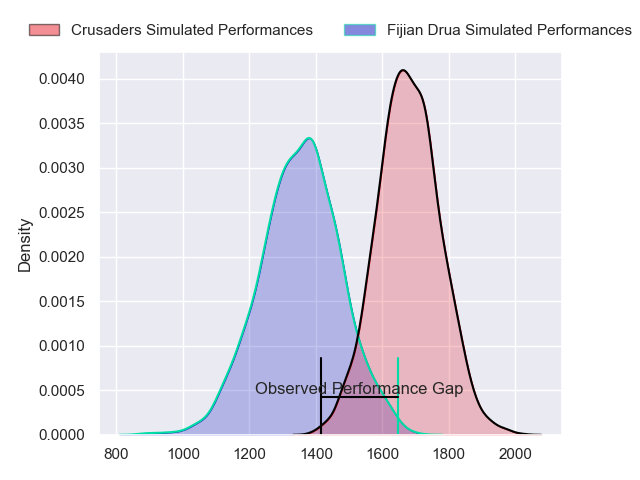
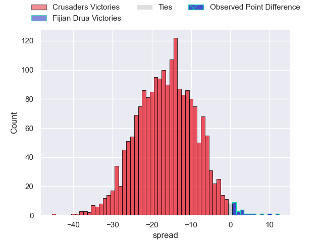
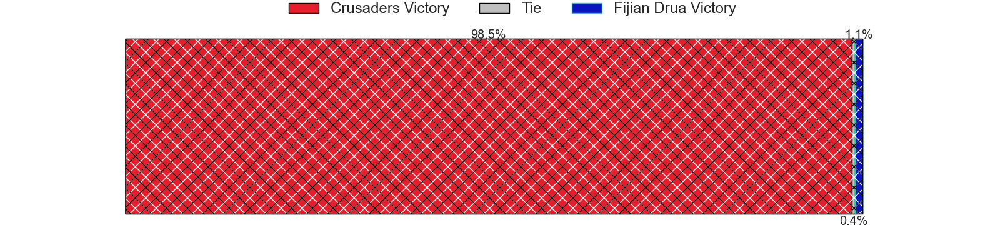
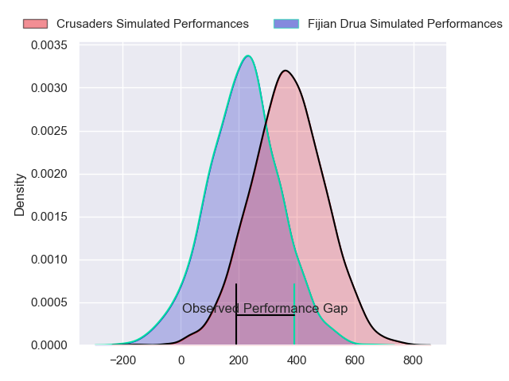
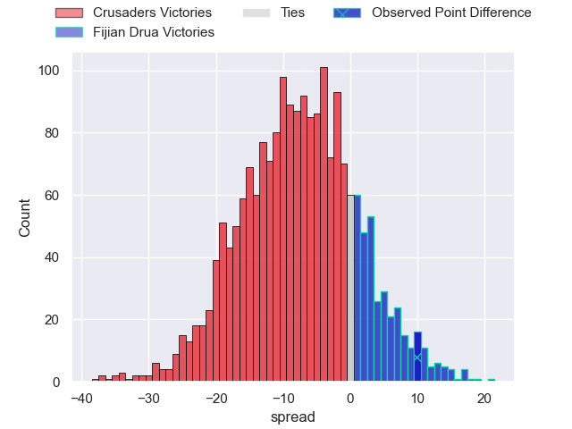
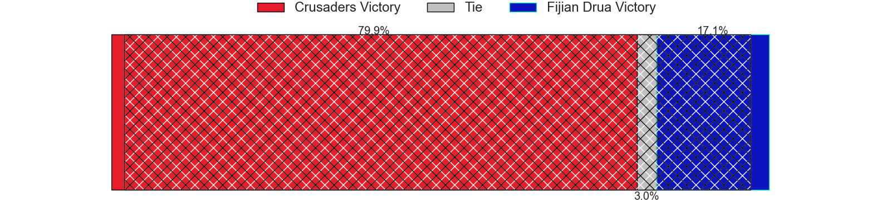

---  
layout: page  
title: Crusaders at Fijian Drua; 10-20  
date: 2024-03-08 18:00:00 -0500  
categories: "Super Rugby Pacific 2024" match review  
---
# Crusaders at Fijian Drua; 10-20

# Club Level Predictions

The first set of predictions treats a club as the smallest object, as the club develops its members, organizes a gameplan, and deploys its players as needed for each match. This club model has a prediction of 0.145, which translates to predicting Crusaders to win by 16.1.

Our Over/Under is 40.5 - and combined with the spread above, we have a predicted scoreline of 28 to 12

Each club has a rating and a rating deviation (similar to a Glicko rating), and expected performances can be generated. This allows for simulated matches and spreads like the ones below.
## Projected Performances - Club Model

## Projected Spreads - Club Model

## Projected Results - Club Model

# Player Level Predictions - Version 2

Treating teams instead as an entity made up of the currently active players, I have ratings for each player in an altogether different system. These can be combined to form team ratings once teamsheets are announced, weighting starters a bit higher than the reserves. After the match is played, players can be weighted by their minutes on the field, allowing for an accurate measure of the team's composition. With these compiled team ratings, we can make predictions, measure inaccuracy, and update the individual player ratings.
## Prediction without Player Minutes: Crusaders by 6.8

Crusaders by 9.3 on a neutral pitch

## Projected Performances - Player Model

## Projected Spreads - Player Model

## Projected Results - Player Model

|   Away Minutes | Away Player       |   Away Percentile |   Number |   Home Percentile | Home Player             |   Home Minutes |
|---------------:|:------------------|------------------:|---------:|------------------:|:------------------------|---------------:|
|             51 | George Bower      |              6.97 |        1 |             92.39 | Haereiti Hetet          |             74 |
|             61 | George Bell       |             15.46 |        2 |             89.89 | Tevita Ikanivere        |             68 |
|             51 | Fletcher Newell   |              1.92 |        3 |             56    | Jone Koroiduadua        |             49 |
|             80 | Scott Barrett     |             93.8  |        4 |             66.27 | Mesake Vocevoce         |             80 |
|             51 | Quinten Strange   |             79.74 |        5 |             46.84 | Ratu Rotuisolia         |             58 |
|             80 | Dom Gardiner      |             35.02 |        6 |             65.2  | Etonia Waqa             |             80 |
|             80 | Tom Christie      |             62.11 |        7 |             78.08 | Vilive Miramira         |             80 |
|             63 | Cullen Grace      |             70.87 |        8 |             48.3  | Meli Derenalagi         |             66 |
|             51 | Willi Heinz       |             92.64 |        9 |             67.48 | Frank Lomani            |             80 |
|             62 | Taha Kemara       |              8.71 |       10 |             55.47 | Isaiah Armstrong-Ravula |             80 |
|             80 | Heremaia Murray   |             27.5  |       11 |             57.89 | Epeli Momo              |             60 |
|             80 | David Havili      |             96.43 |       12 |             55.48 | Apisalome Vota          |             51 |
|             51 | Levi Aumua        |             68.1  |       13 |             78.57 | Iosefo Masi             |             80 |
|             80 | Sevu Reece        |             78.09 |       14 |             86.36 | Selestino Ravutaumada   |             80 |
|             80 | Chay Fihaki       |             13.91 |       15 |             75.78 | Ilaisa Droasese         |             75 |
|             19 | Ioane Moananu     |            nan    |       16 |            nan    | Mesu Dolokoto           |             12 |
|             29 | Joe Moody         |             77.18 |       17 |             39.6  | Livai Natave            |              6 |
|             29 | Seb Calder        |            nan    |       18 |             22.36 | Mesake Doge             |             31 |
|             29 | Jamie Hannah      |            nan    |       19 |             57.57 | Te Ahiwaru Cirikidaveta |             22 |
|             17 | Tahlor Cahill     |            nan    |       20 |             55.73 | Elia Canakaivata        |             14 |
|             29 | Mitchell Drummond |             92.43 |       21 |             50.1  | Simione Kuruvoli        |              5 |
|             29 | Jone Rova         |            nan    |       22 |            nan    | Kemu Valetini           |             29 |
|             18 | Riley Hohepa      |             15.67 |       23 |            nan    | Iliesa Junior Ratuva    |             20 |

