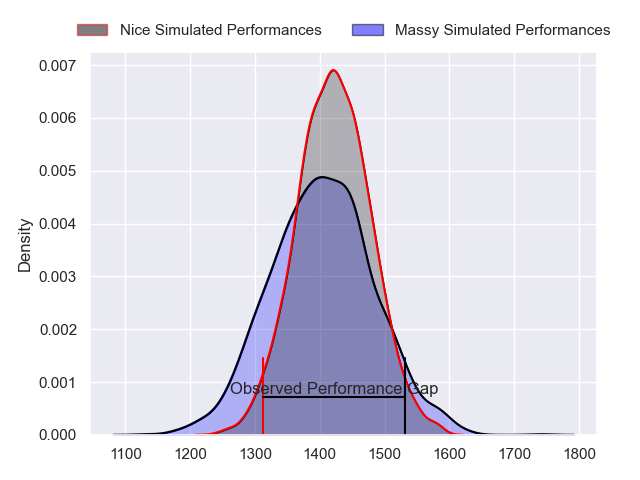
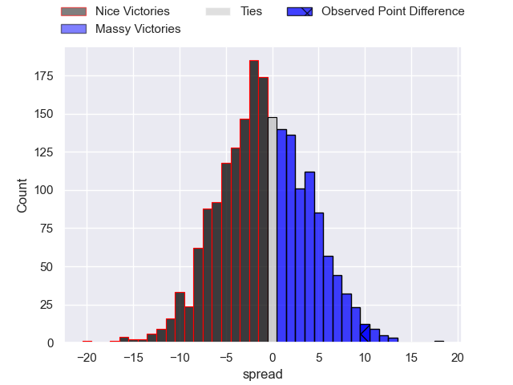
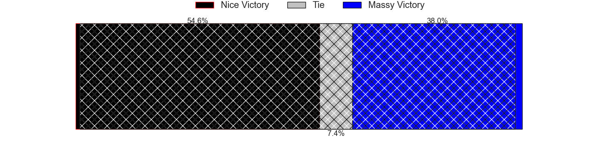
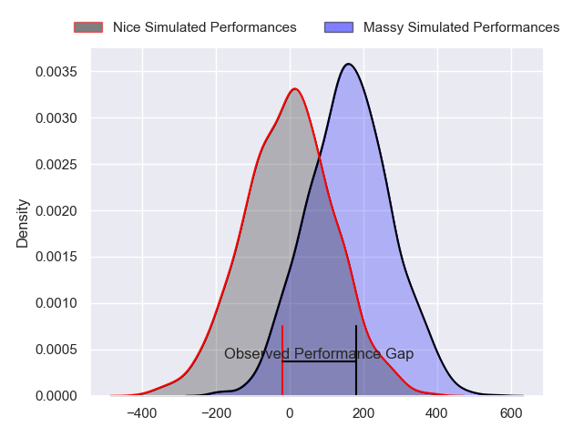
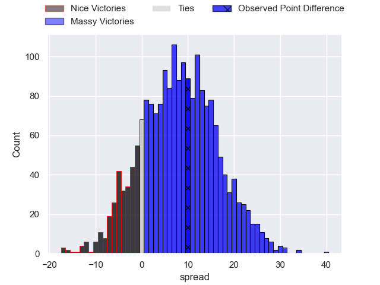
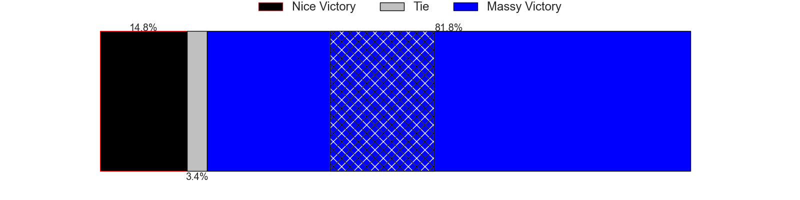

---  
layout: page  
title: Nice at Massy; 13-23  
date: 2024-03-08 18:00:00 -0500  
categories: "Nationale 2023" match review  
---
# Nice at Massy; 13-23

# Club Level Predictions

The first set of predictions treats a club as the smallest object, as the club develops its members, organizes a gameplan, and deploys its players as needed for each match. This club model has a prediction of 0.475, which translates to predicting Nice to win by 0.9.

Our Over/Under is 43.5 - and combined with the spread above, we have a predicted scoreline of 22 to 21

Each club has a rating and a rating deviation (similar to a Glicko rating), and expected performances can be generated. This allows for simulated matches and spreads like the ones below.
## Projected Performances - Club Model

## Projected Spreads - Club Model

## Projected Results - Club Model

# Player Level Predictions - Version 2

Treating teams instead as an entity made up of the currently active players, I have ratings for each player in an altogether different system. These can be combined to form team ratings once teamsheets are announced, weighting starters a bit higher than the reserves. After the match is played, players can be weighted by their minutes on the field, allowing for an accurate measure of the team's composition. With these compiled team ratings, we can make predictions, measure inaccuracy, and update the individual player ratings.
## Prediction without Player Minutes: Massy by 9.9

Massy by 5.7 on a neutral pitch

## Projected Performances - Player Model

## Projected Spreads - Player Model

## Projected Results - Player Model

|   Away Minutes | Away Player               |   Away Percentile |   Number |   Home Percentile | Home Player              |   Home Minutes |
|---------------:|:--------------------------|------------------:|---------:|------------------:|:-------------------------|---------------:|
|             52 | Jules Martinez            |              3.48 |        1 |             76.26 | Robin Poipy              |             27 |
|             53 | Santiago Benjamin Ovejero |             64.89 |        2 |             92.37 | Pierre Trassoudaine      |             30 |
|             80 | Nicolas Ciancio           |              9.62 |        3 |             87.26 | Nicolas Ferrer           |             49 |
|             48 | Yann Tivoli               |             42.43 |        4 |              1.19 | Abongile Nonkontwana     |             80 |
|             80 | Thibault Rey              |              4.17 |        5 |             86.77 | Andrei Mahu              |             58 |
|             80 | Louis Vincent             |              2.42 |        6 |             68.94 | Samuel Nollet            |             80 |
|             80 | Johann Afonso Grundlingh  |              9.47 |        7 |             91.3  | Hugo Boutin              |             58 |
|             44 | Bastien Berenguel         |             43.45 |        8 |             16.26 | Alexandre Loubiere       |             80 |
|             48 | Matéo Jeune-Joly          |             27.2  |        9 |             72.6  | Benjamin Prier           |             58 |
|             80 | Mathis Viard              |             45.02 |       10 |              4.48 | Hugo Verdu               |             80 |
|             56 | Gautier Lacointa          |              2.79 |       11 |             55.21 | Giorgi Gogoladze         |             80 |
|             80 | Baptiste Lafond           |              1.9  |       12 |             49.17 | Victorien Jacomme        |             80 |
|             26 | Nathan Courtade           |             91.07 |       13 |             87.62 | Arthur Seigneuret        |             52 |
|             80 | Simon Delas               |             93.02 |       14 |              8.81 | Yanis Dit Robaglia       |             71 |
|             80 | Pierre Le Huby            |             31.18 |       15 |             69.3  | Tom Deleuze              |             80 |
|             28 | Sunia Vola                |             86.53 |       16 |              4.31 | Fernandez Correa         |             53 |
|             27 | Pierre Strippoli          |             11.45 |       17 |             17.94 | Pierre-Alexandre Duclieu |             50 |
|             32 | Bastien Trape             |            nan    |       18 |             78    | Tijde Visser             |             31 |
|             36 | Arthur Vignolles          |             70.26 |       19 |             40.08 | Loris Rouet              |             22 |
|             32 | Jules Solinas             |             89.16 |       20 |             94.82 | Clément Vidoni           |             22 |
|             24 | Andrzej Charlat           |             96.78 |       21 |             75.46 | Lucas Rubio              |             22 |
|             54 | Alban Conduche            |              5.71 |       22 |             85    | Tom Cusson               |             28 |
|            nan | nan                       |            nan    |       23 |              0.71 | Kimami Sitauti           |              9 |

