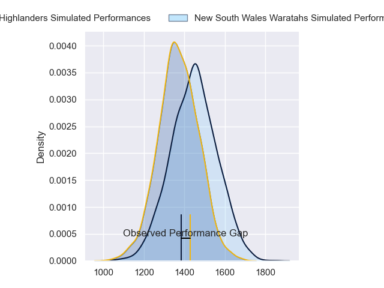
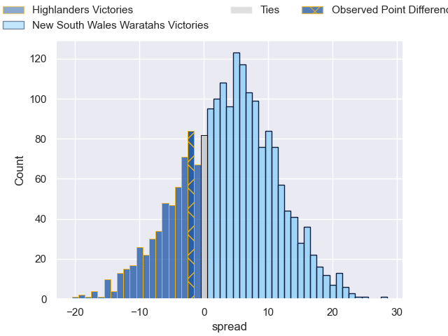
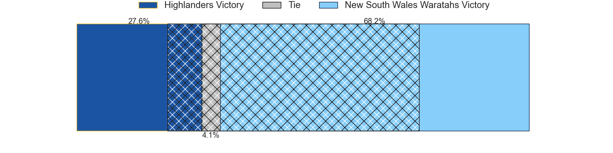
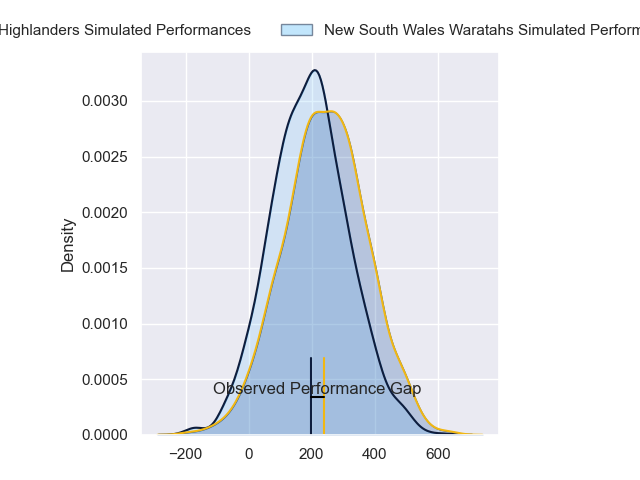
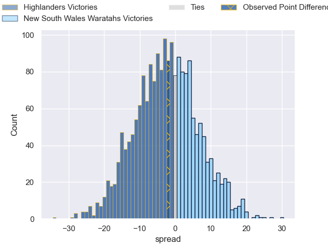

---  
layout: page  
title: Highlanders at New South Wales Waratahs; 23-21  
date: 2024-03-08 18:00:00 -0500  
categories: "Super Rugby Pacific 2024" match review  
---
# Highlanders at New South Wales Waratahs; 23-21

# Club Level Predictions

The first set of predictions treats a club as the smallest object, as the club develops its members, organizes a gameplan, and deploys its players as needed for each match. This club model has a prediction of 0.6, which translates to predicting New South Wales Waratahs to win by 3.7.

Our Over/Under is 44.5 - and combined with the spread above, we have a predicted scoreline of 20 to 24

Each club has a rating and a rating deviation (similar to a Glicko rating), and expected performances can be generated. This allows for simulated matches and spreads like the ones below.
## Projected Performances - Club Model

## Projected Spreads - Club Model

## Projected Results - Club Model

# Player Level Predictions - Version 2

Treating teams instead as an entity made up of the currently active players, I have ratings for each player in an altogether different system. These can be combined to form team ratings once teamsheets are announced, weighting starters a bit higher than the reserves. After the match is played, players can be weighted by their minutes on the field, allowing for an accurate measure of the team's composition. With these compiled team ratings, we can make predictions, measure inaccuracy, and update the individual player ratings.
## Prediction without Player Minutes: Highlanders by 2.3

Highlanders by 6.6 on a neutral pitch

## Projected Performances - Player Model

## Projected Spreads - Player Model

## Projected Results - Player Model

|   Away Minutes | Away Player                   |   Away Percentile |   Number |   Home Percentile | Home Player              |   Home Minutes |
|---------------:|:------------------------------|------------------:|---------:|------------------:|:-------------------------|---------------:|
|             55 | Ethan de Groot                |             70.3  |        1 |             91.11 | Angus Bell               |             67 |
|             55 | Henry Bell                    |             35.31 |        2 |             23.66 | Mahe Vailanu             |             80 |
|             74 | Jermaine Ainsley              |             38.68 |        3 |             31.9  | Tom Ross                 |             33 |
|             80 | Fabian Holland                |             71.63 |        4 |             41.72 | Jed Holloway             |             80 |
|             80 | Max Hicks                     |             54.59 |        5 |             28.49 | Hugh Sinclair            |             55 |
|             63 | Tom Sanders                   |             41.96 |        6 |             48.24 | Ned Hanigan              |             80 |
|             48 | Nikora Broughton              |             39.87 |        7 |             75.22 | Charlie Gamble           |             80 |
|             80 | Hugh Renton                   |              8.01 |        8 |             70.39 | Langi Gleeson            |             55 |
|             80 | Folau Fakatava                |             66.05 |        9 |             91.21 | Jake Gordon              |             77 |
|             55 | Rhys Patchell                 |             97.51 |       10 |             41.29 | Tane Edmed               |             80 |
|             80 | Jona Nareki                   |             81.74 |       11 |             58.43 | Triston Reilly           |             80 |
|             80 | Sam Gilbert                   |             41.07 |       12 |             85.12 | Joey Walton              |             80 |
|             68 | Tanielu Tele'a                |             46.31 |       13 |             57.62 | Izaia Perese             |             67 |
|             80 | Timoci Tavatavanawai          |             35.45 |       14 |             51.77 | Mark Nawaqanitawase      |             80 |
|             80 | Jacob Ratumaitavuki-Kneepkens |             96.64 |       15 |             75.3  | Max Jorgensen            |             80 |
|             25 | Ricky Jackson                 |             37.79 |       16 |            nan    | Julian Heaven            |              0 |
|             25 | Dan Lienert-Brown             |             20.99 |       17 |             93.49 | Hayden Thompson-Stringer |             13 |
|              6 | Saula Ma'u                    |             53.35 |       18 |             72.04 | Harry Johnson-Holmes     |             47 |
|             17 | Sean Withy                    |             19.16 |       19 |              5.36 | Miles Amatosero          |             25 |
|             32 | Billy Harmon                  |             72.25 |       20 |             25    | Fergus Lee-Warner        |             25 |
|              0 | James Arscott                 |             13.5  |       21 |            nan    | Teddy Wilson             |              3 |
|             25 | Ajay Faleafaga                |            nan    |       22 |             46.67 | Harry Wilson             |             13 |
|             12 | Jonah Lowe                    |             86.57 |       23 |             20.83 | Mosese Tuipulotu         |              0 |

