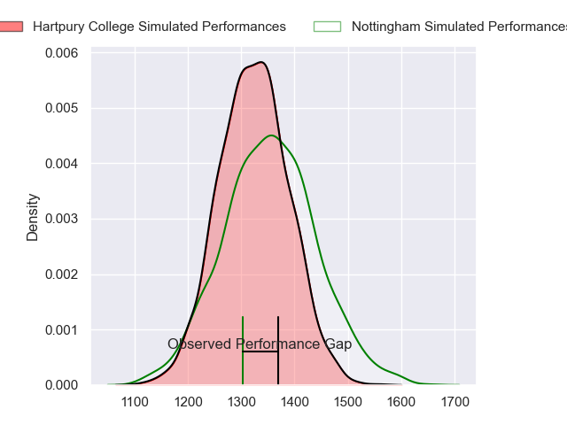
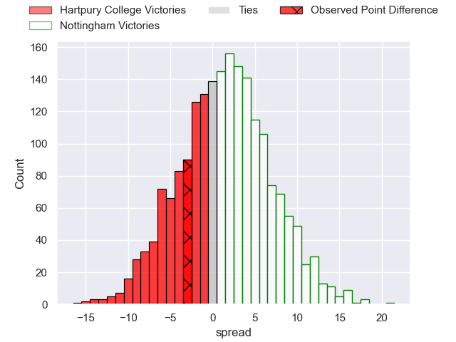
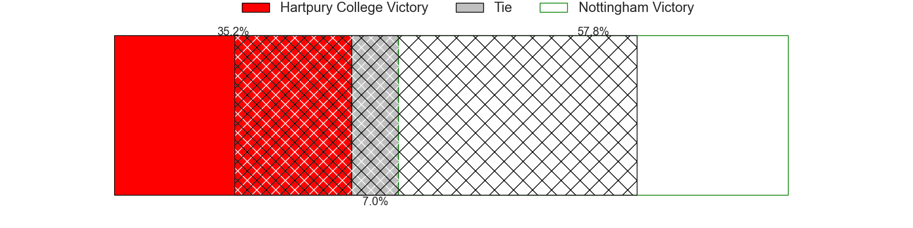
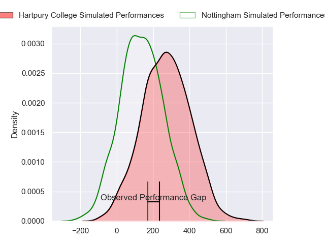
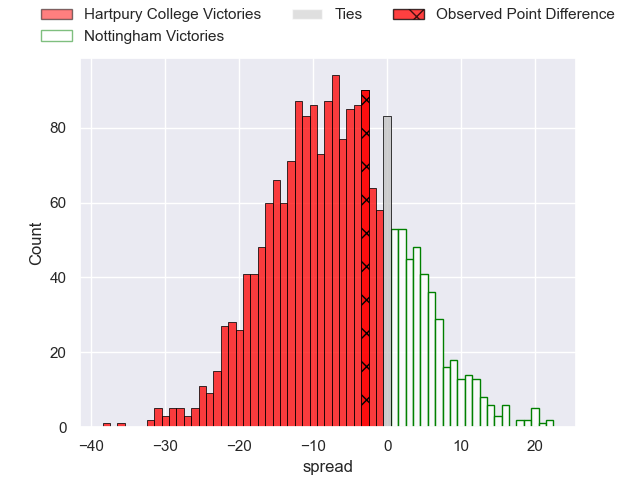

---  
layout: page  
title: Hartpury College at Nottingham; 3-0  
date: 2024-03-08 18:00:00 -0500  
categories: "RFU Championship 2023" match review  
---
# Hartpury College at Nottingham; 3-0

# Club Level Predictions

The first set of predictions treats a club as the smallest object, as the club develops its members, organizes a gameplan, and deploys its players as needed for each match. This club model has a prediction of 0.539, which translates to predicting Nottingham to win by 1.4.

Our Over/Under is 46.5 - and combined with the spread above, we have a predicted scoreline of 23 to 24

Each club has a rating and a rating deviation (similar to a Glicko rating), and expected performances can be generated. This allows for simulated matches and spreads like the ones below.
## Projected Performances - Club Model

## Projected Spreads - Club Model

## Projected Results - Club Model

# Player Level Predictions - Version 2

Treating teams instead as an entity made up of the currently active players, I have ratings for each player in an altogether different system. These can be combined to form team ratings once teamsheets are announced, weighting starters a bit higher than the reserves. After the match is played, players can be weighted by their minutes on the field, allowing for an accurate measure of the team's composition. With these compiled team ratings, we can make predictions, measure inaccuracy, and update the individual player ratings.
## Prediction without Player Minutes: Hartpury College by 6.0

Hartpury College by 9.4 on a neutral pitch

## Projected Performances - Player Model

## Projected Spreads - Player Model

## Projected Results - Player Model

|   Away Minutes | Away Player           |   Away Percentile |   Number |   Home Percentile | Home Player               |   Home Minutes |
|---------------:|:----------------------|------------------:|---------:|------------------:|:--------------------------|---------------:|
|             80 | Aristot Benz-Salomon  |             83.49 |        1 |             57.18 | Kai Owen                  |             61 |
|             80 | William Crane         |             79.42 |        2 |             83.65 | Harry Clayton             |             55 |
|             80 | Jonathan Benz-Salomon |             78.82 |        3 |             69.78 | Xavier Valentine          |             61 |
|             80 | Dale Lemon            |             73.56 |        4 |              3.12 | Sebastien Ferreira        |             80 |
|             80 | Jack Davies           |             87.86 |        5 |             48.8  | Come Clayver Joussain     |              9 |
|             80 | Josh Gray             |             88.39 |        6 |             48.82 | Sam Green                 |             80 |
|             80 | Harry Short           |             85.23 |        7 |             71.82 | Nathan Tweedy             |             80 |
|             80 | Jarrad Hayler         |             62.29 |        8 |             49.39 | James Cherry              |             50 |
|             80 | Michael Austin        |             77.18 |        9 |             26.97 | Micheal Stronge           |             80 |
|             80 | Morgan Adderly-Jones  |             68.42 |       10 |             54.39 | Matthew Arden             |             80 |
|             41 | Bradley Denty         |             75.38 |       11 |             42.65 | Jordan Olowofela          |             55 |
|             80 | Robbie Smith          |             16.12 |       12 |             52    | Dafydd-Rhys Tiueti        |             68 |
|             80 | Joseph Jenkins        |             60.85 |       13 |             15.52 | Marcus Alexander Ramage   |             80 |
|             80 | Charlie Powell        |             87.86 |       14 |             33.48 | David Williams            |             80 |
|             68 | Alex Forrester        |             37.35 |       15 |             64.1  | Ellis Mee                 |             80 |
|             39 | Matthew Ward          |             49.89 |       16 |             63.7  | Iosefa Danny Wayne Fiaola |             71 |
|             12 | Oliver Holliday       |            nan    |       17 |              7.06 | Scott Hall                |             30 |
|            nan | nan                   |            nan    |       18 |             71.54 | Antonio TJ Harris         |             25 |
|            nan | nan                   |            nan    |       19 |             60.28 | Harry Graham              |             25 |
|            nan | nan                   |            nan    |       20 |             54.29 | Aniseko Sio               |             19 |
|            nan | nan                   |            nan    |       21 |             24.44 | Jake Bridges              |             19 |
|            nan | nan                   |            nan    |       22 |              3.39 | Jack Stapley              |             12 |

