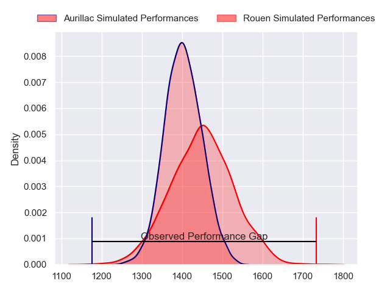
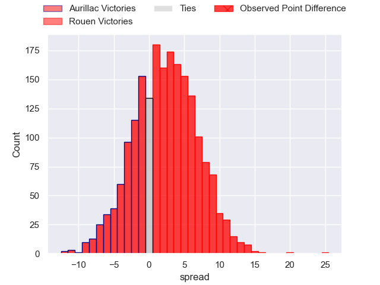
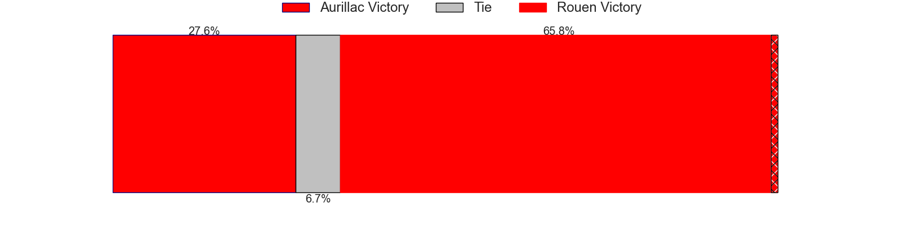
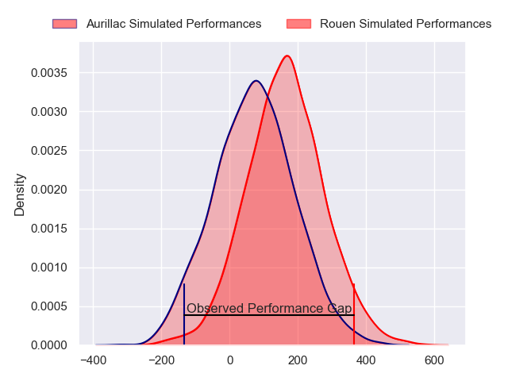
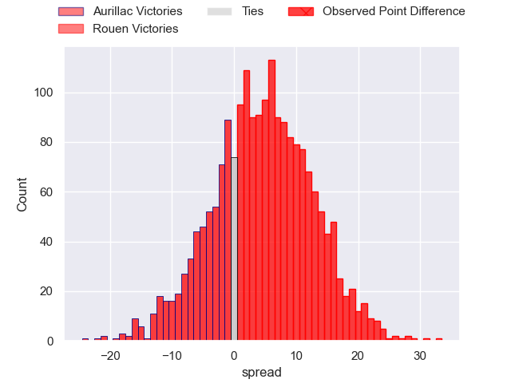
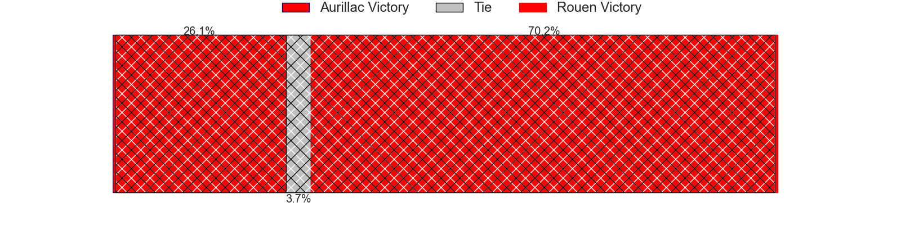

---  
layout: page  
title: Aurillac at Rouen; 13-38  
date: 2024-03-08 18:00:00 -0500  
categories: "Pro D2 2023" match review  
---
# Aurillac at Rouen; 13-38

# Club Level Predictions

The first set of predictions treats a club as the smallest object, as the club develops its members, organizes a gameplan, and deploys its players as needed for each match. This club model has a prediction of 0.566, which translates to predicting Rouen to win by 2.3.

Our Over/Under is 45.5 - and combined with the spread above, we have a predicted scoreline of 22 to 24

Each club has a rating and a rating deviation (similar to a Glicko rating), and expected performances can be generated. This allows for simulated matches and spreads like the ones below.
## Projected Performances - Club Model

## Projected Spreads - Club Model

## Projected Results - Club Model

# Player Level Predictions - Version 2

Treating teams instead as an entity made up of the currently active players, I have ratings for each player in an altogether different system. These can be combined to form team ratings once teamsheets are announced, weighting starters a bit higher than the reserves. After the match is played, players can be weighted by their minutes on the field, allowing for an accurate measure of the team's composition. With these compiled team ratings, we can make predictions, measure inaccuracy, and update the individual player ratings.
## Prediction without Player Minutes: Rouen by 4.1

Rouen by 0.9 on a neutral pitch

## Projected Performances - Player Model

## Projected Spreads - Player Model

## Projected Results - Player Model

|   Away Minutes | Away Player         |   Away Percentile |   Number |   Home Percentile | Home Player        |   Home Minutes |
|---------------:|:--------------------|------------------:|---------:|------------------:|:-------------------|---------------:|
|             51 | Robert Rodgers      |              9.81 |        1 |             70.85 | Antoine Fournier   |             49 |
|             40 | Ronan Loughnane     |             35.69 |        2 |              3.63 | Jeremie Maurouard  |             64 |
|             40 | Tim Daniel-Meissen  |             23.46 |        3 |             73.33 | Soso Bekoshvili    |             64 |
|             80 | Martial Rolland     |             45.53 |        4 |             26.34 | John-Charles Astle |             62 |
|             40 | Cam Dodson          |             78.55 |        5 |             31.23 | Will Witty         |             80 |
|             80 | Eoghan Masterson    |             76.1  |        6 |             83.81 | Tienie Burger      |             80 |
|             53 | Hugo Huurman        |             66.85 |        7 |             26.32 | Samuel Maximin     |             54 |
|             62 | Didier Tison        |             40.53 |        8 |             44.9  | Abdelkarim Fofana  |             80 |
|             51 | David Delarue       |             21.88 |        9 |             47.85 | Florent Campeggia  |             62 |
|             80 | Antoine Aucagne     |             30.1  |       10 |             82.84 | Franck Pourteau    |             62 |
|             80 | AJ Coertzen         |             69.71 |       11 |             66.81 | Paul Vallee        |             80 |
|             80 | Christa Powell      |             11.07 |       12 |             80.95 | Taylor Gontineac   |             80 |
|             80 | Hugo Bastard        |             38.45 |       13 |             23.21 | JT Jackson         |             80 |
|             10 | Juun Pieters        |             66.38 |       14 |             90.23 | Kevin Bly          |             59 |
|             80 | Marc Palmier        |             15.35 |       15 |             72.9  | Baptiste Mouchous  |             80 |
|             70 | Simeli Yabaki       |             11.82 |       16 |             10.82 | Elias El Ansari    |             31 |
|             40 | Luka Nioradze       |             18.51 |       17 |             35.35 | Lucas Costa        |             26 |
|             40 | Théo Cambon         |             13.11 |       18 |              7.5  | Alex Luatua        |             21 |
|             40 | Lasha Mchelidze     |             92.85 |       19 |             73.42 | Maxime Sidobre     |             18 |
|             29 | Jean-Jacques Gymael |             12.56 |       20 |             62.1  | Toby Salmon        |             18 |
|             29 | Mikheil Alania      |             36.81 |       21 |             84.65 | Pete Lydon         |             18 |
|             27 | Yohann Gbizie       |             83.92 |       22 |             17.18 | Lucas Malbert      |             16 |
|             18 | Latuka Maituku      |             10.44 |       23 |             18.61 | Cody Thomas        |             16 |

