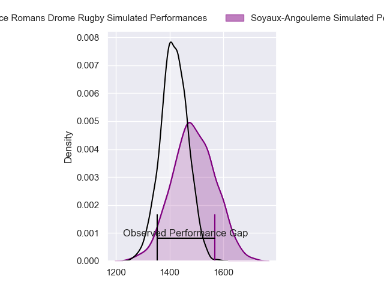
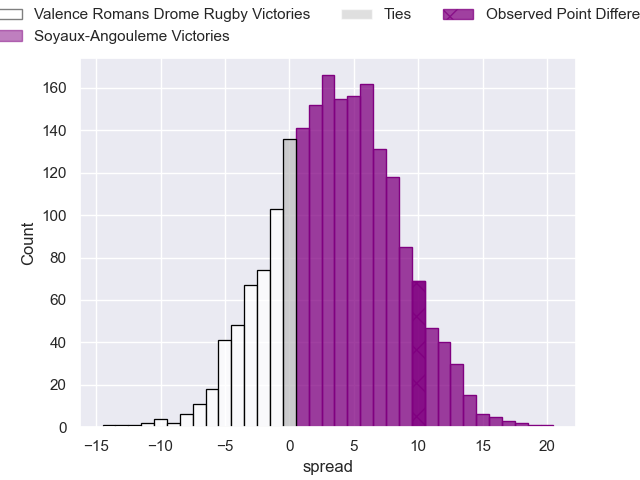
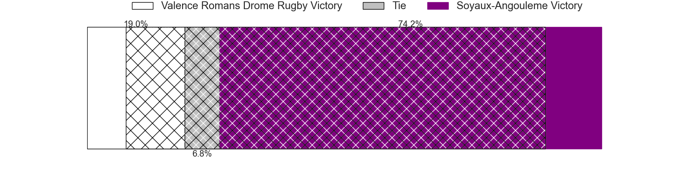
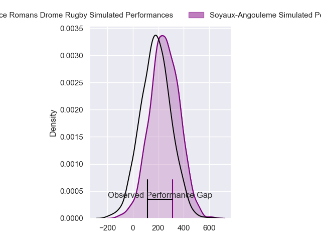
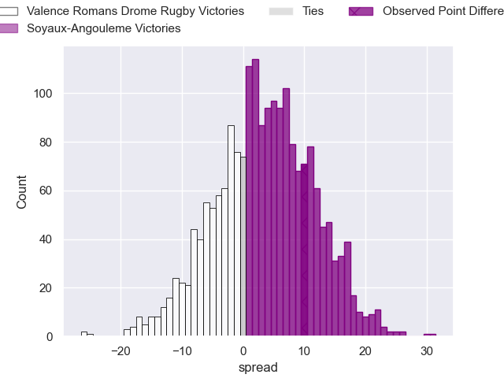
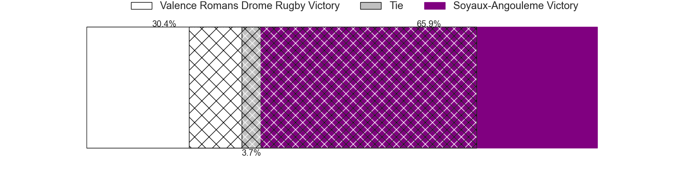

---  
layout: page  
title: Valence Romans Drome Rugby at Soyaux-Angouleme; 8-18  
date: 2024-03-08 18:00:00 -0500  
categories: "Pro D2 2023" match review  
---
# Valence Romans Drome Rugby at Soyaux-Angouleme; 8-18

# Club Level Predictions

The first set of predictions treats a club as the smallest object, as the club develops its members, organizes a gameplan, and deploys its players as needed for each match. This club model has a prediction of 0.601, which translates to predicting Soyaux-Angouleme to win by 3.6.

Our Over/Under is 34.5 - and combined with the spread above, we have a predicted scoreline of 16 to 19

Each club has a rating and a rating deviation (similar to a Glicko rating), and expected performances can be generated. This allows for simulated matches and spreads like the ones below.
## Projected Performances - Club Model

## Projected Spreads - Club Model

## Projected Results - Club Model

# Player Level Predictions - Version 2

Treating teams instead as an entity made up of the currently active players, I have ratings for each player in an altogether different system. These can be combined to form team ratings once teamsheets are announced, weighting starters a bit higher than the reserves. After the match is played, players can be weighted by their minutes on the field, allowing for an accurate measure of the team's composition. With these compiled team ratings, we can make predictions, measure inaccuracy, and update the individual player ratings.
## Prediction without Player Minutes: Soyaux-Angouleme by 3.1

Valence Romans Drome Rugby by 1.0 on a neutral pitch

## Projected Performances - Player Model

## Projected Spreads - Player Model

## Projected Results - Player Model

|   Away Minutes | Away Player          |   Away Percentile |   Number |   Home Percentile | Home Player        |   Home Minutes |
|---------------:|:---------------------|------------------:|---------:|------------------:|:-------------------|---------------:|
|             53 | Andrea Pontanier     |             71.46 |        1 |             95.99 | Sami Zouhair       |             58 |
|             57 | Dorian Marco Pena    |             75    |        2 |             57.88 | Patxi Bidart       |             58 |
|             64 | Gareth Milasinovich  |             33.02 |        3 |             13.62 | Yassine Boutemane  |             53 |
|             80 | Ryan McCauley        |             37.74 |        4 |             64.78 | William Greatbanks |             45 |
|             53 | Florian Goumat       |             69.11 |        5 |             86.42 | Sikeli Nabou       |             45 |
|             68 | Axel Bruchet         |             43.52 |        6 |              5.52 | Gautier Gibouin    |             45 |
|             80 | Sven Bernat Girlando |             74.97 |        7 |             81.06 | Germain Burgaud    |             80 |
|             53 | Ioane Iashagashvili  |             84.67 |        8 |             38.93 | Maxence Lemardelet |             80 |
|             53 | Tim Menzel           |             83.2  |        9 |             41.49 | Alexis Levron      |             45 |
|             80 | Lucas Meret          |             25.81 |       10 |             80.2  | Ben Botica         |             62 |
|             80 | Anatole Pauvert      |             76.26 |       11 |             36.43 | Inaki Ayarza       |             80 |
|             80 | Mathieu Guillomot    |             10.3  |       12 |             32.36 | Mathis Lafon       |             80 |
|             80 | Ben Neiceru          |             83.15 |       13 |             84.24 | Ledua Mau          |             80 |
|             80 | Adam Vargas          |             94.86 |       14 |             53.5  | Eoghan Barrett     |             80 |
|             64 | Joris Moura          |             80.72 |       15 |             64.82 | Jules Dubecq       |             80 |
|             27 | Anthony Aléo         |             40.49 |       16 |             50.41 | Manu Saubusse      |             35 |
|             27 | Yassine Maamry       |             59.38 |       17 |             50.24 | Ian Kitwanga       |             35 |
|             27 | Mathieu Vachon       |             84.91 |       18 |             19.23 | Matt Beukeboom     |             35 |
|             27 | Thomas Lhusero       |             78.01 |       19 |             81.29 | Nicolas Martins    |             35 |
|             23 | Cyril Deligny        |              2.12 |       20 |             19.03 | Seydou Diakité     |             27 |
|             16 | Chris Talakai        |             22.76 |       21 |             17.12 | Motu Matu'u        |             22 |
|             16 | Jonathan Quinnez     |             60.72 |       22 |             59.14 | Luca Tabarot       |             22 |
|             12 | Éloi Massot          |              3.04 |       23 |             35.9  | Rémi Brosset       |             18 |

