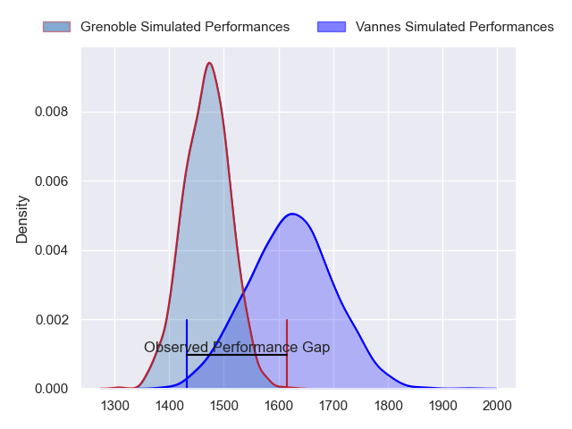
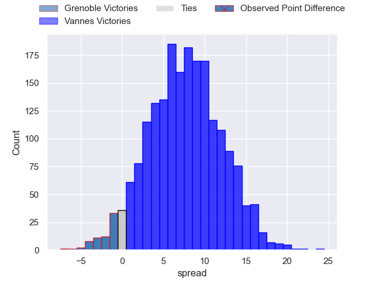
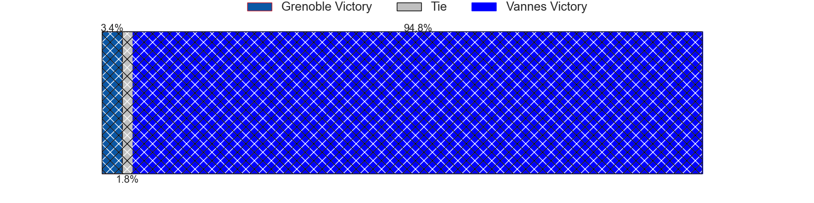
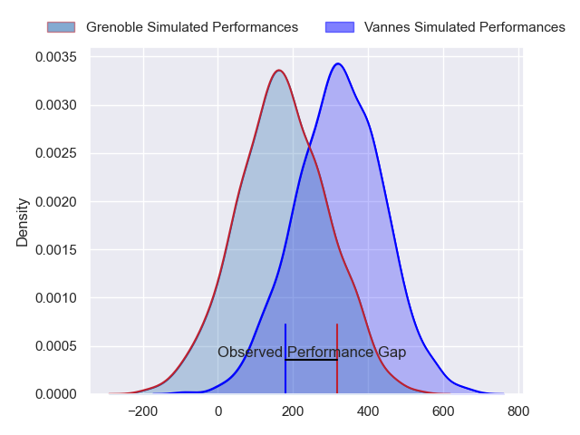
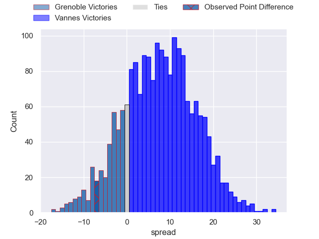
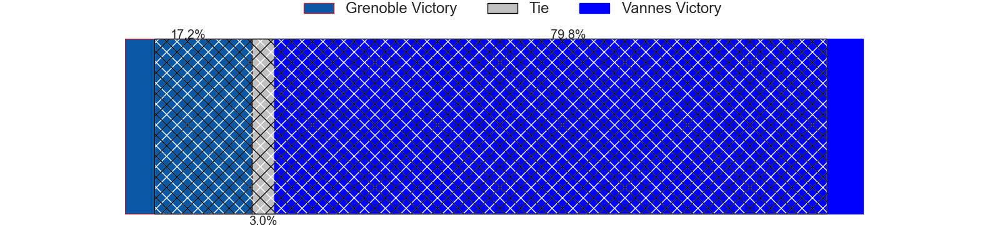

---  
layout: page  
title: Grenoble at Vannes; 17-10  
date: 2024-03-08 18:00:00 -0500  
categories: "Pro D2 2023" match review  
---
# Grenoble at Vannes; 17-10

# Club Level Predictions

The first set of predictions treats a club as the smallest object, as the club develops its members, organizes a gameplan, and deploys its players as needed for each match. This club model has a prediction of 0.706, which translates to predicting Vannes to win by 7.7.

Our Over/Under is 50.5 - and combined with the spread above, we have a predicted scoreline of 22 to 29

Each club has a rating and a rating deviation (similar to a Glicko rating), and expected performances can be generated. This allows for simulated matches and spreads like the ones below.
## Projected Performances - Club Model

## Projected Spreads - Club Model

## Projected Results - Club Model

# Player Level Predictions - Version 2

Treating teams instead as an entity made up of the currently active players, I have ratings for each player in an altogether different system. These can be combined to form team ratings once teamsheets are announced, weighting starters a bit higher than the reserves. After the match is played, players can be weighted by their minutes on the field, allowing for an accurate measure of the team's composition. With these compiled team ratings, we can make predictions, measure inaccuracy, and update the individual player ratings.
## Prediction without Player Minutes: Vannes by 8.6

Vannes by 4.7 on a neutral pitch

## Projected Performances - Player Model

## Projected Spreads - Player Model

## Projected Results - Player Model

|   Away Minutes | Away Player         |   Away Percentile |   Number |   Home Percentile | Home Player             |   Home Minutes |
|---------------:|:--------------------|------------------:|---------:|------------------:|:------------------------|---------------:|
|             50 | Eli Eglaine         |             17.07 |        1 |             31.81 | Charles-Henri Berguet   |             68 |
|             53 | Barnabé Massa       |             70.77 |        2 |             86.54 | Pat Leafa               |             51 |
|             71 | Irakli Aptsiauri    |             77.61 |        3 |             33.12 | Simon Bourgeois         |             51 |
|             48 | Thomas Lainault     |             48.44 |        4 |             93.15 | Joe Edwards             |             80 |
|             69 | Pierce Phillips     |             62.26 |        5 |             14.9  | Mattéo Desjeux          |             68 |
|             80 | Jose Madeira        |             91.21 |        6 |             14.43 | Karl Chateau            |             51 |
|             80 | Steeve Blanc-Mappaz |             70.46 |        7 |             98.08 | Francisco Gorrissen     |             80 |
|             58 | Antonin Berruyer    |             55.72 |        8 |             52.8  | Sione Kalamafoni        |             58 |
|             59 | Eric Escande        |             91.29 |        9 |             39.42 | Jules Le Bail           |             74 |
|             80 | Max Clement         |             54.64 |       10 |             92.23 | Maxime Lafage           |             80 |
|             80 | Erwan Dridi         |             78.45 |       11 |             40.37 | Enzo Benmegal           |             80 |
|             80 | Romain Trouilloud   |             59.15 |       12 |             11.88 | Alex Arrate             |             80 |
|             62 | Romain Fusier       |             30.91 |       13 |             82.3  | Sacha Valleau           |             80 |
|             80 | Wilfried Hulleu     |             84.68 |       14 |             13.46 | Martin Alonso Munoz     |             80 |
|             80 | Julien Farnoux      |             96.14 |       15 |             52.53 | Paul Surano             |             58 |
|             30 | Luka Goginava       |             50.93 |       16 |             20.52 | Juan Bautista Pedemonte |             29 |
|             32 | Georgi Javakhia     |             67.67 |       17 |             80.32 | Phil Kite               |             29 |
|             27 | Mathis Sarragallet  |             23.85 |       18 |             53.27 | Théo Beziat             |             29 |
|             22 | Thibaut Martel      |             36.74 |       19 |             11.18 | Eric Marks              |             22 |
|             21 | Barnabe Couilloud   |              4.77 |       20 |             44.86 | Thibault Debaes         |             22 |
|             18 | Bautista Ezcurra    |             96.36 |       21 |             29.2  | Thomas Moukoro          |             12 |
|             11 | Brandon Nansen      |             42.67 |       22 |            nan    | Timothé Mezou           |             12 |
|              9 | Théo Lavoine        |            nan    |       23 |            nan    | Alexandre Gouaux        |              6 |

