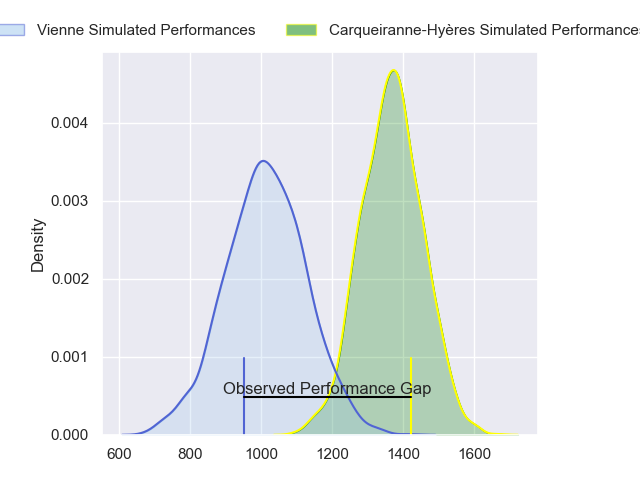
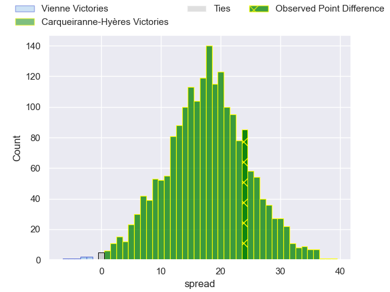
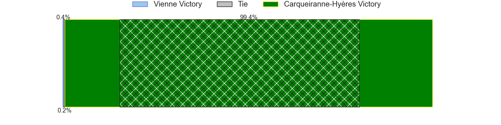
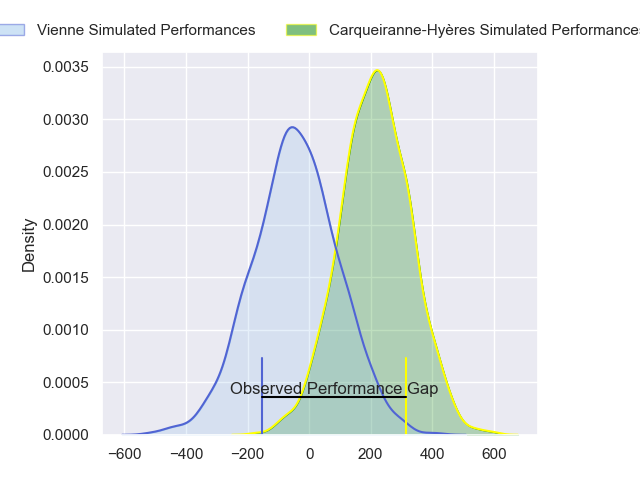
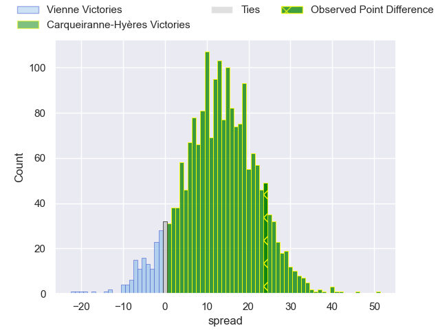
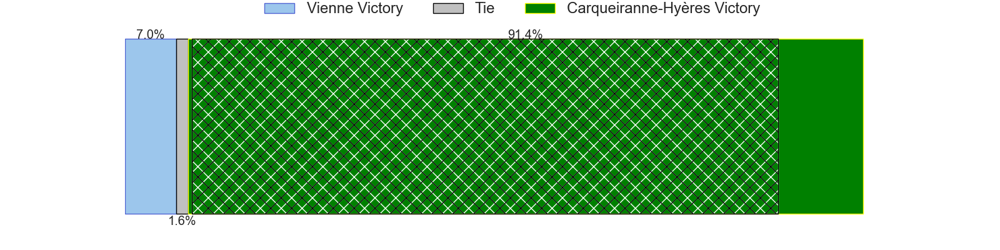

---  
layout: page  
title: Vienne at Carqueiranne-Hyeres; 5-29  
date: 2024-03-09 18:00:00 -0500  
categories: "Nationale 2023" match review  
---
# Vienne at Carqueiranne-Hyeres; 5-29

# Club Level Predictions

The first set of predictions treats a club as the smallest object, as the club develops its members, organizes a gameplan, and deploys its players as needed for each match. This club model has a prediction of 0.873, which translates to predicting Carqueiranne-Hyères to win by 17.8.

Our Over/Under is 31.5 - and combined with the spread above, we have a predicted scoreline of 7 to 25

Each club has a rating and a rating deviation (similar to a Glicko rating), and expected performances can be generated. This allows for simulated matches and spreads like the ones below.
## Projected Performances - Club Model

## Projected Spreads - Club Model

## Projected Results - Club Model

# Player Level Predictions - Version 2

Treating teams instead as an entity made up of the currently active players, I have ratings for each player in an altogether different system. These can be combined to form team ratings once teamsheets are announced, weighting starters a bit higher than the reserves. After the match is played, players can be weighted by their minutes on the field, allowing for an accurate measure of the team's composition. With these compiled team ratings, we can make predictions, measure inaccuracy, and update the individual player ratings.
## Prediction without Player Minutes: Carqueiranne-Hyères by 14.6

Carqueiranne-Hyères by 12.2 on a neutral pitch

## Projected Performances - Player Model

## Projected Spreads - Player Model

## Projected Results - Player Model

|   Away Minutes | Away Player            |   Away Percentile |   Number |   Home Percentile | Home Player         |   Home Minutes |
|---------------:|:-----------------------|------------------:|---------:|------------------:|:--------------------|---------------:|
|             80 | Corentin Durand        |             27.71 |        1 |             75.84 | Costel Burtila      |             55 |
|             80 | Yanis Gimenez          |             70.96 |        2 |             62.69 | Theo Lachaud        |             55 |
|             80 | Benjamin Robin         |              4.48 |        3 |             72.01 | Eli Serra-Miglietti |             17 |
|             80 | Antoine Frambourg      |             13.1  |        4 |             45.67 | Nathan Gendre       |             80 |
|             80 | Victor Comptat         |             41.71 |        5 |             53.97 | Adam Peters         |             80 |
|             80 | Léon Peyrat            |              2.25 |        6 |             32.02 | Nicolas Baquer      |             51 |
|             80 | Guillaume Moroldo      |             29.43 |        7 |             63.47 | Joachim Beaumont    |             80 |
|             80 | Théo Minodier          |              9.98 |        8 |             96.11 | Andre Gorin         |             51 |
|             80 | Malory Piet            |             20.33 |        9 |             83.82 | Thomas Sonetti      |             57 |
|             80 | Enzo Ravanello         |              5.51 |       10 |             51.13 | Juan Kotze          |             59 |
|             80 | Pierre Mollard         |             12.8  |       11 |             68.93 | Josselyn Bouchon    |             80 |
|             80 | Anzize Said Omar       |             22.42 |       12 |             68.48 | Theo Moitrier       |             55 |
|             80 | Matthias Giovale       |              4.73 |       13 |             35.27 | Dylan Sage          |             80 |
|             80 | Mathieu Bonnet-Gonnnet |             48.36 |       14 |             43.33 | Paul Gadea          |             80 |
|             80 | Brandon Bellavia       |              8.92 |       15 |             66.99 | Ionel Melinte       |             80 |
|            nan | nan                    |            nan    |       16 |             64.74 | Thomas Lithaud      |             25 |
|            nan | nan                    |            nan    |       17 |              8.65 | Elandre Huggett     |             25 |
|            nan | nan                    |            nan    |       18 |             40.58 | Nassim Aanikid      |             63 |
|            nan | nan                    |            nan    |       19 |             42.55 | Shade Barkallah     |             29 |
|            nan | nan                    |            nan    |       20 |             65.73 | Spike Salman        |             29 |
|            nan | nan                    |            nan    |       21 |             33.61 | Rémi Dubié          |             23 |
|            nan | nan                    |            nan    |       22 |             60.96 | Adrien Amans        |             21 |
|            nan | nan                    |            nan    |       23 |             83.88 | Romain Leveque      |             25 |

