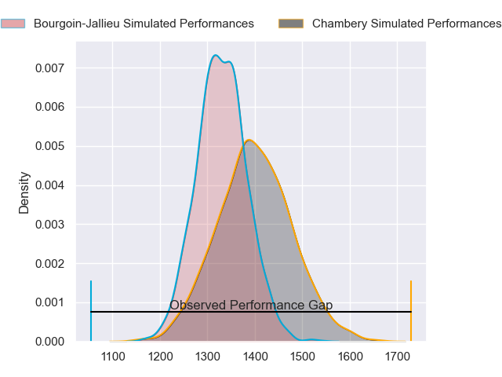
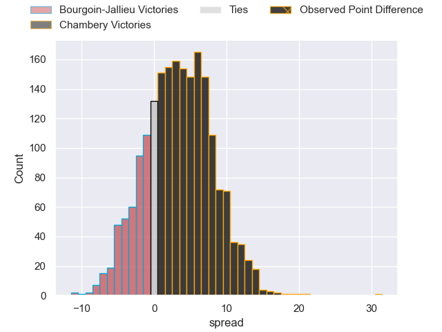
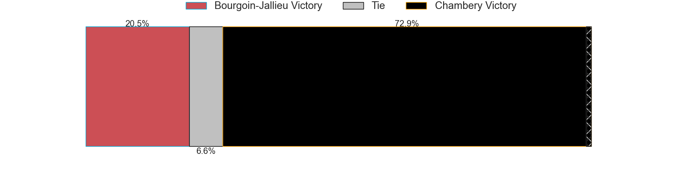
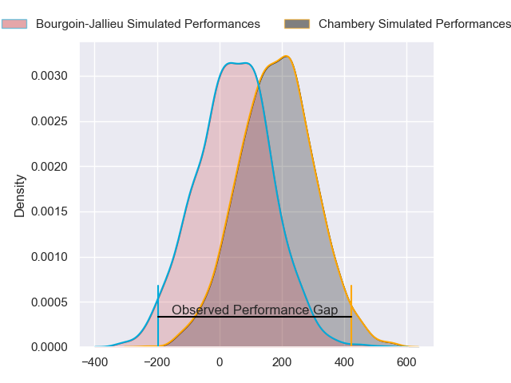
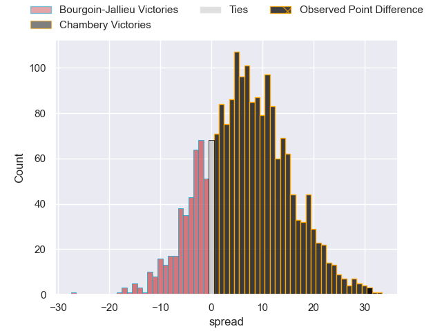
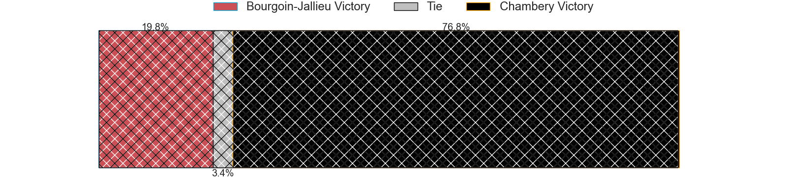

---  
layout: page  
title: Bourgoin-Jallieu at Chambery; 7-38  
date: 2024-03-09 18:00:00 -0500  
categories: "Nationale 2023" match review  
---
# Bourgoin-Jallieu at Chambery; 7-38

# Club Level Predictions

The first set of predictions treats a club as the smallest object, as the club develops its members, organizes a gameplan, and deploys its players as needed for each match. This club model has a prediction of 0.596, which translates to predicting Chambery to win by 3.4.

Our Over/Under is 45.5 - and combined with the spread above, we have a predicted scoreline of 21 to 24

Each club has a rating and a rating deviation (similar to a Glicko rating), and expected performances can be generated. This allows for simulated matches and spreads like the ones below.
## Projected Performances - Club Model

## Projected Spreads - Club Model

## Projected Results - Club Model

# Player Level Predictions - Version 2

Treating teams instead as an entity made up of the currently active players, I have ratings for each player in an altogether different system. These can be combined to form team ratings once teamsheets are announced, weighting starters a bit higher than the reserves. After the match is played, players can be weighted by their minutes on the field, allowing for an accurate measure of the team's composition. With these compiled team ratings, we can make predictions, measure inaccuracy, and update the individual player ratings.
## Prediction without Player Minutes: Chambery by 7.1

Chambery by 4.3 on a neutral pitch

## Projected Performances - Player Model

## Projected Spreads - Player Model

## Projected Results - Player Model

|   Away Minutes | Away Player           |   Away Percentile |   Number |   Home Percentile | Home Player                  |   Home Minutes |
|---------------:|:----------------------|------------------:|---------:|------------------:|:-----------------------------|---------------:|
|             49 | Romain Favaretto      |             52.06 |        1 |             37.49 | Nugzar Somkhishvili          |             58 |
|             49 | Killian Tripier       |             67.18 |        2 |             81.68 | Gauthier Brute de Remur      |             64 |
|             48 | Maxime Calliet        |             17.32 |        3 |             76.9  | Giorgi Pertaia               |             64 |
|             80 | Robin Gascou          |             56.38 |        4 |             49.58 | Ahmed Tidiane Kane           |             80 |
|             80 | Léandre Cotte         |             22.77 |        5 |             70.32 | Corentin Astier              |             54 |
|             80 | Kevin Chaudouard      |             43.28 |        6 |             70.59 | Thomas Coignat               |             80 |
|             49 | Theophile Cotte       |             63.22 |        7 |             74.89 | Colin Lebian                 |             64 |
|             49 | Poutasi Luafutu       |             32.04 |        8 |             74.03 | Tui Uru                      |             80 |
|             60 | Martin Doan           |             56.03 |        9 |             20.86 | Thibault Dufau               |             69 |
|             80 | Aviata Silago         |             19.65 |       10 |             80.1  | Jean-Luc Alewyn Cilliers     |             33 |
|             80 | Quentin Lefort        |             74.33 |       11 |             89.04 | Arthur Nennig                |             80 |
|             56 | Pieter Morton         |             37.02 |       12 |             50    | Bastien Reymond              |             80 |
|             80 | Christopher Bosch     |             31.07 |       13 |             66.31 | Maewen Sao                   |             60 |
|             80 | Paul-Hugo Champ       |             53.28 |       14 |             50.05 | Va'aufauese Apelu Maliko     |             80 |
|             80 | Antoine Renaud        |              0.48 |       15 |             61.39 | Paul Baptiste Florent Altier |             80 |
|             32 | Osman Dimen           |             33.73 |       16 |             35.07 | Victor Pisano                |             47 |
|             31 | Oktay Yilmaz          |             55.55 |       17 |             68.89 | Fabien Witz                  |             26 |
|             13 | Théo Lepage           |             55.1  |       18 |             37.12 | Enzo Segui                   |             22 |
|             24 | Gaby Lovobalavu       |             73.1  |       19 |             37.41 | Jules Dorrival               |             20 |
|             31 | Mohamed Khribache     |             23.28 |       20 |             16.04 | Zauri Tevdorashvili          |             16 |
|             20 | Tomas Munilla lo Duca |             83.84 |       21 |            nan    | Pierre-Nicolas Dance         |             16 |
|             18 | Aitor Hourcade        |             11.56 |       22 |             22.33 | Luka Begic                   |             16 |
|             31 | Remi Bouet            |              5.59 |       23 |             31.49 | Hugo Deschaux                |             11 |

