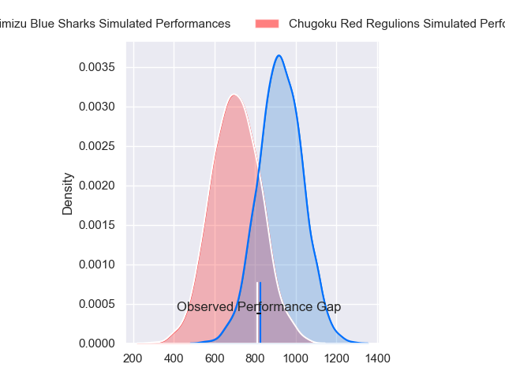
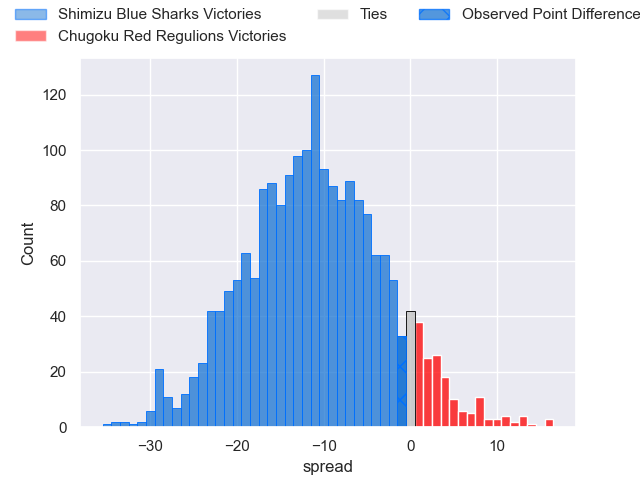
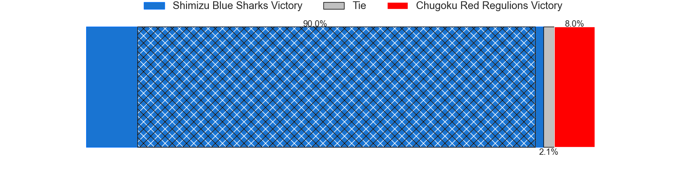
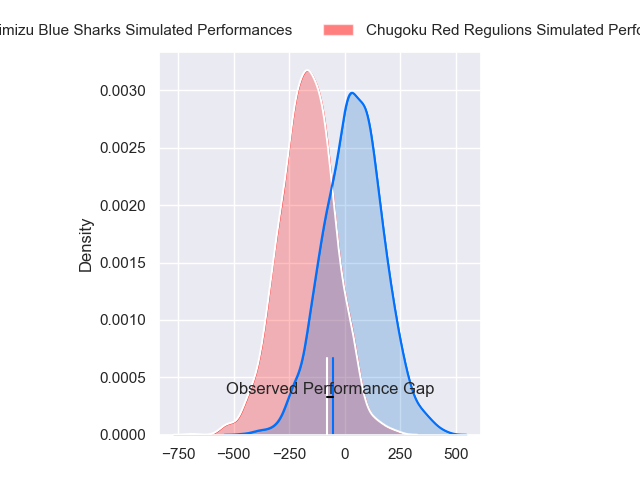
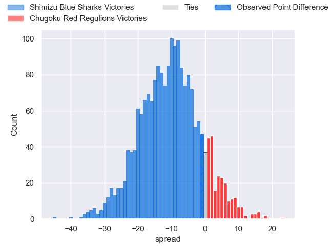
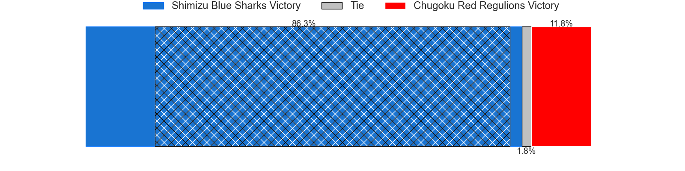

---  
layout: page  
title: Shimizu Blue Sharks at Chugoku Red Regulions; 22-21  
date: 2024-03-09 18:00:00 -0500  
categories: "Japan Rugby League One D3 2023" match review  
---
# Shimizu Blue Sharks at Chugoku Red Regulions; 22-21

# Club Level Predictions

The first set of predictions treats a club as the smallest object, as the club develops its members, organizes a gameplan, and deploys its players as needed for each match. This club model has a prediction of 0.234, which translates to predicting Shimizu Blue Sharks to win by 10.9.

Our Over/Under is 60.5 - and combined with the spread above, we have a predicted scoreline of 36 to 25

Each club has a rating and a rating deviation (similar to a Glicko rating), and expected performances can be generated. This allows for simulated matches and spreads like the ones below.
## Projected Performances - Club Model

## Projected Spreads - Club Model

## Projected Results - Club Model

# Player Level Predictions - Version 2

Treating teams instead as an entity made up of the currently active players, I have ratings for each player in an altogether different system. These can be combined to form team ratings once teamsheets are announced, weighting starters a bit higher than the reserves. After the match is played, players can be weighted by their minutes on the field, allowing for an accurate measure of the team's composition. With these compiled team ratings, we can make predictions, measure inaccuracy, and update the individual player ratings.
## Prediction without Player Minutes: Shimizu Blue Sharks by 11.5

Shimizu Blue Sharks by 14.1 on a neutral pitch

## Projected Performances - Player Model

## Projected Spreads - Player Model

## Projected Results - Player Model

|   Away Minutes | Away Player        |   Away Percentile |   Number |   Home Percentile | Home Player          |   Home Minutes |
|---------------:|:-------------------|------------------:|---------:|------------------:|:---------------------|---------------:|
|             70 | Sanshiro Nomura    |             39.14 |        1 |              6.51 | Kojiro Arito         |             74 |
|             33 | Naomichi Tatekawa  |             16.98 |        2 |              5.53 | Kentaro Iwanaga      |             80 |
|             62 | Shinya Nara        |             35.11 |        3 |             38.04 | Kento Miyata         |             80 |
|             80 | Sam Chongkit       |             65.2  |        4 |              1.07 | Taro Nishikawa       |             80 |
|             80 | Tom Rowe           |             38.14 |        5 |             25.15 | Tomonari Aoki        |             62 |
|             62 | Usa Baleilautoka   |             26.21 |        6 |             15.42 | Shintaro Matsuda     |             80 |
|             80 | Ryo Sato           |              8.92 |        7 |              1.32 | Kouta Moriyama       |             70 |
|             80 | Haruki Matsudo     |             16.5  |        8 |              1.21 | Ed Quirk             |             80 |
|             70 | Kayne Hammington   |             18    |        9 |             15.13 | Rintaro Kawashima    |             70 |
|             70 | Soichiro Kuwata    |             13.93 |       10 |             51.49 | Miyazaki Hayato      |             80 |
|             80 | Toru Kanazawa      |             39.53 |       11 |             21.59 | Hirofumi Higashikawa |             50 |
|             80 | Orbyn Leger        |              2.74 |       12 |             18.21 | Shinya Hirayama      |             80 |
|             62 | Siale Piutau       |             63.57 |       13 |              2.62 | Masaaki Morita       |             57 |
|             80 | Eika Miyazaki      |             27.71 |       14 |             16.33 | Kentaro Fujii        |             80 |
|             80 | Coenie van Wyk     |             21.58 |       15 |              4.08 | Masahiro Nakano      |             80 |
|             47 | Yasuyuki Yamamoto  |             46.95 |       16 |            nan    | Kennta Kitayama      |             30 |
|             18 | Ryota Saitou       |             12.28 |       17 |             11.79 | Hashizo Yoshida      |             23 |
|             18 | Murphy Taramai     |              3.4  |       18 |              2.09 | Kohei Matsunaga      |             18 |
|             18 | Naoki Moriya       |              2.02 |       19 |            nan    | Atsushi Mizofuchi    |             10 |
|             10 | Reijiro Usui       |            nan    |       20 |            nan    | Keisuke Maeda        |              6 |
|             10 | Lima Sopoaga       |             86.57 |       21 |            nan    | Noriyuki Kureyama    |             10 |
|             10 | Takatoshi Sugawara |             11.18 |       22 |            nan    | nan                  |            nan |

