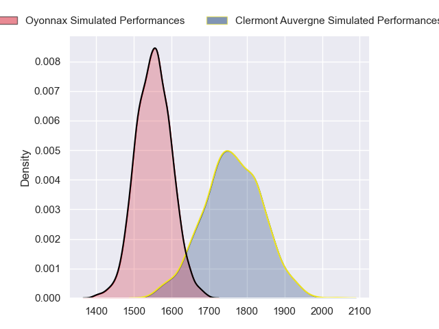
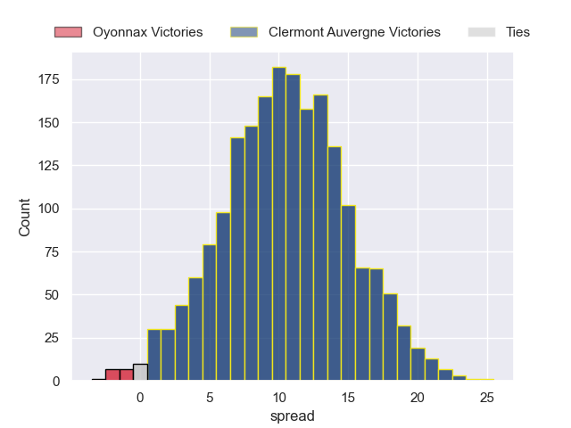
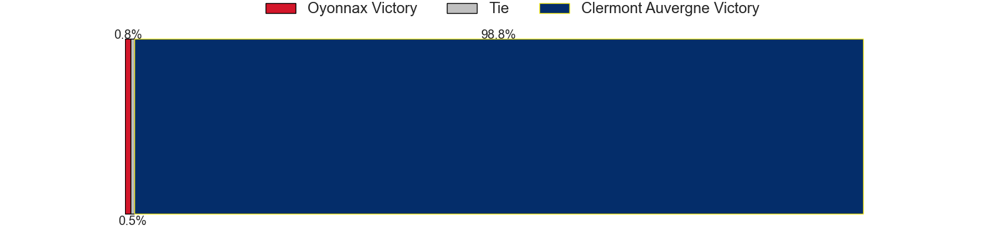
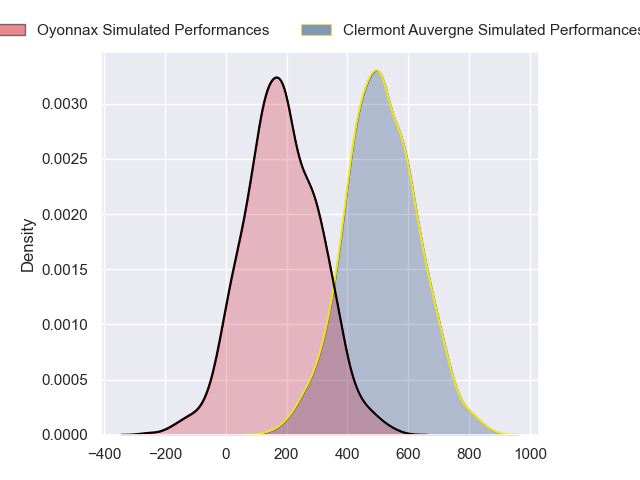
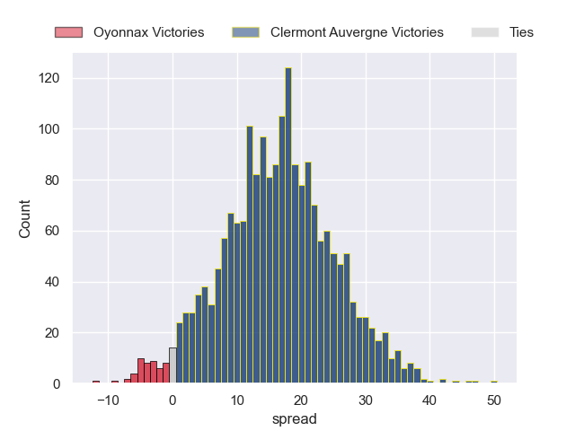
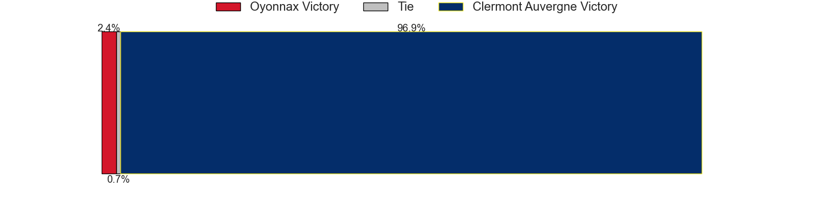

---  
layout: page  
title: Oyonnax at Clermont Auvergne; 15-15  
date: 2024-03-09 18:00:00 -0500  
categories: "Top 14 Orange 2023" match review  
---
# Oyonnax at Clermont Auvergne; 15-15

# Club Level Predictions

The first set of predictions treats a club as the smallest object, as the club develops its members, organizes a gameplan, and deploys its players as needed for each match. This club model has a prediction of 0.765, which translates to predicting Clermont Auvergne to win by 10.4.

Our Over/Under is 49.5 - and combined with the spread above, we have a predicted scoreline of 20 to 30

Each club has a rating and a rating deviation (similar to a Glicko rating), and expected performances can be generated. This allows for simulated matches and spreads like the ones below.
## Projected Performances - Club Model

## Projected Spreads - Club Model

## Projected Results - Club Model

# Player Level Predictions - Version 2

Treating teams instead as an entity made up of the currently active players, I have ratings for each player in an altogether different system. These can be combined to form team ratings once teamsheets are announced, weighting starters a bit higher than the reserves. After the match is played, players can be weighted by their minutes on the field, allowing for an accurate measure of the team's composition. With these compiled team ratings, we can make predictions, measure inaccuracy, and update the individual player ratings.
## Prediction without Player Minutes: Clermont Auvergne by 18.6

Clermont Auvergne by 11.1 on a neutral pitch

## Projected Performances - Player Model

## Projected Spreads - Player Model

## Projected Results - Player Model

|   Away Minutes | Away Player         |   Away Percentile |   Number |   Home Percentile | Home Player         |   Home Minutes |
|---------------:|:--------------------|------------------:|---------:|------------------:|:--------------------|---------------:|
|             41 | Tommy Raynaud       |             84.6  |        1 |             27.86 | Giorgi Beria        |             58 |
|             67 | Benjamin Geledan    |             27.86 |        2 |             92.18 | Folau Fainga'a      |             63 |
|             69 | Christopher Vaotoa  |             50.78 |        3 |             78.74 | Rabah Slimani       |             81 |
|             78 | Phoenix Battye      |             97.85 |        4 |             94.4  | Rob Simmons         |             81 |
|             55 | Ewan Johnson        |             43.74 |        5 |             90.58 | Tomas Lavanini      |             63 |
|             81 | Kevin Lebreton      |             58.37 |        6 |             81.39 | Lucas Dessaigne     |             81 |
|             81 | Rory Grice          |             68.83 |        7 |             68.61 | Thibaud Lanen       |             56 |
|             52 | Loic Godener        |             13.83 |        8 |             81.55 | Pita Gus Sowakula   |             81 |
|             81 | Charlie Cassang     |             85.28 |        9 |             89.57 | Sebastien Bezy      |             63 |
|             81 | Domingo Miotti      |             91.04 |       10 |             73.38 | Jules Plisson       |             81 |
|             81 | Enzo Reybier        |             47.69 |       11 |             10.74 | Alivereti Raka      |             81 |
|             81 | Theo Millet         |             77.38 |       12 |             94.17 | George Moala        |             81 |
|             52 | Pedro Bettencourt   |             20.95 |       13 |             32.86 | Leon Darricarrere   |             81 |
|             54 | Gavin Stark         |             20.3  |       14 |             80.13 | Bautista Delguy     |             81 |
|             81 | Justin Bouraux      |             40.29 |       15 |             68.11 | Alex Newsome        |             81 |
|             14 | Manu Leiataua       |              1.53 |       16 |            nan    | Etienne Fourcade    |             18 |
|             40 | Antoine Abraham     |             42.44 |       17 |             13.29 | Daniel Bibi Biziwu  |             23 |
|             29 | Hugo Fabregue       |             41.48 |       18 |             20.86 | Paul Jedrasiak      |             18 |
|             29 | Loic Credoz         |             30.29 |       19 |             67.4  | Killian Tixeront    |             25 |
|              0 | Ilan El Khattabi    |            nan    |       20 |             35.79 | Baptiste Jauneau    |             18 |
|             29 | Chris Farrell       |            nan    |       21 |            nan    | Theo Giral          |              0 |
|             27 | Daniel Ikpefan      |             70.68 |       22 |             25.42 | Thomas Roziere      |              0 |
|             12 | Irakli Mirtskhulava |             82.95 |       23 |            nan    | Giorgi Dzmanashvili |              0 |

