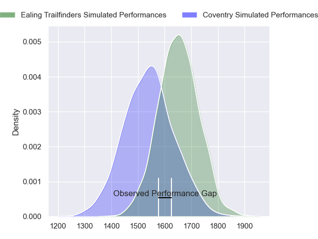
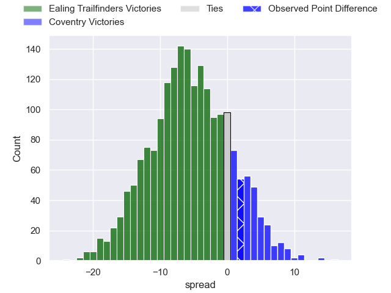
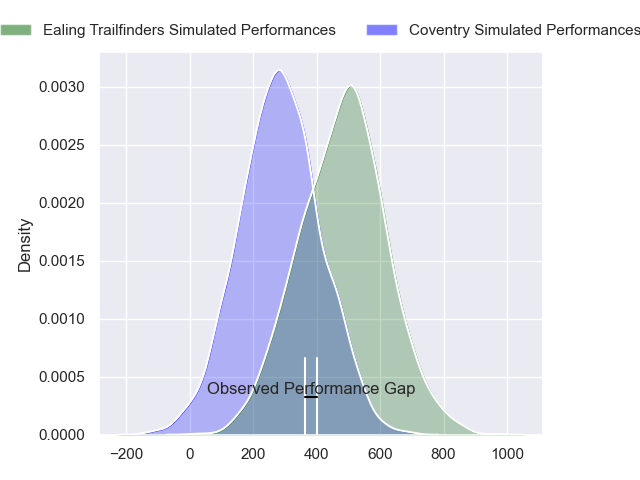
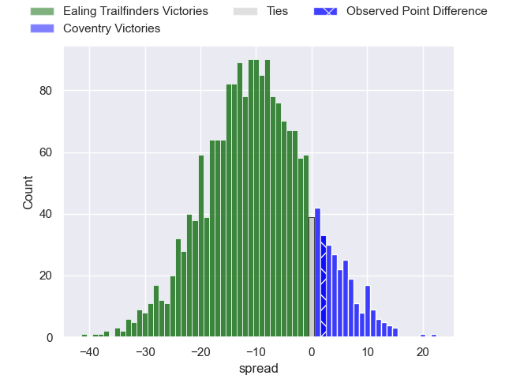
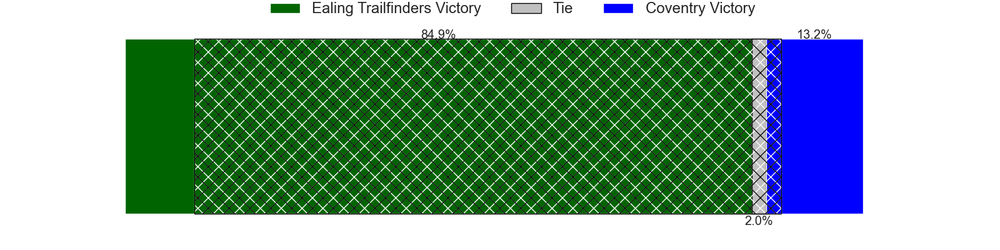

---  
layout: page  
title: Ealing Trailfinders at Coventry; 32-34  
date: 2024-03-09 18:00:00 -0500  
categories: "RFU Championship 2023" match review  
---
# Ealing Trailfinders at Coventry; 32-34

# Club Level Predictions

The first set of predictions treats a club as the smallest object, as the club develops its members, organizes a gameplan, and deploys its players as needed for each match. This club model has a prediction of 0.352, which translates to predicting Ealing Trailfinders to win by 5.4.

Our Over/Under is 60.5 - and combined with the spread above, we have a predicted scoreline of 33 to 27

Each club has a rating and a rating deviation (similar to a Glicko rating), and expected performances can be generated. This allows for simulated matches and spreads like the ones below.
## Projected Performances - Club Model

## Projected Spreads - Club Model

## Projected Results - Club Model

# Player Level Predictions - Version 2

Treating teams instead as an entity made up of the currently active players, I have ratings for each player in an altogether different system. These can be combined to form team ratings once teamsheets are announced, weighting starters a bit higher than the reserves. After the match is played, players can be weighted by their minutes on the field, allowing for an accurate measure of the team's composition. With these compiled team ratings, we can make predictions, measure inaccuracy, and update the individual player ratings.
## Prediction without Player Minutes: Ealing Trailfinders by 8.1

Ealing Trailfinders by 11.0 on a neutral pitch

## Projected Performances - Player Model

## Projected Spreads - Player Model

## Projected Results - Player Model

|   Away Minutes | Away Player          |   Away Percentile |   Number |   Home Percentile | Home Player        |   Home Minutes |
|---------------:|:---------------------|------------------:|---------:|------------------:|:-------------------|---------------:|
|             68 | Will Goodrick-Clarke |             34.42 |        1 |             87.97 | Toby Trinder       |             63 |
|             80 | Matthew Cornish      |             60.38 |        2 |             85    | Jordon Poole       |             77 |
|             71 | Biyi Alo             |             92.63 |        3 |             31.72 | Adam Nicol         |             73 |
|             80 | Bobby de Wee         |             95.07 |        4 |             41.95 | James Tyas         |             80 |
|             80 | Andrew Davidson      |             31.97 |        5 |             32.09 | Obinna Nkwocha     |             80 |
|             28 | Rob Farrar           |             69.56 |        6 |             77.45 | Tom Ball           |             75 |
|             80 | Ollie Newman         |             29.54 |        7 |             20.18 | Matt Kvesic        |             80 |
|             80 | Ryan Smid            |             99.27 |        8 |             95.13 | Senitiki Nayalo    |             67 |
|             80 | Craig Hampson        |             86.1  |        9 |             99.59 | Will Chudley       |             80 |
|             65 | Craig Willis         |             97.24 |       10 |             76.94 | Patrick Pellegrini |             75 |
|             80 | Nathan Earle         |             78.67 |       11 |             88.84 | James Martin       |             80 |
|             80 | Billy Twelvetrees    |             83.39 |       12 |             73.45 | Fred Betteridge    |             80 |
|             80 | Reuben Bird-Tulloch  |             69.33 |       13 |             41.33 | Will Wand          |             80 |
|             80 | James Cordy-Redden   |             99.56 |       14 |             29.54 | Ryan Hutler        |             80 |
|             80 | Jonah Holmes         |             82.41 |       15 |             56.14 | Tobi Wilson        |             80 |
|             52 | Callum Chick         |              5.35 |       16 |             37.13 | Vilikesa Nairau    |             17 |
|             15 | Dan Lancaster        |              2.26 |       17 |             61.35 | Suva Ma'asi        |             13 |
|             12 | Kyle John Whyte      |             86.38 |       18 |             26.59 | Eliot Salt         |              7 |
|              9 | Jimmy Roots          |             46.55 |       19 |            nan    | Chester Owen       |              5 |
|            nan | nan                  |            nan    |       20 |             17.11 | Evan Mitchell      |              5 |
|            nan | nan                  |            nan    |       21 |             55    | Will Biggs         |              3 |

