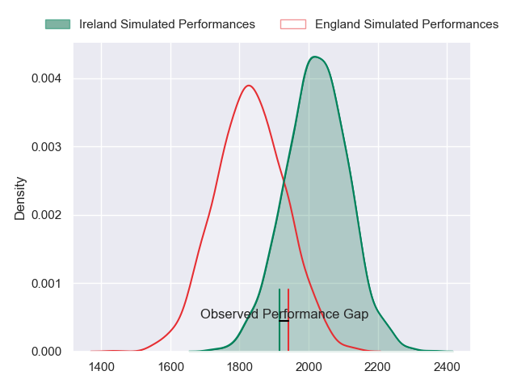
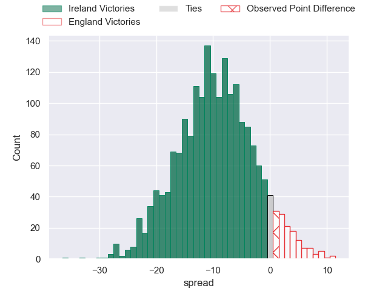
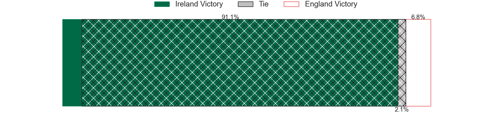
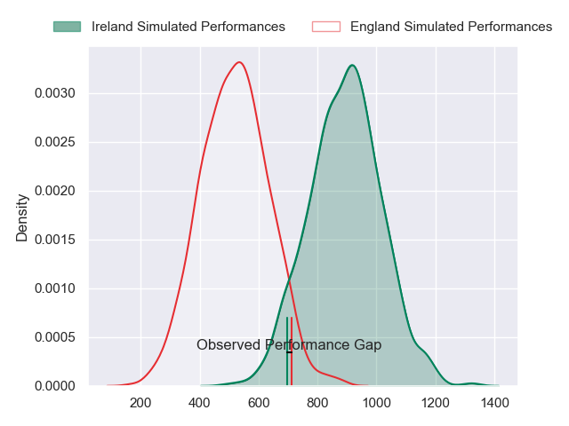
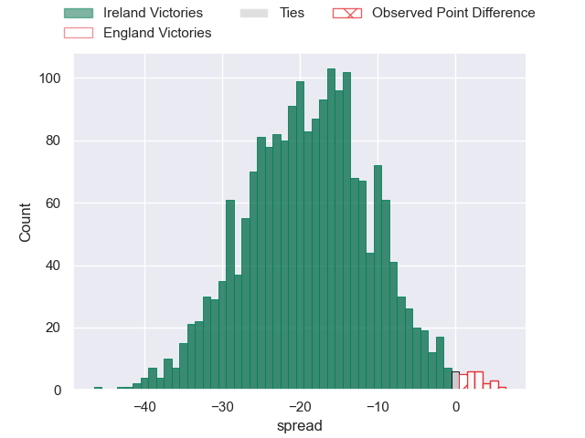
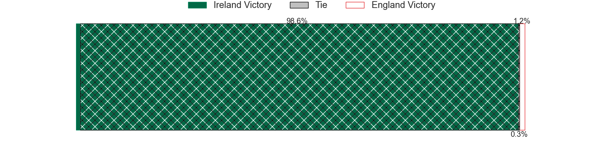

---  
layout: page  
title: Ireland at England; 22-23  
date: 2024-03-09 18:00:00 -0500  
categories: "Six Nations Championship 2024" match review  
---
# Ireland at England; 22-23

# Club Level Predictions

The first set of predictions treats a club as the smallest object, as the club develops its members, organizes a gameplan, and deploys its players as needed for each match. This club model has a prediction of 0.263, which translates to predicting Ireland to win by 9.3.

Our Over/Under is 50.5 - and combined with the spread above, we have a predicted scoreline of 30 to 21

Each club has a rating and a rating deviation (similar to a Glicko rating), and expected performances can be generated. This allows for simulated matches and spreads like the ones below.
## Projected Performances - Club Model

## Projected Spreads - Club Model

## Projected Results - Club Model

# Player Level Predictions - Version 2

Treating teams instead as an entity made up of the currently active players, I have ratings for each player in an altogether different system. These can be combined to form team ratings once teamsheets are announced, weighting starters a bit higher than the reserves. After the match is played, players can be weighted by their minutes on the field, allowing for an accurate measure of the team's composition. With these compiled team ratings, we can make predictions, measure inaccuracy, and update the individual player ratings.
## Prediction without Player Minutes: Ireland by 15.4

Ireland by 19.4 on a neutral pitch

## Projected Performances - Player Model

## Projected Spreads - Player Model

## Projected Results - Player Model

|   Away Minutes | Away Player         |   Away Percentile |   Number |   Home Percentile | Home Player               |   Home Minutes |
|---------------:|:--------------------|------------------:|---------:|------------------:|:--------------------------|---------------:|
|             71 | Andrew Porter       |             94.04 |        1 |             44.82 | Ellis Genge               |             54 |
|             61 | Dan Sheehan         |             79.39 |        2 |             98.28 | Jamie George              |             54 |
|             61 | Tadhg Furlong       |             98.44 |        3 |             44.45 | Dan Cole                  |             54 |
|             61 | Joe McCarthy        |             84.74 |        4 |             95.23 | Maro Itoje                |             81 |
|             81 | Tadhg Beirne        |             99.52 |        5 |             90.46 | George Martin             |             81 |
|             69 | Peter O'Mahony      |             98.35 |        6 |             81.06 | Ollie Chessum             |             66 |
|             61 | Josh van der Flier  |             99.01 |        7 |             88.66 | Sam Underhill             |             61 |
|             81 | Caelan Doris        |             97.57 |        8 |             94.66 | Ben Earl                  |             81 |
|             81 | Jamison Gibson-Park |             97.55 |        9 |             94.89 | Alex Mitchell             |             66 |
|             81 | Jack Crowley        |             54.23 |       10 |             93.53 | George Ford               |             59 |
|             81 | James Lowe          |            100    |       11 |             96.56 | Tommy Freeman             |             81 |
|             81 | Bundee Aki          |             99.29 |       12 |             77.74 | Ollie Lawrence            |             81 |
|             81 | Robbie Henshaw      |             93.81 |       13 |             97.5  | Henry Slade               |             66 |
|              6 | Calvin Nash         |             92.37 |       14 |             80.67 | Immanuel Feyi-Waboso      |             81 |
|             81 | Hugo Keenan         |             99.52 |       15 |             95.92 | George Furbank            |             81 |
|             20 | Ronan Kelleher      |             91.41 |       16 |             37.02 | Theo Dan                  |             27 |
|             10 | Cian Healy          |             92.94 |       17 |             98.35 | Joe Marler                |             27 |
|             20 | Finlay Bealham      |             96.88 |       18 |             22.09 | Will Stuart               |             27 |
|             20 | Iain Henderson      |             88.44 |       19 |             71.04 | Chandler Cunningham-South |             18 |
|             12 | Ryan Baird          |             88.77 |       20 |             87.86 | Alex Dombrandt            |             15 |
|             20 | Jack Conan          |             98.06 |       21 |            100    | Danny Care                |             15 |
|             30 | Conor Murray        |             97.96 |       22 |             88.31 | Marcus Smith              |             22 |
|             45 | Ciaran Frawley      |             68.59 |       23 |             79.16 | Elliot Daly               |             15 |

