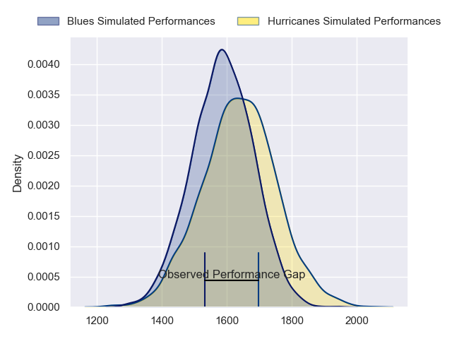
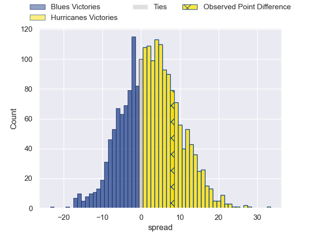
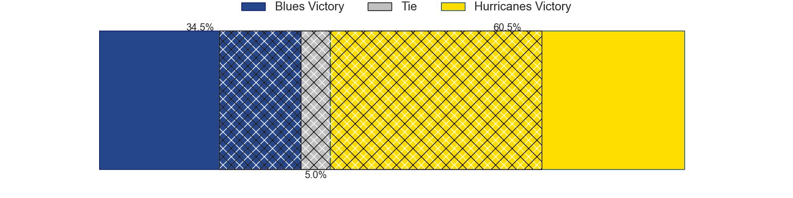
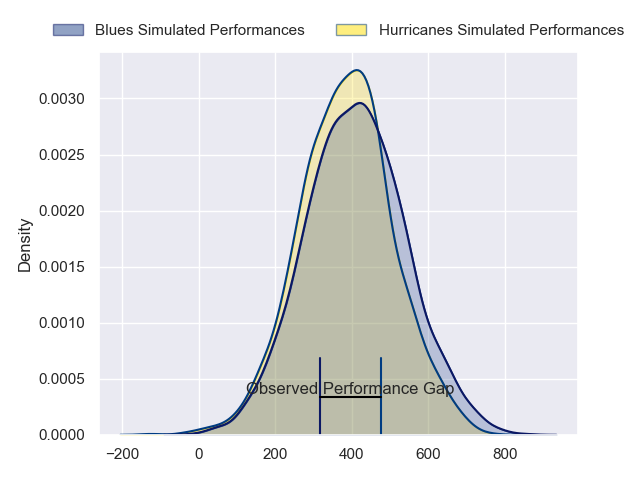
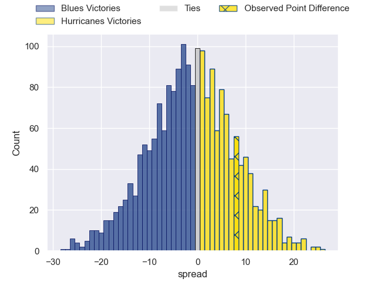

---  
layout: page  
title: Blues at Hurricanes; 21-29  
date: 2024-03-09 18:00:00 -0500  
categories: "Super Rugby Pacific 2024" match review  
---
# Blues at Hurricanes; 21-29

# Club Level Predictions

The first set of predictions treats a club as the smallest object, as the club develops its members, organizes a gameplan, and deploys its players as needed for each match. This club model has a prediction of 0.568, which translates to predicting Hurricanes to win by 2.5.

Our Over/Under is 52.5 - and combined with the spread above, we have a predicted scoreline of 25 to 27

Each club has a rating and a rating deviation (similar to a Glicko rating), and expected performances can be generated. This allows for simulated matches and spreads like the ones below.
## Projected Performances - Club Model

## Projected Spreads - Club Model

## Projected Results - Club Model

# Player Level Predictions - Version 2

Treating teams instead as an entity made up of the currently active players, I have ratings for each player in an altogether different system. These can be combined to form team ratings once teamsheets are announced, weighting starters a bit higher than the reserves. After the match is played, players can be weighted by their minutes on the field, allowing for an accurate measure of the team's composition. With these compiled team ratings, we can make predictions, measure inaccuracy, and update the individual player ratings.
## Prediction without Player Minutes: Blues by 0.2

Blues by 4.5 on a neutral pitch

## Projected Performances - Player Model

## Projected Spreads - Player Model

## Projected Results - Player Model

|   Away Minutes | Away Player        |   Away Percentile |   Number |   Home Percentile | Home Player          |   Home Minutes |
|---------------:|:-------------------|------------------:|---------:|------------------:|:---------------------|---------------:|
|             41 | Josh Fusitu'a      |             50.14 |        1 |             87.35 | Tevita Mafileo       |             48 |
|             48 | Kurt Eklund        |             90.27 |        2 |             94.27 | Asafo Aumua          |             71 |
|             80 | Marcel Renata      |             55.91 |        3 |             92.3  | Tyrel Lomax          |             60 |
|             80 | Cameron Suafoa     |             60.79 |        4 |             87.6  | James Tucker         |             49 |
|             80 | Laghlan McWhannell |             94.28 |        5 |             95.83 | Isaia Walker-Leawere |             80 |
|             48 | Anton Segner       |             51.21 |        6 |              0.99 | TK Howden            |             55 |
|             80 | Dalton Papalii     |             98.57 |        7 |             92.51 | Peter Lakai          |             80 |
|             66 | Akira Ioane        |             91.26 |        8 |              1.7  | Brayden Iose         |             80 |
|             80 | Finlay Christie    |             66.67 |        9 |             49.08 | Cam Roigard          |             70 |
|             80 | Stephen Perofeta   |             95.02 |       10 |             12.19 | Brett Cameron        |             80 |
|             15 | AJ Lam             |             61.65 |       11 |             95.49 | Kini Naholo          |             70 |
|             80 | Harry Plummer      |             88.81 |       12 |             84.17 | Riley Higgins        |             70 |
|             80 | Rieko Ioane        |             69.64 |       13 |             88.57 | Billy Proctor        |             80 |
|             70 | Mark Tele'a        |             50.48 |       14 |             76.48 | Joshua Moorby        |             80 |
|             15 | Zarn Sullivan      |             81.53 |       15 |             92.57 | Ruben Love           |             80 |
|             32 | Ricky Riccitelli   |             69.66 |       16 |             26.91 | James O'Reilly       |              9 |
|              3 | Jordan Lay         |             27.77 |       17 |             93.77 | Xavier Numia         |             32 |
|             36 | Angus Ta'avao      |             95.78 |       18 |             62.6  | Pasilio Tosi         |             20 |
|             10 | Josh Beehre        |             73.66 |       19 |             76.4  | Caleb Delany         |             31 |
|             32 | Hoskins Sotutu     |             89.32 |       20 |             83.04 | Devan Flanders       |             25 |
|             65 | Taufa Funaki       |             14.72 |       21 |            nan    | TJ Perenara          |             10 |
|             14 | Adrian Choat       |             48.02 |       22 |             42.26 | Peter Umaga-Jensen   |             10 |
|             65 | Cole Forbes        |             49.16 |       23 |             85.5  | Salesi Rayasi        |             10 |

