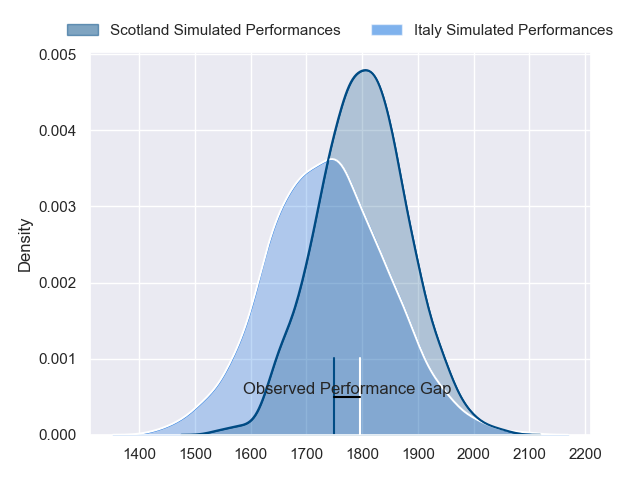
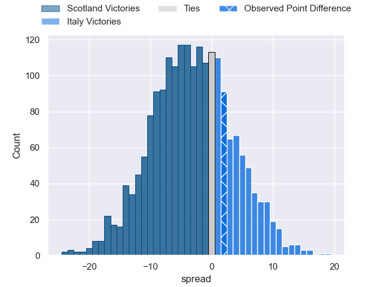
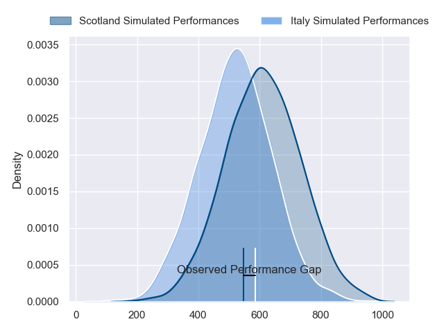
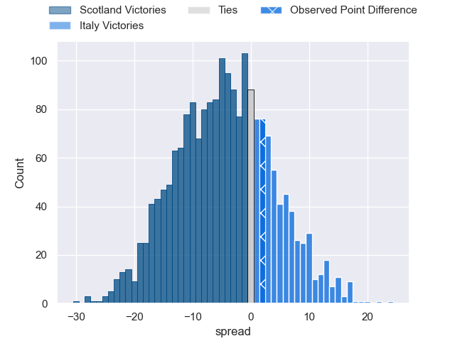

---  
layout: page  
title: Scotland at Italy; 29-31  
date: 2024-03-09 18:00:00 -0500  
categories: "Six Nations Championship 2024" match review  
---
# Scotland at Italy; 29-31

# Club Level Predictions

The first set of predictions treats a club as the smallest object, as the club develops its members, organizes a gameplan, and deploys its players as needed for each match. This club model has a prediction of 0.42, which translates to predicting Scotland to win by 2.9.

Our Over/Under is 49.5 - and combined with the spread above, we have a predicted scoreline of 26 to 24

Each club has a rating and a rating deviation (similar to a Glicko rating), and expected performances can be generated. This allows for simulated matches and spreads like the ones below.
## Projected Performances - Club Model

## Projected Spreads - Club Model

## Projected Results - Club Model

# Player Level Predictions - Version 2

Treating teams instead as an entity made up of the currently active players, I have ratings for each player in an altogether different system. These can be combined to form team ratings once teamsheets are announced, weighting starters a bit higher than the reserves. After the match is played, players can be weighted by their minutes on the field, allowing for an accurate measure of the team's composition. With these compiled team ratings, we can make predictions, measure inaccuracy, and update the individual player ratings.
## Prediction without Player Minutes: Scotland by 2.7

Scotland by 6.3 on a neutral pitch

## Projected Performances - Player Model

## Projected Spreads - Player Model

## Projected Results - Player Model

|   Away Minutes | Away Player         |   Away Percentile |   Number |   Home Percentile | Home Player        |   Home Minutes |
|---------------:|:--------------------|------------------:|---------:|------------------:|:-------------------|---------------:|
|             59 | Pierre Schoeman     |             93.28 |        1 |             73.79 | Danilo Fischetti   |             59 |
|             59 | George Turner       |             99.62 |        2 |             98.65 | Giacomo Nicotera   |             51 |
|             70 | Zander Fagerson     |             99.16 |        3 |             96.64 | Simone Ferrari     |             51 |
|             70 | Grant Gilchrist     |             95.19 |        4 |             64.54 | Niccolo Cannone    |             73 |
|             80 | Scott Cummings      |             97.12 |        5 |             96.88 | Federico Ruzza     |             80 |
|             59 | Andy Christie       |             24.8  |        6 |             87.37 | Sebastian Negri    |             59 |
|             70 | Rory Darge          |             77.56 |        7 |             96.39 | Michele Lamaro     |             80 |
|             80 | Jack Dempsey        |             48.42 |        8 |             68.86 | Ross Vintcent      |             80 |
|             59 | George Horne        |             99.38 |        9 |             78.63 | Martin Page-Relo   |             51 |
|             80 | Finn Russell        |             99.75 |       10 |             82.71 | Paolo Garbisi      |             80 |
|             80 | Duhan van der Merwe |             84.57 |       11 |             98.8  | Monty Ioane        |             80 |
|             80 | Cameron Redpath     |             51.03 |       12 |             87.64 | Tommaso Menoncello |             79 |
|             80 | Huw Jones           |             41.09 |       13 |             93.94 | Juan Ignacio Brex  |             80 |
|             80 | Kyle Steyn          |             97.26 |       14 |             83.59 | Louis Lynagh       |             71 |
|             80 | Blair Kinghorn      |             99.76 |       15 |             94.22 | Ange Capuozzo      |             80 |
|             21 | Ewan Ashman         |             88.27 |       16 |             79.62 | Gianmarco Lucchesi |             29 |
|             21 | Alec Hepburn        |             67.44 |       17 |            nan    | Mirco Spagnolo     |             21 |
|             10 | Elliot Millar-Mills |            nan    |       18 |             60.82 | Giosue Zilocchi    |             29 |
|             10 | Sam Skinner         |             84.74 |       19 |             44.47 | Andrea Zambonin    |              7 |
|             10 | Jamie Ritchie       |            100    |       20 |             91.48 | Lorenzo Cannone    |             21 |
|             21 | Matt Fagerson       |             96.17 |       21 |             27.59 | Stephen Varney     |             29 |
|             21 | Ali Price           |             87.97 |       22 |             63.66 | Leonardo Marin     |              1 |
|              0 | Kyle Rowe           |             77.24 |       23 |             60.24 | Federico Mori      |              9 |

