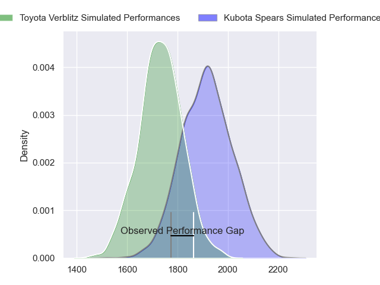
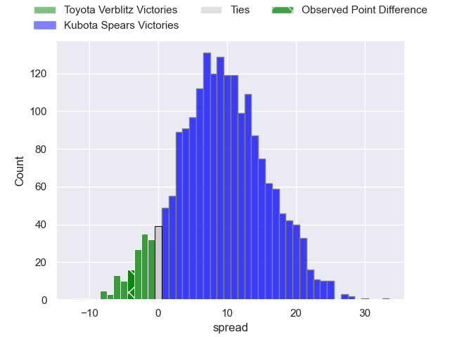
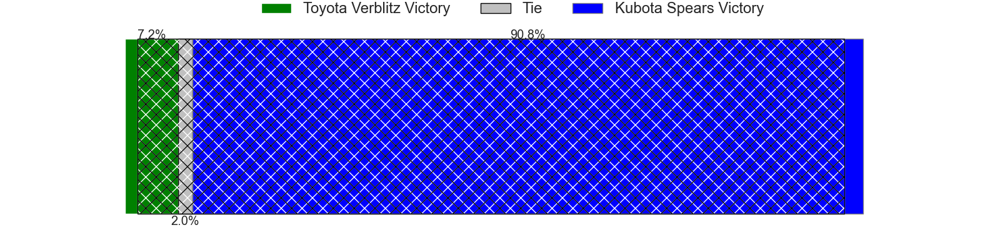
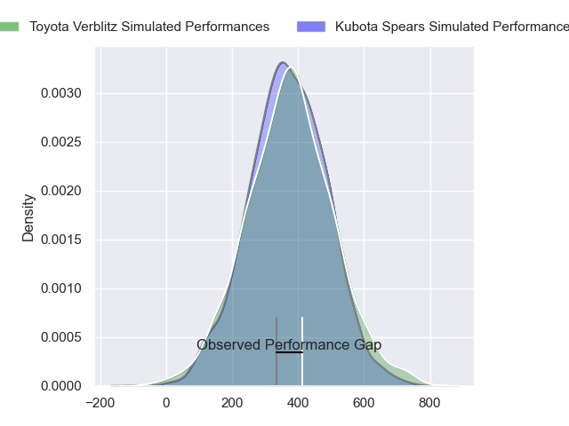
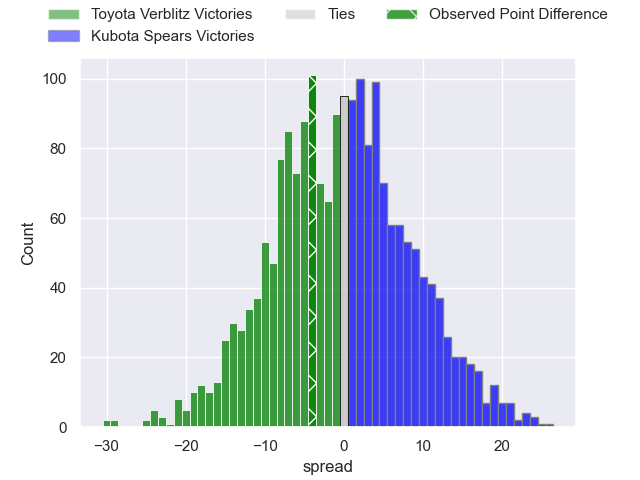

---  
layout: page  
title: Toyota Verblitz at Kubota Spears; 31-27  
date: 2024-03-09 18:00:00 -0500  
categories: "Japan Rugby League One 2023" match review  
---
# Toyota Verblitz at Kubota Spears; 31-27

# Club Level Predictions

The first set of predictions treats a club as the smallest object, as the club develops its members, organizes a gameplan, and deploys its players as needed for each match. This club model has a prediction of 0.737, which translates to predicting Kubota Spears to win by 9.3.

Our Over/Under is 49.5 - and combined with the spread above, we have a predicted scoreline of 20 to 30

Each club has a rating and a rating deviation (similar to a Glicko rating), and expected performances can be generated. This allows for simulated matches and spreads like the ones below.
## Projected Performances - Club Model

## Projected Spreads - Club Model

## Projected Results - Club Model

# Player Level Predictions - Version 2

Treating teams instead as an entity made up of the currently active players, I have ratings for each player in an altogether different system. These can be combined to form team ratings once teamsheets are announced, weighting starters a bit higher than the reserves. After the match is played, players can be weighted by their minutes on the field, allowing for an accurate measure of the team's composition. With these compiled team ratings, we can make predictions, measure inaccuracy, and update the individual player ratings.
## Prediction without Player Minutes: Kubota Spears by 1.6

Toyota Verblitz by 1.4 on a neutral pitch

## Projected Performances - Player Model

## Projected Spreads - Player Model

## Projected Results - Player Model

|   Away Minutes | Away Player          |   Away Percentile |   Number |   Home Percentile | Home Player         |   Home Minutes |
|---------------:|:---------------------|------------------:|---------:|------------------:|:--------------------|---------------:|
|             65 | Shogo Miura          |             92.58 |        1 |             87.17 | Kota Kaishi         |             51 |
|             80 | Yoshikatsu Hikosaka  |             96.95 |        2 |             52.29 | Schalk Erasmus      |             51 |
|             55 | Genki Sudo           |             86.89 |        3 |             46.75 | Satoshi Saita       |             51 |
|             80 | Josh Dickson         |             50.06 |        4 |             98.93 | Ruan Botha          |             57 |
|             61 | Daichi Akiyama       |             78.78 |        5 |             79.02 | David Bulbring      |             80 |
|             61 | Will Tupou           |             17.18 |        6 |             92.07 | Lappies Labuschagne |             57 |
|             80 | Kazuki Himeno        |             77.42 |        7 |             85.13 | Takeo Suenaga       |             80 |
|             80 | Pieter-Steph du Toit |             83.01 |        8 |             80.83 | Faulua Makisi       |             80 |
|             57 | Aaron Smith          |             97.14 |        9 |             45.19 | Shinobu Fujiwara    |             79 |
|             80 | Beauden Barrett      |            100    |       10 |             58.21 | Tomoki Kishioka     |             57 |
|             80 | Vatiliai Tuidraki    |             65.31 |       11 |             77.66 | Haruto Kida         |             55 |
|             80 | Charlie Lawrence     |             91.43 |       12 |             71.31 | Harumichi Tatekawa  |             80 |
|             80 | Siosaia Fifita       |              1.67 |       13 |             52.86 | Rikus Pretorius     |             80 |
|             80 | Yuichiro Wada        |             51.99 |       14 |             71    | Suryung Kim         |             80 |
|             80 | Taichi Takahashi     |             85.13 |       15 |             20.38 | Yuhei Shimada       |             80 |
|             25 | Yusuke Kizu          |             56.74 |       16 |             50.5  | Yota Kaminori       |             29 |
|              7 | Kenta Fukuda         |             73.62 |       17 |             68.84 | Opeti Helu          |             29 |
|             19 | Isaiah Mapusua       |             88.68 |       18 |            nan    | Hayate Era          |             29 |
|             19 | Ryusei Koike         |             61.14 |       19 |             71.54 | Halatoa Vailea      |             23 |
|             16 | Shuhei Yamaguchi     |            nan    |       20 |             85.61 | Koga Nezuka         |             25 |
|             15 | Gaku Shimizu         |            nan    |       21 |             87.96 | Uwe Helu            |             23 |
|            nan | nan                  |            nan    |       22 |             75.55 | Finau Tupa          |             23 |
|            nan | nan                  |            nan    |       23 |            nan    | Shunta Koga         |              1 |

