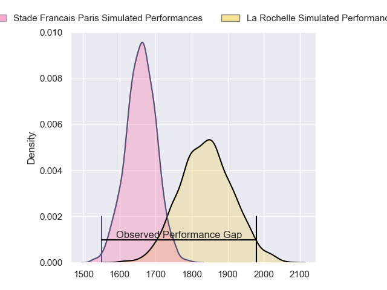
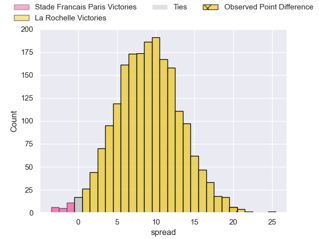
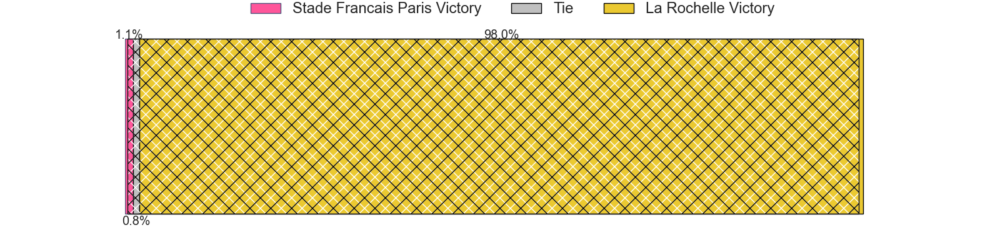
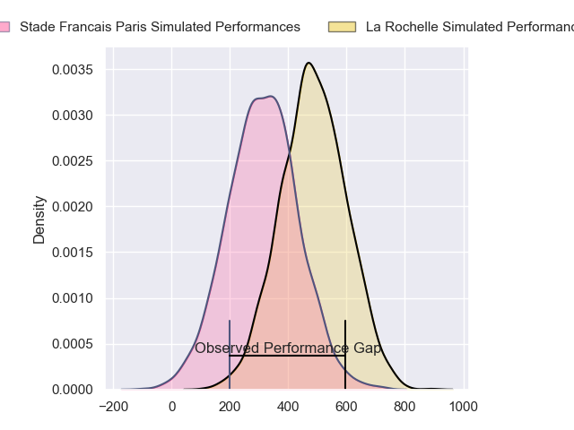
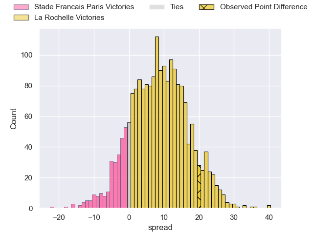
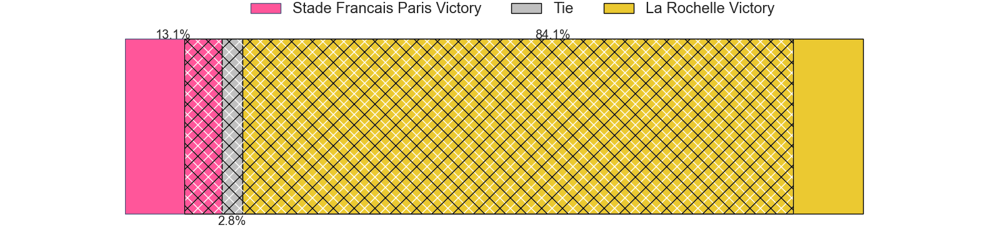

---  
layout: page  
title: Stade Francais Paris at La Rochelle; 3-23  
date: 2024-03-09 18:00:00 -0500  
categories: "Top 14 Orange 2023" match review  
---
# Stade Francais Paris at La Rochelle; 3-23

# Club Level Predictions

The first set of predictions treats a club as the smallest object, as the club develops its members, organizes a gameplan, and deploys its players as needed for each match. This club model has a prediction of 0.735, which translates to predicting La Rochelle to win by 8.9.

Our Over/Under is 42.5 - and combined with the spread above, we have a predicted scoreline of 17 to 26

Each club has a rating and a rating deviation (similar to a Glicko rating), and expected performances can be generated. This allows for simulated matches and spreads like the ones below.
## Projected Performances - Club Model

## Projected Spreads - Club Model

## Projected Results - Club Model

# Player Level Predictions - Version 2

Treating teams instead as an entity made up of the currently active players, I have ratings for each player in an altogether different system. These can be combined to form team ratings once teamsheets are announced, weighting starters a bit higher than the reserves. After the match is played, players can be weighted by their minutes on the field, allowing for an accurate measure of the team's composition. With these compiled team ratings, we can make predictions, measure inaccuracy, and update the individual player ratings.
## Prediction without Player Minutes: La Rochelle by 12.2

La Rochelle by 5.0 on a neutral pitch

## Projected Performances - Player Model

## Projected Spreads - Player Model

## Projected Results - Player Model

|   Away Minutes | Away Player          |   Away Percentile |   Number |   Home Percentile | Home Player        |   Home Minutes |
|---------------:|:---------------------|------------------:|---------:|------------------:|:-------------------|---------------:|
|             53 | Clement Castets      |             44.78 |        1 |             51.87 | Alexandre Kaddouri |             55 |
|             53 | Mickael Ivaldi       |             96.73 |        2 |             74.62 | Quentin Lespiaucq  |             55 |
|             62 | Paul Alo-Emile       |             88.99 |        3 |             88.06 | Joel Sclavi        |             64 |
|             53 | Pierre-Henri Azagoh  |             71.75 |        4 |             90.14 | Thomas Lavault     |             78 |
|             53 | JJ van der Mescht    |             85.94 |        5 |             61.66 | Remi Picquette     |             57 |
|             80 | Tanginoa Halaifonua  |             31.57 |        6 |             35.85 | Judicael Cancoriet |             69 |
|             80 | Romain Briatte       |             73.39 |        7 |             97.63 | Levani Botia       |             46 |
|             65 | Mathieu Hirigoyen    |              8.76 |        8 |             70.32 | Yoan Tanga         |             80 |
|             41 | Jules Gimbert        |             13.07 |        9 |             98.34 | Tawera Kerr-Barlow |             19 |
|             80 | Joris Segonds        |             75.44 |       10 |             59.4  | Antoine Hastoy     |             69 |
|             41 | Sekou Macalou        |             94.97 |       11 |             98.91 | Dillyn Leyds       |             80 |
|             80 | Pierre Boudehent     |             45.94 |       12 |             81.45 | Jules Favre        |             67 |
|             80 | Jeremy Ward          |             89.33 |       13 |             71.03 | Ulupano Seuteni    |             80 |
|             80 | Joe Marchant         |             90.37 |       14 |             96.72 | Jack Nowell        |             80 |
|             71 | Charles Laloi        |             33.98 |       15 |             99.28 | Brice Dulin        |             80 |
|             27 | Lucas Peyresblanques |             28.27 |       16 |             88.85 | Tolu Latu          |             25 |
|             27 | Moses Alo-Emile      |             73.51 |       17 |             37.41 | Louis Penverne     |             25 |
|             27 | Paul Gabrillagues    |             51.2  |       18 |             80.89 | Ultan Dillane      |             25 |
|             27 | Baptiste Pesenti     |             84.38 |       19 |             44.76 | Matthias Haddad    |             11 |
|             39 | Rory Kockott         |             98.96 |       20 |            nan    | Oscar Jegou        |             34 |
|             15 | Ryan Chapuis         |              6.31 |       21 |             79.21 | Thomas Berjon      |             61 |
|             39 | Zack Henry           |             84.96 |       22 |             50.3  | Ihaia West         |             24 |
|             27 | Giorgi Melikidze     |             93.84 |       23 |             53.36 | Alexandre Kuntelia |             16 |

