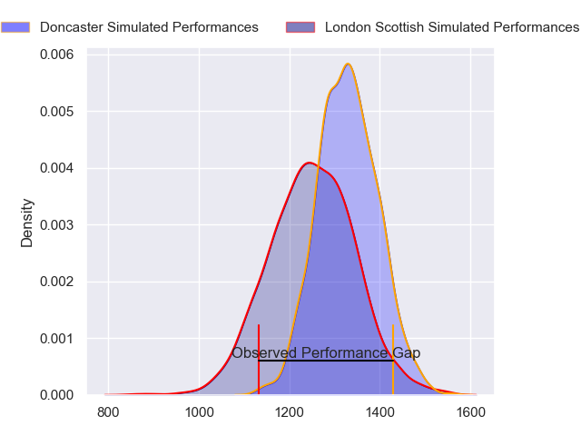
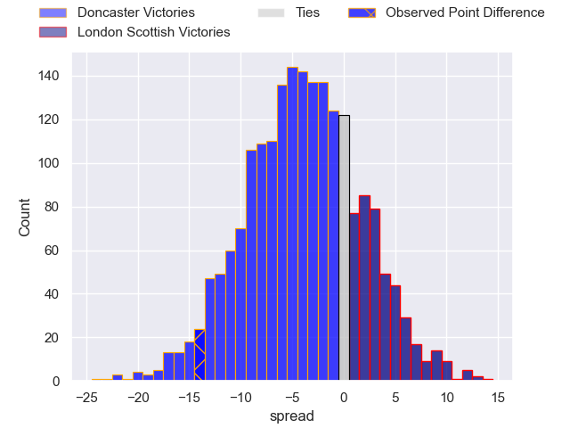
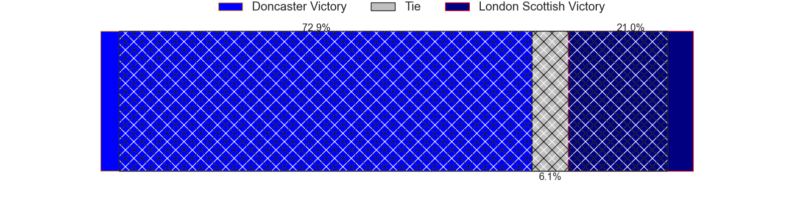
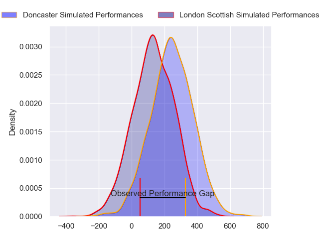
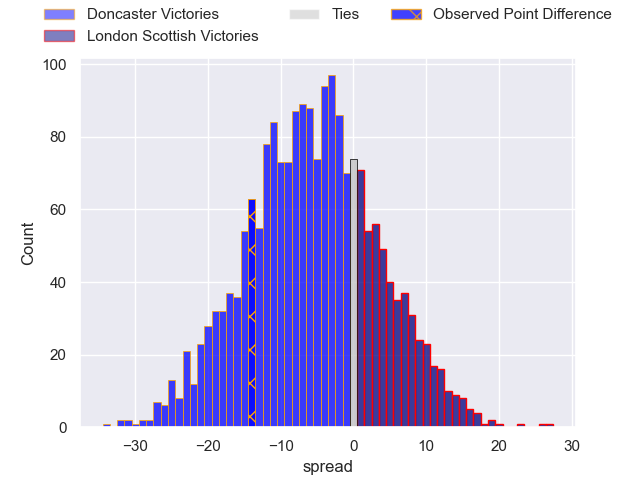
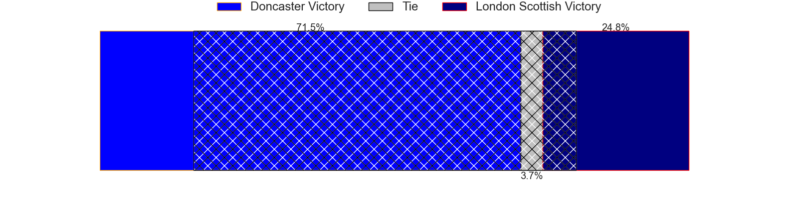

---  
layout: page  
title: Doncaster at London Scottish; 34-20  
date: 2024-03-09 18:00:00 -0500  
categories: "RFU Championship 2023" match review  
---
# Doncaster at London Scottish; 34-20

# Club Level Predictions

The first set of predictions treats a club as the smallest object, as the club develops its members, organizes a gameplan, and deploys its players as needed for each match. This club model has a prediction of 0.386, which translates to predicting Doncaster to win by 4.1.

Our Over/Under is 52.5 - and combined with the spread above, we have a predicted scoreline of 28 to 24

Each club has a rating and a rating deviation (similar to a Glicko rating), and expected performances can be generated. This allows for simulated matches and spreads like the ones below.
## Projected Performances - Club Model

## Projected Spreads - Club Model

## Projected Results - Club Model

# Player Level Predictions - Version 2

Treating teams instead as an entity made up of the currently active players, I have ratings for each player in an altogether different system. These can be combined to form team ratings once teamsheets are announced, weighting starters a bit higher than the reserves. After the match is played, players can be weighted by their minutes on the field, allowing for an accurate measure of the team's composition. With these compiled team ratings, we can make predictions, measure inaccuracy, and update the individual player ratings.
## Prediction without Player Minutes: Doncaster by 4.6

Doncaster by 7.8 on a neutral pitch

## Projected Performances - Player Model

## Projected Spreads - Player Model

## Projected Results - Player Model

|   Away Minutes | Away Player              |   Away Percentile |   Number |   Home Percentile | Home Player          |   Home Minutes |
|---------------:|:-------------------------|------------------:|---------:|------------------:|:---------------------|---------------:|
|             73 | Conor Davidson           |             76.87 |        1 |             32.28 | Tom Osborne          |             65 |
|             39 | Tom Doughty              |             22.12 |        2 |             59.23 | Jack Musk            |             59 |
|             80 | Lewis Thiede             |             98.6  |        3 |             41.7  | Caleb Ashworth       |             24 |
|             17 | Charlie Beckett          |             70.79 |        4 |             22.6  | Matt Wilkinson       |             65 |
|             80 | Ben Murphy               |             70.91 |        5 |             59.01 | Harry Browne         |             80 |
|             65 | Fyn Brown                |             39.57 |        6 |             37.38 | Bailey Ransom        |             80 |
|             65 | Rhys Tait                |             55.24 |        7 |              9.02 | Jack Ingall          |             64 |
|             80 | Jack Digby               |             65.21 |        8 |             25.3  | Tom Marshall         |             80 |
|             80 | Alex Dolly               |             84.85 |        9 |              9.54 | Daniel Nutton        |             64 |
|             80 | Billy McBryde            |             87.22 |       10 |             50.63 | Alexander Lloyd-Seed |             80 |
|             80 | Jack Metcalf             |             24.51 |       11 |              1.2  | Noah Ferdinand       |             80 |
|             80 | Russell Bennett          |             92.36 |       12 |             44.24 | Bryn Bradley         |             80 |
|             73 | Sam Bedlow               |             78.79 |       13 |             27.24 | Luke Mehson          |             80 |
|             80 | George Simpson           |             38.4  |       14 |             36.32 | Conor Byrne          |             64 |
|             80 | Westleigh Alleyne Holden |             60.72 |       15 |             76.63 | Will Brown           |             70 |
|             63 | Evan Mintern             |             85.46 |       16 |             43.75 | Rhys Charalambous    |             56 |
|             41 | George Roberts           |             36.35 |       17 |             12.31 | Austin Wallis        |             21 |
|             15 | Ollie Fox                |              4.36 |       18 |             10.12 | Edward Coulson       |             16 |
|             15 | Archie Smeaton           |             53.66 |       19 |             17.43 | Jonny Law            |             16 |
|              7 | Harrison Courtney        |             66.88 |       20 |             19.39 | Lewis Barrett        |             16 |
|              7 | Corrie Barrett           |             32.74 |       21 |             65.39 | Will Prior           |             15 |
|            nan | nan                      |            nan    |       22 |             19.73 | Ioan Rhys Davies     |             15 |
|            nan | nan                      |            nan    |       23 |            nan    | Elliott Haydon       |             10 |

