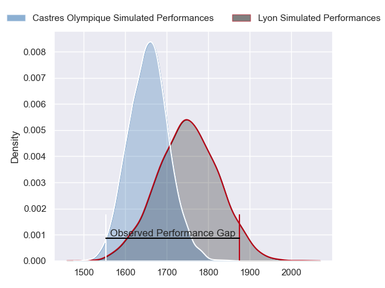
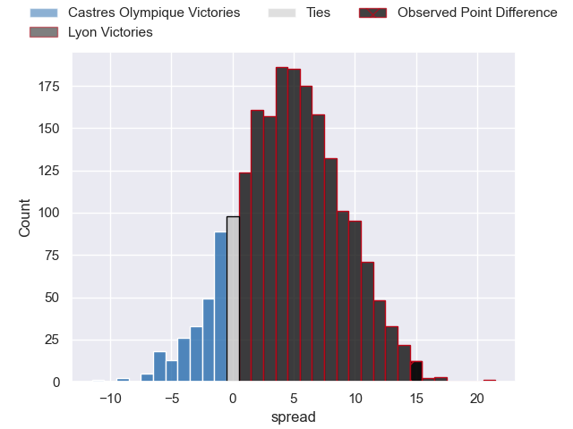
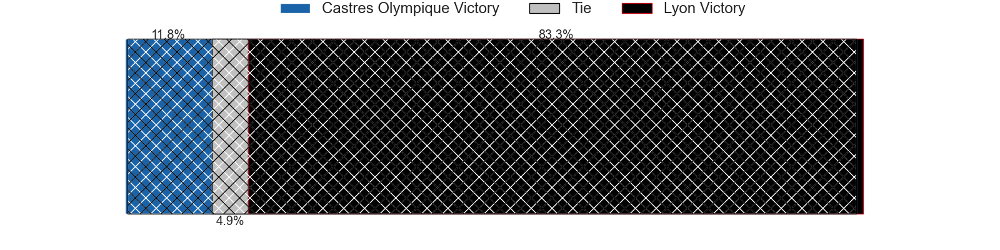
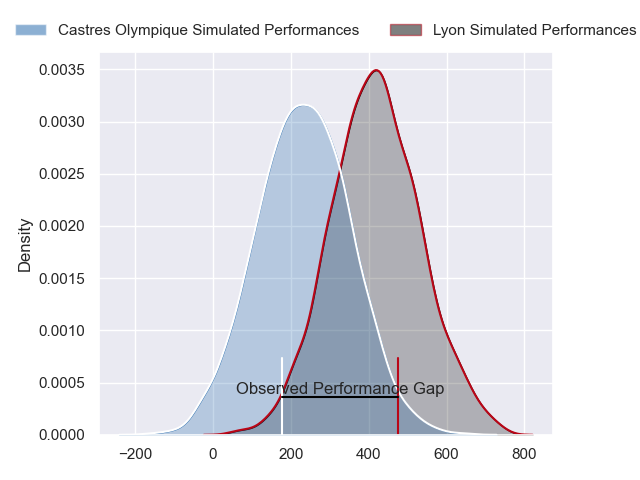
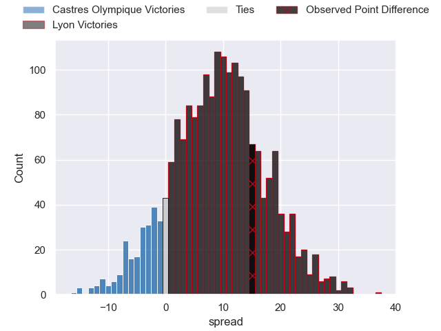
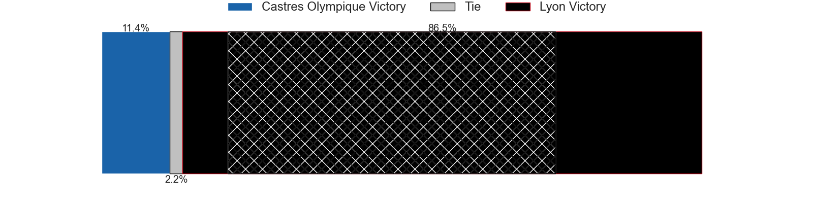

---  
layout: page  
title: Castres Olympique at Lyon; 19-34  
date: 2024-03-09 18:00:00 -0500  
categories: "Top 14 Orange 2023" match review  
---
# Castres Olympique at Lyon; 19-34

# Club Level Predictions

The first set of predictions treats a club as the smallest object, as the club develops its members, organizes a gameplan, and deploys its players as needed for each match. This club model has a prediction of 0.63, which translates to predicting Lyon to win by 4.7.

Our Over/Under is 45.5 - and combined with the spread above, we have a predicted scoreline of 21 to 25

Each club has a rating and a rating deviation (similar to a Glicko rating), and expected performances can be generated. This allows for simulated matches and spreads like the ones below.
## Projected Performances - Club Model

## Projected Spreads - Club Model

## Projected Results - Club Model

# Player Level Predictions - Version 2

Treating teams instead as an entity made up of the currently active players, I have ratings for each player in an altogether different system. These can be combined to form team ratings once teamsheets are announced, weighting starters a bit higher than the reserves. After the match is played, players can be weighted by their minutes on the field, allowing for an accurate measure of the team's composition. With these compiled team ratings, we can make predictions, measure inaccuracy, and update the individual player ratings.
## Prediction without Player Minutes: Lyon by 10.3

Lyon by 2.8 on a neutral pitch

## Projected Performances - Player Model

## Projected Spreads - Player Model

## Projected Results - Player Model

|   Away Minutes | Away Player                |   Away Percentile |   Number |   Home Percentile | Home Player          |   Home Minutes |
|---------------:|:---------------------------|------------------:|---------:|------------------:|:---------------------|---------------:|
|             54 | Lois Guerois-Galisson      |             62.51 |        1 |             28.23 | Jerome Rey           |             60 |
|             54 | Gaetan Barlot              |             78.63 |        2 |             82.63 | Liam Coltman         |             60 |
|             54 | Levan Chilachava           |             81.58 |        3 |             60.49 | Feao Fotuaika        |             51 |
|             83 | Gauthier Maravat           |              5.84 |        4 |             79.38 | Felix Lambey         |             83 |
|             64 | Tom Staniforth             |             81.53 |        5 |             69.13 | Mickael Guillard     |             71 |
|             83 | Baptiste Delaporte         |             84.69 |        6 |             53.63 | Joel Kpoku           |             83 |
|             51 | Baptiste Cope              |             54.63 |        7 |             65.31 | Liam Allen           |             64 |
|             55 | Abraham Papali'i           |             54.85 |        8 |             93.2  | Jordan Taufua        |             72 |
|             67 | Santiago Arata             |             74.03 |        9 |             93.25 | Baptiste Couilloud   |             68 |
|             68 | Louis Le Brun              |             74.38 |       10 |             65.67 | Leo Berdeu           |             64 |
|             83 | Antoine Bouzerand          |             40.17 |       11 |             81.31 | Davit Niniashvili    |             83 |
|             83 | Adrea Cocagi               |             88.93 |       12 |             16.55 | Josiah Maraku        |             68 |
|             64 | Adrien Seguret             |             32.62 |       13 |             62.86 | Alfred Parisien      |             83 |
|             83 | Josaia Raisuqe             |             74.11 |       14 |             96.35 | Vincent Rattez       |             83 |
|             83 | Pierre Popelin             |             67.39 |       15 |             57.55 | Alexandre Tchaptchet |             83 |
|             29 | Loris Zarantonello         |             52.67 |       16 |             22.71 | Guillaume Marchand   |             23 |
|             29 | Quentin Walcker            |            nan    |       17 |             66.36 | Vivien Devisme       |             23 |
|             19 | Florent Vanverberghe       |             66.15 |       18 |             64.48 | Alban Roussel        |             23 |
|             32 | Mathieu Babillot           |             50.22 |       19 |             22.58 | Theo William         |             19 |
|             28 | Nick Champion de Crespigny |             47.91 |       20 |             63.39 | Joe Powell           |             15 |
|             16 | Jeremy Fernandez           |             31.9  |       21 |             82.34 | Paddy Jackson        |             19 |
|             34 | Vilimoni Botitu            |             62.38 |       22 |             67.38 | Kyle Godwin          |             15 |
|             29 | Henry Thomas               |             64.44 |       23 |            nan    | Valentin Simutoga    |             32 |

