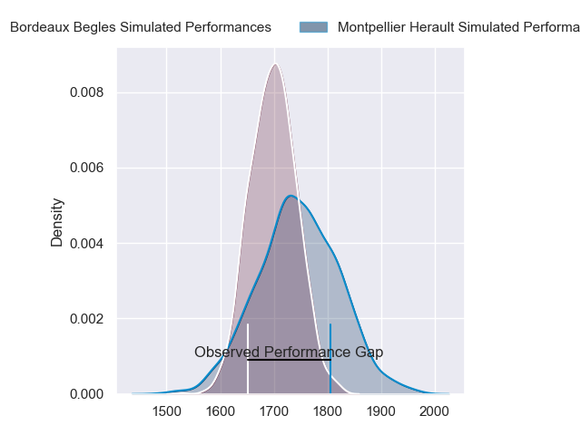
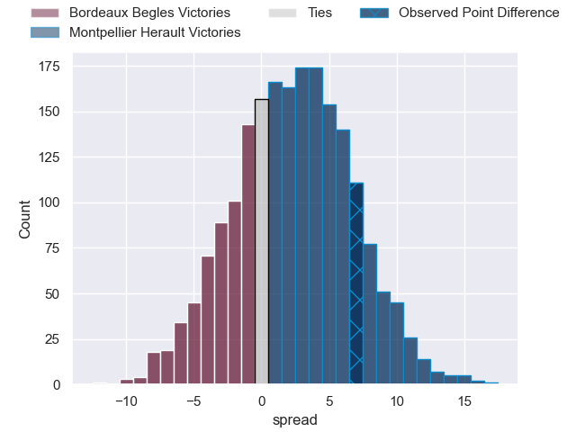
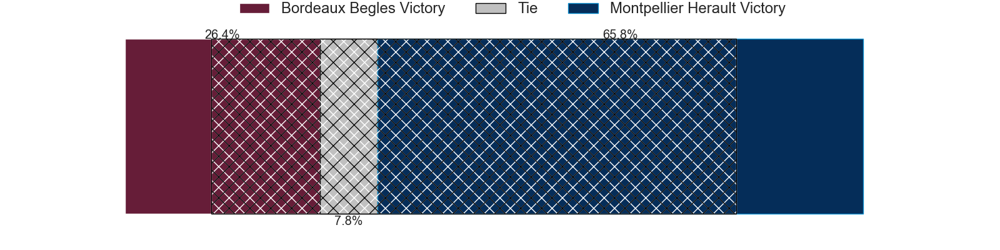
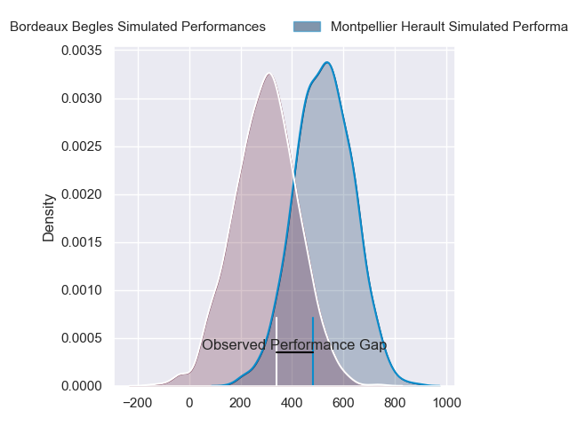
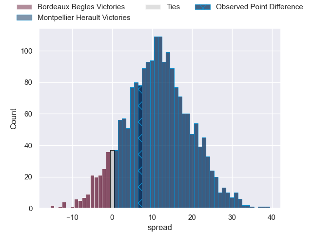
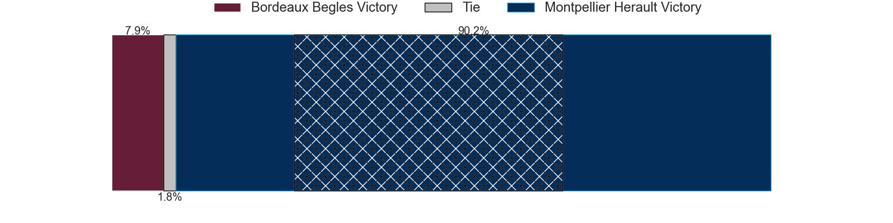

---  
layout: page  
title: Bordeaux Begles at Montpellier Herault; 3-10  
date: 2024-03-09 18:00:00 -0500  
categories: "Top 14 Orange 2023" match review  
---
# Bordeaux Begles at Montpellier Herault; 3-10

# Club Level Predictions

The first set of predictions treats a club as the smallest object, as the club develops its members, organizes a gameplan, and deploys its players as needed for each match. This club model has a prediction of 0.565, which translates to predicting Montpellier Herault to win by 2.3.

Our Over/Under is 49.5 - and combined with the spread above, we have a predicted scoreline of 24 to 26

Each club has a rating and a rating deviation (similar to a Glicko rating), and expected performances can be generated. This allows for simulated matches and spreads like the ones below.
## Projected Performances - Club Model

## Projected Spreads - Club Model

## Projected Results - Club Model

# Player Level Predictions - Version 2

Treating teams instead as an entity made up of the currently active players, I have ratings for each player in an altogether different system. These can be combined to form team ratings once teamsheets are announced, weighting starters a bit higher than the reserves. After the match is played, players can be weighted by their minutes on the field, allowing for an accurate measure of the team's composition. With these compiled team ratings, we can make predictions, measure inaccuracy, and update the individual player ratings.
## Prediction without Player Minutes: Montpellier Herault by 14.2

Montpellier Herault by 6.8 on a neutral pitch

## Projected Performances - Player Model

## Projected Spreads - Player Model

## Projected Results - Player Model

|   Away Minutes | Away Player               |   Away Percentile |   Number |   Home Percentile | Home Player                 |   Home Minutes |
|---------------:|:--------------------------|------------------:|---------:|------------------:|:----------------------------|---------------:|
|             75 | Ugo Boniface              |             90.95 |        1 |             12.59 | Baptiste Erdocio            |             49 |
|             56 | Romain Latterrade         |             40.96 |        2 |             85.77 | Brandon Paenga-Amosa        |             49 |
|             40 | Toma'akino Taufa          |             38.81 |        3 |             78.36 | Luka Japaridze              |             49 |
|             56 | Guido Petti               |             89.06 |        4 |             94.71 | Yacouba Camara              |             54 |
|             71 | Adam Coleman              |             98.44 |        5 |             70.55 | Paul Willemse               |             66 |
|             77 | Marko Gazzotti            |             35.17 |        6 |             89.85 | Nicolaas Janse van Rensburg |             80 |
|             44 | Antoine Miquel            |             72.38 |        7 |             58.74 | Lenni Nouchi                |             63 |
|             80 | Tevita Tatafu             |             83.94 |        8 |             89.78 | Marco Tauleigne             |             41 |
|             63 | Yann Lesgourgues          |              7.26 |        9 |             94.4  | Cobus Reinach               |             62 |
|             61 | Mateo Garcia              |             33.33 |       10 |             71.18 | Louis Carbonel              |             80 |
|             80 | Mael Moustin              |             28.01 |       11 |             84.03 | Masivesi Dakuwaqa           |             80 |
|             80 | Ben Tapuai                |             52.48 |       12 |             81.33 | Jan Serfontein              |             72 |
|             80 | Tani Vili                 |             48.48 |       13 |             65.45 | Arthur Vincent              |             69 |
|             80 | Romain Buros              |             97.7  |       14 |             99.45 | Ben Lam                     |             80 |
|             80 | Nans Ducuing              |             84.1  |       15 |             81.2  | Anthony Bouthier            |             80 |
|             24 | Clement Maynadier         |             93.08 |       16 |             95.38 | Christopher Tolofua         |             31 |
|              5 | Yahnis El Maslouhi        |            nan    |       17 |             76.68 | Enzo Forletta               |             31 |
|             24 | Thomas Jolmes             |            nan    |       18 |             83.77 | Bastien Chalureau           |             26 |
|              9 | Kane Douglas              |             76.68 |       19 |             69.71 | Tyler Duguid                |             31 |
|             39 | Bastien Vergnes Taillefer |             71.7  |       20 |             75.67 | Sam Simmonds                |             39 |
|             17 | Paul Abadie               |              2.28 |       21 |             67.43 | Leo Coly                    |             18 |
|             19 | Zack Holmes               |             73.09 |       22 |             68.24 | Auguste Cadot               |             19 |
|             40 | Ben Tameifuna             |             97.29 |       23 |             58.12 | Lasha Macharashvili         |             31 |

