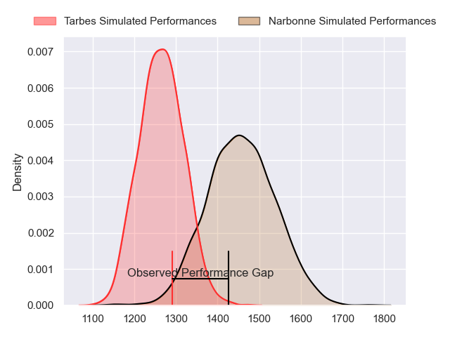
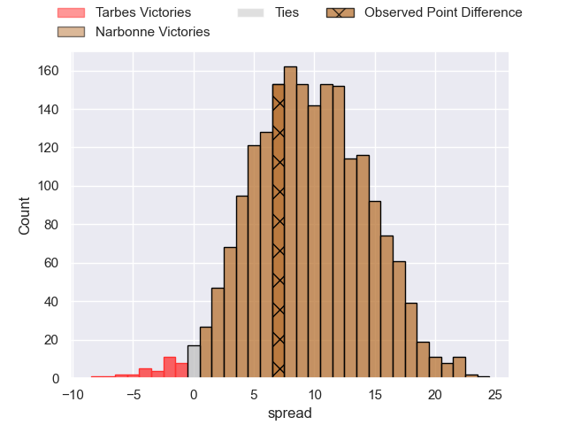
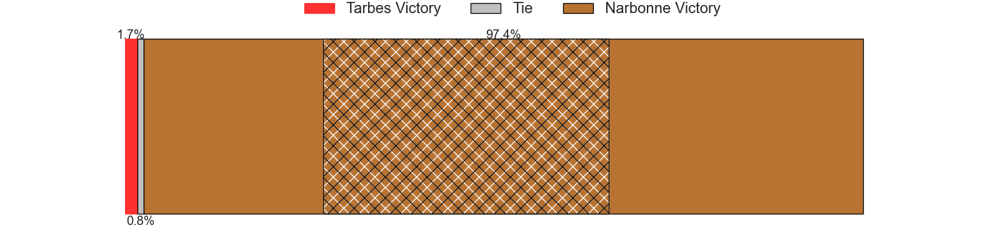
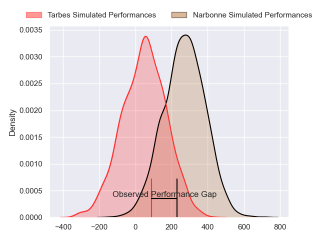
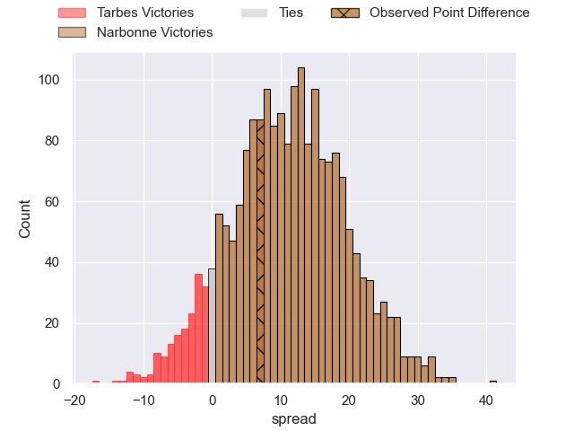
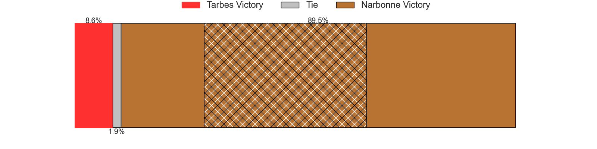

---  
layout: page  
title: Tarbes at Narbonne; 13-20  
date: 2024-03-09 18:00:00 -0500  
categories: "Nationale 2023" match review  
---
# Tarbes at Narbonne; 13-20

# Club Level Predictions

The first set of predictions treats a club as the smallest object, as the club develops its members, organizes a gameplan, and deploys its players as needed for each match. This club model has a prediction of 0.742, which translates to predicting Narbonne to win by 9.3.

Our Over/Under is 41.5 - and combined with the spread above, we have a predicted scoreline of 16 to 25

Each club has a rating and a rating deviation (similar to a Glicko rating), and expected performances can be generated. This allows for simulated matches and spreads like the ones below.
## Projected Performances - Club Model

## Projected Spreads - Club Model

## Projected Results - Club Model

# Player Level Predictions - Version 2

Treating teams instead as an entity made up of the currently active players, I have ratings for each player in an altogether different system. These can be combined to form team ratings once teamsheets are announced, weighting starters a bit higher than the reserves. After the match is played, players can be weighted by their minutes on the field, allowing for an accurate measure of the team's composition. With these compiled team ratings, we can make predictions, measure inaccuracy, and update the individual player ratings.
## Prediction without Player Minutes: Narbonne by 12.4

Narbonne by 4.5 on a neutral pitch

## Projected Performances - Player Model

## Projected Spreads - Player Model

## Projected Results - Player Model

|   Away Minutes | Away Player            |   Away Percentile |   Number |   Home Percentile | Home Player            |   Home Minutes |
|---------------:|:-----------------------|------------------:|---------:|------------------:|:-----------------------|---------------:|
|             47 | Alexandre Combier      |             14.55 |        1 |             53.08 | Sylvain Abadie         |             30 |
|             47 | Enzo Mondon            |             57.12 |        2 |             24.62 | Clément Esteriola      |             54 |
|             47 | Alexandre Duny         |             55.6  |        3 |             66.32 | Jamie Hagan            |             30 |
|             80 | Léo Estaque            |             35.94 |        4 |             72.6  | Marius Antonescu       |             80 |
|             42 | Jone Trevor Seuvou     |             15.75 |        5 |             31.85 | Dennis Visser          |             80 |
|             65 | Léo Saint-Guilhem      |             79.14 |        6 |             54.34 | Thibault Clauzade      |             62 |
|             80 | Jean Guicherd          |             73.73 |        7 |             52.54 | Baptiste Abescat-Leroy |             52 |
|             42 | Julien Cantan          |             23.6  |        8 |             29.93 | Charles Malet          |             80 |
|             69 | Thibaut Dulucq         |             52.07 |        9 |             16.6  | Pierrick Nova          |             62 |
|             80 | Anthony Fuertes        |             10.28 |       10 |              4.01 | Gilles Bosch           |             80 |
|             80 | Jone Tuva              |              3.28 |       11 |             73.63 | Clément Clavières      |             80 |
|             80 | Clement Latorre        |             55.15 |       12 |             98.91 | Peter Betham           |             60 |
|             80 | Savenaca Rawaca        |             74.18 |       13 |             41.94 | Pierre Nueno           |             80 |
|             65 | Thibaut Trotta         |             23.63 |       14 |             31.62 | Pierre-Hugo Ducom      |             80 |
|             80 | Yon Camou              |             73.73 |       15 |             55.42 | Paul Auradou           |             80 |
|             38 | Baptiste Peytavi       |             73.92 |       16 |             62.97 | Théo Castinel          |             50 |
|             38 | Filipe Manu            |             13.87 |       17 |             57.09 | Levi Tikoipau          |             50 |
|             33 | Johan Mees Erasmus     |             43.47 |       18 |             18.15 | Leva Fifita            |             28 |
|             33 | Vincent Dolier         |             60    |       19 |             88.65 | Mehdi Boundjema        |             26 |
|             33 | Aleksi Tchitchiashvili |             15.58 |       20 |             38.42 | Théo Mias              |             20 |
|             15 | Jon Abadie             |             50.85 |       21 |             95.85 | Josh Valentine         |             18 |
|             15 | Mathieu Berbizier      |             33.58 |       22 |             55.36 | Arthur Christienne     |             18 |
|             11 | Mickael Thébault       |             70.33 |       23 |            nan    | nan                    |            nan |

