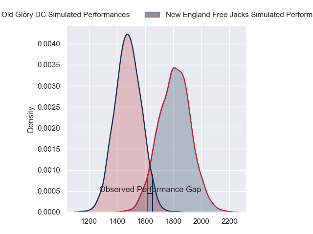
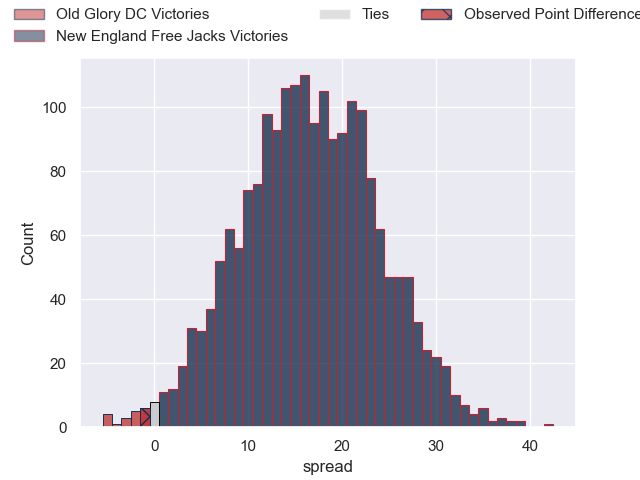
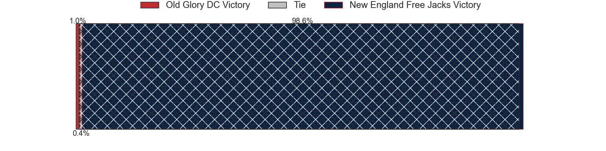

---  
layout: page  
title: Old Glory DC at New England Free Jacks; 35-34  
date: 2024-03-09 18:00:00 -0500  
categories: "Major League Rugby 2024" match review  
---
# Old Glory DC at New England Free Jacks; 35-34

# Club Level Predictions

The first set of predictions treats a club as the smallest object, as the club develops its members, organizes a gameplan, and deploys its players as needed for each match. This club model has a prediction of 0.862, which translates to predicting New England Free Jacks to win by 16.6.

Our Over/Under is 47.5 - and combined with the spread above, we have a predicted scoreline of 16 to 32

Each club has a rating and a rating deviation (similar to a Glicko rating), and expected performances can be generated. This allows for simulated matches and spreads like the ones below.
## Projected Performances - Club Model

## Projected Spreads - Club Model

## Projected Results - Club Model

