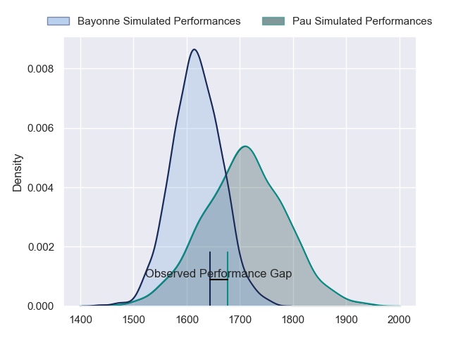
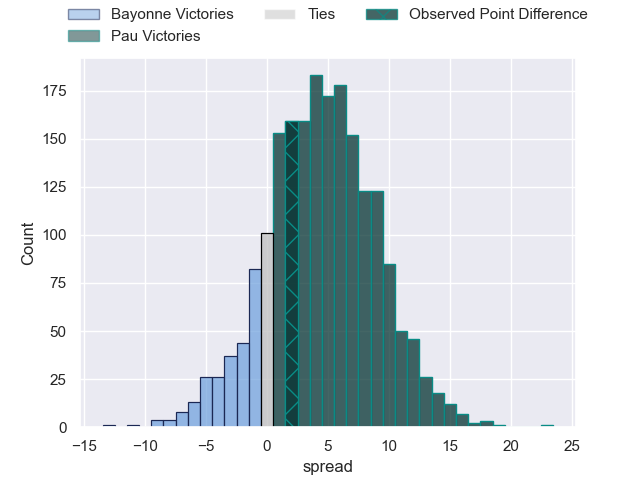
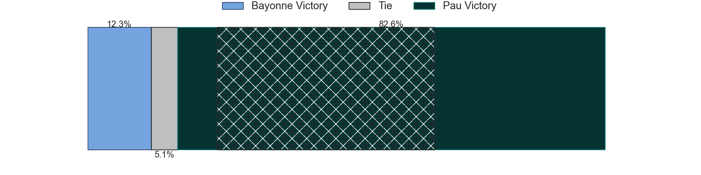
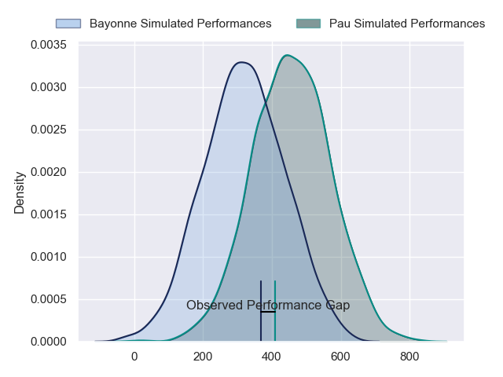
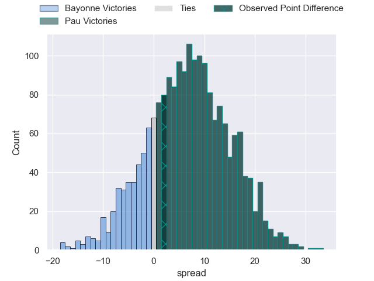
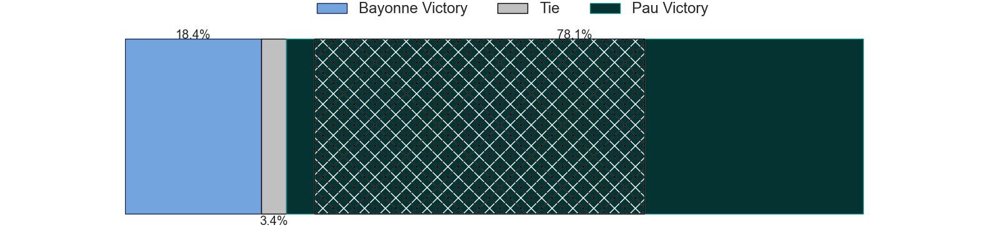

---  
layout: page  
title: Bayonne at Pau; 40-42  
date: 2024-03-09 18:00:00 -0500  
categories: "Top 14 Orange 2023" match review  
---
# Bayonne at Pau; 40-42

# Club Level Predictions

The first set of predictions treats a club as the smallest object, as the club develops its members, organizes a gameplan, and deploys its players as needed for each match. This club model has a prediction of 0.628, which translates to predicting Pau to win by 4.6.

Our Over/Under is 51.5 - and combined with the spread above, we have a predicted scoreline of 23 to 28

Each club has a rating and a rating deviation (similar to a Glicko rating), and expected performances can be generated. This allows for simulated matches and spreads like the ones below.
## Projected Performances - Club Model

## Projected Spreads - Club Model

## Projected Results - Club Model

# Player Level Predictions - Version 2

Treating teams instead as an entity made up of the currently active players, I have ratings for each player in an altogether different system. These can be combined to form team ratings once teamsheets are announced, weighting starters a bit higher than the reserves. After the match is played, players can be weighted by their minutes on the field, allowing for an accurate measure of the team's composition. With these compiled team ratings, we can make predictions, measure inaccuracy, and update the individual player ratings.
## Prediction without Player Minutes: Pau by 8.6

Pau by 0.5 on a neutral pitch

## Projected Performances - Player Model

## Projected Spreads - Player Model

## Projected Results - Player Model

|   Away Minutes | Away Player           |   Away Percentile |   Number |   Home Percentile | Home Player          |   Home Minutes |
|---------------:|:----------------------|------------------:|---------:|------------------:|:---------------------|---------------:|
|             45 | Swan Cormenier        |             58.4  |        1 |             32.93 | Simon-Pierre Chauvac |             61 |
|             61 | Vincent Giudicelli    |             19.04 |        2 |             13.27 | Lucas Rey            |             49 |
|             54 | Tevita Tatafu         |             42.54 |        3 |             83.21 | Siate Tokolahi       |             61 |
|             45 | Denis Marchois        |             97.24 |        4 |             60.58 | Hugo Auradou         |             61 |
|             45 | Thomas Ceyte          |             59.98 |        5 |             99.4  | Samuel Whitelock     |             54 |
|             83 | Remi Bourdeau         |             95.6  |        6 |             98.76 | Luke Whitelock       |             83 |
|             83 | Arthur Iturria        |             90.53 |        7 |             63.25 | Reece Hewat          |             54 |
|             83 | Uzair Cassiem         |             84.18 |        8 |             51.34 | Beka Gorgadze        |             83 |
|             59 | Maxime Machenaud      |             93.98 |        9 |             86.72 | Thibault Daubagna    |             61 |
|             83 | Camille Lopez         |             95.74 |       10 |             83.46 | Joe Simmonds         |             83 |
|             62 | Remy Baget            |             90.81 |       11 |              5.36 | Samuel Ezeala        |             56 |
|             30 | Guillaume Martocq     |             43.88 |       12 |             94.06 | Tumua Manu           |             83 |
|             83 | Arnaud Erbinartegaray |             54.79 |       13 |             32.24 | Emilien Gailleton    |             83 |
|             83 | Mateo Carreras        |             73.74 |       14 |             42.12 | Theo Attissogbe      |             83 |
|             83 | Cheikh Tiberghien     |             28.67 |       15 |             77.83 | Jack Maddocks        |             83 |
|             22 | Thomas Acquier        |             85.19 |       16 |             55.19 | Youri Delhommel      |             34 |
|             38 | Matis Perchaud        |             61.57 |       17 |             47.57 | Siegfried Fisi'ihoi  |             22 |
|             38 | Konstantin Mikautadze |              5.29 |       18 |             19.71 | Guillaume Ducat      |             22 |
|             38 | Baptiste Heguy        |             92.33 |       19 |             70.31 | Lekima Tagitagivalu  |             29 |
|             24 | Gela Aprasidze        |             60.58 |       20 |             52.55 | Sacha Zegueur        |             29 |
|             53 | Yan Lestrade          |             91.39 |       21 |             98.55 | Dan Robson           |             22 |
|             21 | Reece Hodge           |             82.18 |       22 |             57.89 | Axel Desperes        |             27 |
|             29 | Pieter Scholtz        |              3.54 |       23 |              8.68 | Nicolas Corato       |             22 |

