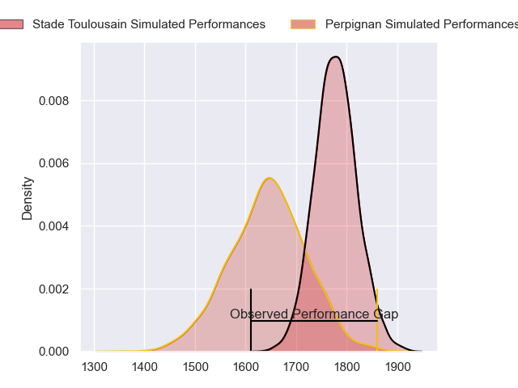
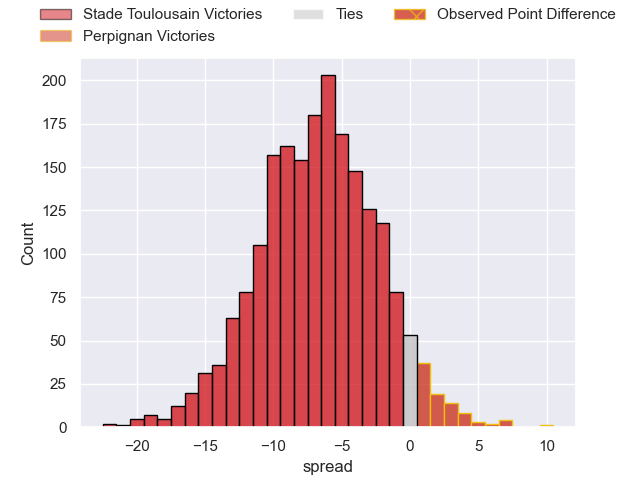
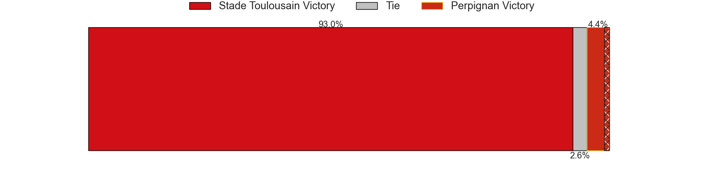
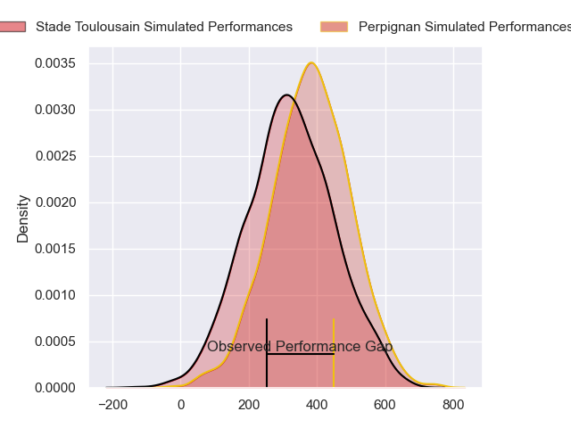
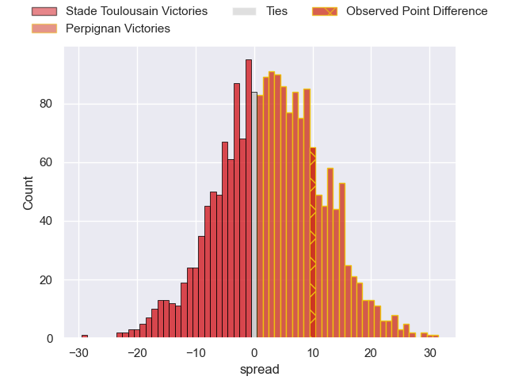
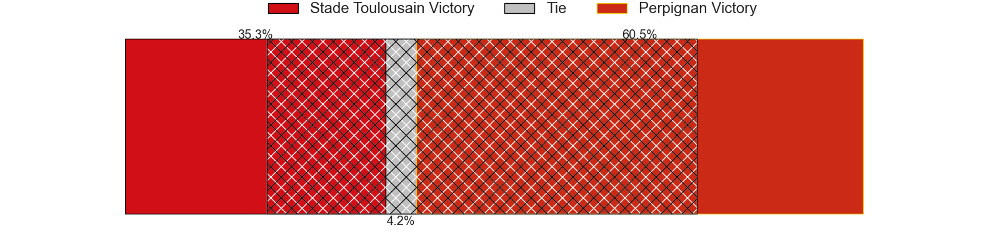

---  
layout: page  
title: Stade Toulousain at Perpignan; 17-27  
date: 2024-03-09 18:00:00 -0500  
categories: "Top 14 Orange 2023" match review  
---
# Stade Toulousain at Perpignan; 17-27

# Club Level Predictions

The first set of predictions treats a club as the smallest object, as the club develops its members, organizes a gameplan, and deploys its players as needed for each match. This club model has a prediction of 0.313, which translates to predicting Stade Toulousain to win by 6.9.

Our Over/Under is 49.5 - and combined with the spread above, we have a predicted scoreline of 28 to 21

Each club has a rating and a rating deviation (similar to a Glicko rating), and expected performances can be generated. This allows for simulated matches and spreads like the ones below.
## Projected Performances - Club Model

## Projected Spreads - Club Model

## Projected Results - Club Model

# Player Level Predictions - Version 2

Treating teams instead as an entity made up of the currently active players, I have ratings for each player in an altogether different system. These can be combined to form team ratings once teamsheets are announced, weighting starters a bit higher than the reserves. After the match is played, players can be weighted by their minutes on the field, allowing for an accurate measure of the team's composition. With these compiled team ratings, we can make predictions, measure inaccuracy, and update the individual player ratings.
## Prediction without Player Minutes: Perpignan by 4.8

Stade Toulousain by 4.0 on a neutral pitch

## Projected Performances - Player Model

## Projected Spreads - Player Model

## Projected Results - Player Model

|   Away Minutes | Away Player         |   Away Percentile |   Number |   Home Percentile | Home Player         |   Home Minutes |
|---------------:|:--------------------|------------------:|---------:|------------------:|:--------------------|---------------:|
|             50 | Marco Trauth        |             38.25 |        1 |              2.61 | Giorgi Tetrashvili  |             56 |
|             71 | Guillaume Cramont   |             78.27 |        2 |             89.23 | Seilala Lam         |             62 |
|             71 | Joel Merkler        |             63.25 |        3 |             55.97 | Nemo Roelofse       |             76 |
|             83 | Joshua Brennan      |             72.84 |        4 |             73.2  | Jacobus van Tonder  |             27 |
|             56 | Piula Fa'asalele    |             61.78 |        5 |             50    | Mathieu Tanguy      |             60 |
|             71 | Leo Banos           |             69.45 |        6 |             92.67 | Patrick Sobela      |             53 |
|             83 | Jack Willis         |             93.57 |        7 |             74.75 | Alan Brazo          |             83 |
|             71 | Mathis Castro       |             58.64 |        8 |             79.32 | Joaquin Oviedo      |             83 |
|             83 | Paul Graou          |             59.13 |        9 |             84.02 | Tom Ecochard        |             53 |
|             83 | Juan Cruz Mallia    |             96.99 |       10 |             88.47 | Jake McIntyre       |             83 |
|             83 | Arthur Retiere      |             94.53 |       11 |             66.41 | Lucas Dubois        |             83 |
|             83 | Pita Ahki           |             54.3  |       12 |             55.39 | Afusipa Taumoepeau  |             83 |
|             83 | Paul Costes         |             53.82 |       13 |             12.61 | Alivereti Duguivalu |             76 |
|              8 | Setareki Bituniyata |             73.52 |       14 |             70.9  | Tavite Veredamu     |             83 |
|             66 | Kalvin Gourgues     |             51.81 |       15 |             80    | Tommaso Allan       |             83 |
|             12 | Malachi Hawkes      |            nan    |       16 |             56.73 | Ignacio Ruiz        |             21 |
|             33 | Rodrigue Neti       |             45.34 |       17 |             44.68 | Sacha Lotrian       |             27 |
|             27 | Clement Verge       |            nan    |       18 |             91.11 | Marvin Orie         |             56 |
|             12 | Clement Sentubery   |            nan    |       19 |              1.68 | Shahn Eru           |             23 |
|             12 | Leo Labarthe        |            nan    |       20 |             12.9  | Lucas Velarte       |             30 |
|             17 | Baptiste Germain    |              5.81 |       21 |              6.64 | Sadek Deghmache     |             30 |
|             75 | Lucas Tauzin        |             78.34 |       22 |             28.73 | Apisai Naqalevu     |              7 |
|             12 | Paul Mallez         |            nan    |       23 |            nan    | Akato Fakatika      |              7 |

