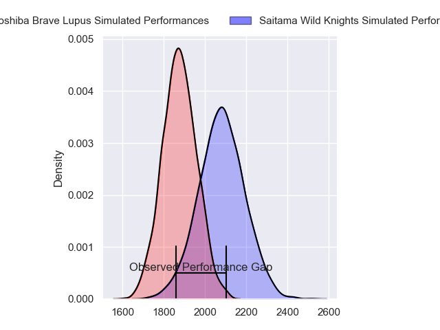
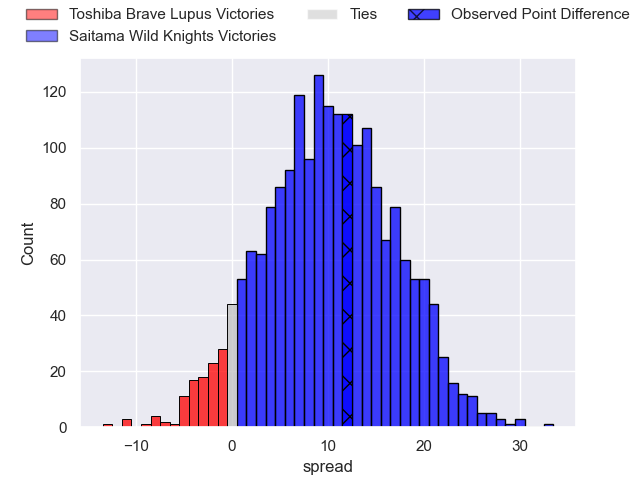
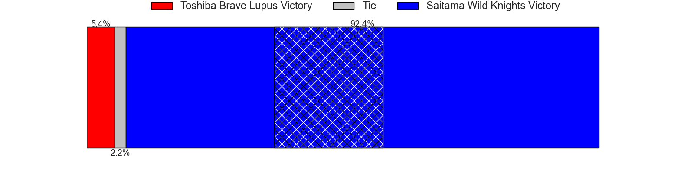
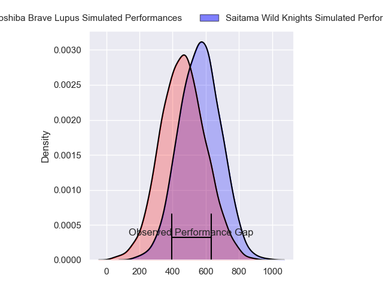
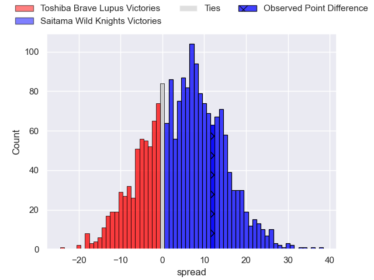
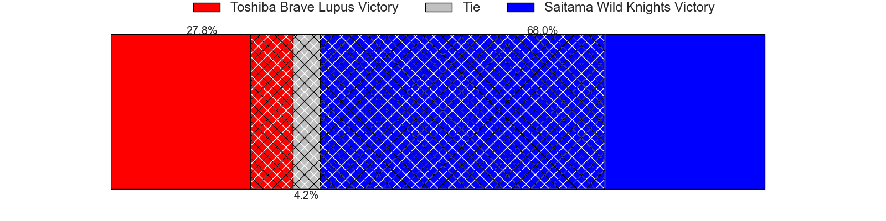

---  
layout: page  
title: Toshiba Brave Lupus at Saitama Wild Knights; 24-36  
date: 2024-03-09 18:00:00 -0500  
categories: "Japan Rugby League One 2023" match review  
---
# Toshiba Brave Lupus at Saitama Wild Knights; 24-36

# Club Level Predictions

The first set of predictions treats a club as the smallest object, as the club develops its members, organizes a gameplan, and deploys its players as needed for each match. This club model has a prediction of 0.756, which translates to predicting Saitama Wild Knights to win by 10.1.

Our Over/Under is 44.5 - and combined with the spread above, we have a predicted scoreline of 17 to 27

Each club has a rating and a rating deviation (similar to a Glicko rating), and expected performances can be generated. This allows for simulated matches and spreads like the ones below.
## Projected Performances - Club Model

## Projected Spreads - Club Model

## Projected Results - Club Model

# Player Level Predictions - Version 2

Treating teams instead as an entity made up of the currently active players, I have ratings for each player in an altogether different system. These can be combined to form team ratings once teamsheets are announced, weighting starters a bit higher than the reserves. After the match is played, players can be weighted by their minutes on the field, allowing for an accurate measure of the team's composition. With these compiled team ratings, we can make predictions, measure inaccuracy, and update the individual player ratings.
## Prediction without Player Minutes: Saitama Wild Knights by 8.0

Saitama Wild Knights by 4.6 on a neutral pitch

## Projected Performances - Player Model

## Projected Spreads - Player Model

## Projected Results - Player Model

|   Away Minutes | Away Player        |   Away Percentile |   Number |   Home Percentile | Home Player       |   Home Minutes |
|---------------:|:-------------------|------------------:|---------:|------------------:|:------------------|---------------:|
|             58 | Teruo Makabe       |             84.23 |        1 |             50.05 | Craig Millar      |             68 |
|             63 | Mamoru Harada      |             82.25 |        2 |             81.3  | Atsushi Sakate    |             51 |
|             52 | Yuta Kokaji        |             87.81 |        3 |             79.19 | Taiki Fujii       |             51 |
|             80 | Warner Dearns      |             91.18 |        4 |             36.71 | Liam Mitchell     |             80 |
|             55 | Samuela Anise      |             34.45 |        5 |             94.64 | Lood de Jager     |             68 |
|             80 | Shin Ito           |             77.09 |        6 |             98.68 | Ryota Hasegawa    |             25 |
|             80 | Yoshitaka Tokunaga |             28.52 |        7 |             96.81 | Lachlan Boshier   |             79 |
|             80 | Shannon Frizell    |             84.22 |        8 |             91.02 | Jack Cornelsen    |             80 |
|             80 | Yuhei Sugiyama     |             76.69 |        9 |             92.02 | Taiki Koyama      |             79 |
|             80 | Richie Mo'unga     |             99.75 |       10 |             97.26 | Rikiya Matsuda    |             80 |
|             80 | Futoshi Mori       |             44.36 |       11 |             59.51 | Tatsuhiro Tanji   |             68 |
|             71 | Michael Collins    |             94.64 |       12 |             98.21 | Damian de Allende |             80 |
|             80 | Seta Tamanivalu    |             96.07 |       13 |             97.38 | Dylan Riley       |             80 |
|             80 | Atsuki Kuwayama    |             77.87 |       14 |             93.88 | Keita Inagaki     |             80 |
|             80 | Takuro Matsunaga   |             88.97 |       15 |             60.43 | Kyohei Yamasawa   |             80 |
|             28 | Taufa Latu         |             50.69 |       16 |             85.9  | Itsuki Onishi     |             55 |
|             22 | Masataka Mikami    |            nan    |       17 |             93.32 | Shota Horie       |             29 |
|             25 | Asaeli Lausii      |            nan    |       18 |             95.69 | Asaeli Ai Valu    |             29 |
|             17 | Daigo Hashimoto    |             50.57 |       19 |             39.96 | Daniel Perez      |             12 |
|              9 | Taichi Mano        |             76.79 |       20 |             15.02 | Mark Abbott       |             12 |
|            nan | nan                |            nan    |       21 |             93.56 | Marika Koroibete  |             12 |
|            nan | nan                |            nan    |       22 |             57.38 | Vince Aso         |              1 |
|            nan | nan                |            nan    |       23 |             97.75 | Keisuke Uchida    |              1 |

