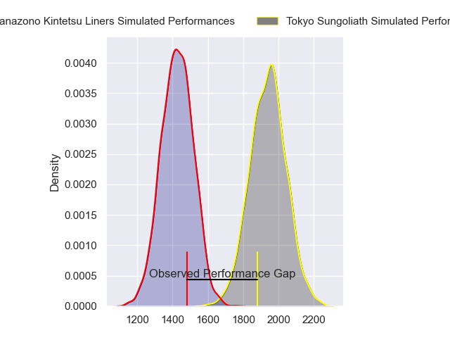
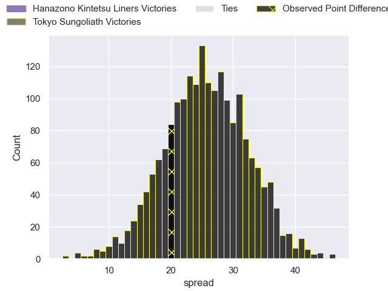
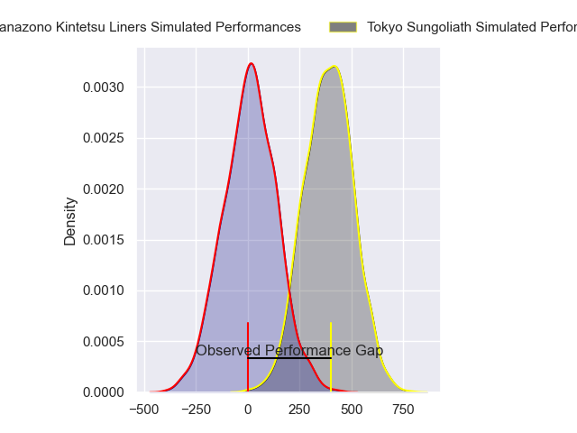
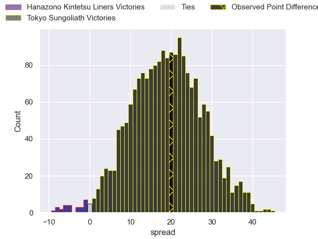
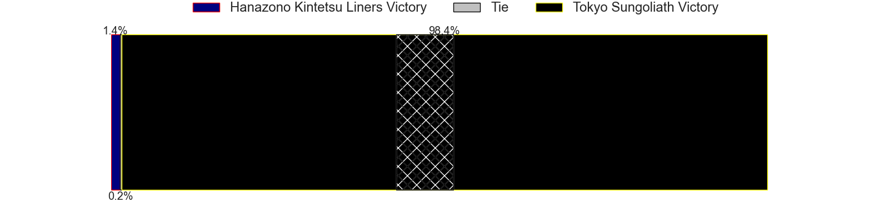

---  
layout: page  
title: Hanazono Kintetsu Liners at Tokyo Sungoliath; 14-34  
date: 2024-03-09 18:00:00 -0500  
categories: "Japan Rugby League One 2023" match review  
---
# Hanazono Kintetsu Liners at Tokyo Sungoliath; 14-34

# Club Level Predictions

The first set of predictions treats a club as the smallest object, as the club develops its members, organizes a gameplan, and deploys its players as needed for each match. This club model has a prediction of 0.946, which translates to predicting Tokyo Sungoliath to win by 25.8.

Our Over/Under is 69.5 - and combined with the spread above, we have a predicted scoreline of 22 to 48

Each club has a rating and a rating deviation (similar to a Glicko rating), and expected performances can be generated. This allows for simulated matches and spreads like the ones below.
## Projected Performances - Club Model

## Projected Spreads - Club Model

## Projected Results - Club Model

# Player Level Predictions - Version 2

Treating teams instead as an entity made up of the currently active players, I have ratings for each player in an altogether different system. These can be combined to form team ratings once teamsheets are announced, weighting starters a bit higher than the reserves. After the match is played, players can be weighted by their minutes on the field, allowing for an accurate measure of the team's composition. With these compiled team ratings, we can make predictions, measure inaccuracy, and update the individual player ratings.
## Prediction without Player Minutes: Tokyo Sungoliath by 19.6

Tokyo Sungoliath by 16.3 on a neutral pitch

## Projected Performances - Player Model

## Projected Spreads - Player Model

## Projected Results - Player Model

|   Away Minutes | Away Player       |   Away Percentile |   Number |   Home Percentile | Home Player       |   Home Minutes |
|---------------:|:------------------|------------------:|---------:|------------------:|:------------------|---------------:|
|             56 | Kenta Tanaka      |              7.28 |        1 |             91.04 | Yukio Morikawa    |             31 |
|             56 | Keiichi Kaneko    |              8.27 |        2 |             69.81 | Kosuke Horikoshi  |             61 |
|             40 | Kota Mitake       |             16.04 |        3 |             54.66 | Kan Nakano        |             56 |
|             80 | Patrick Tafa      |              6.37 |        4 |             20.19 | Trevor Hosea      |             70 |
|             40 | James Blackwell   |             21.39 |        5 |             98.68 | Harry Hockings    |             80 |
|             80 | Takahito Sugahara |              0.68 |        6 |             72.6  | Kanji Shimokawa   |             80 |
|             80 | Shohei Nonaka     |             17.7  |        7 |             48.93 | Ryuga Hashimoto   |             80 |
|             65 | Jose Seru         |             34.55 |        8 |             64.23 | Hendrik Tui       |             45 |
|             40 | Tomoya Nakamura   |             25.1  |        9 |             26.14 | Naoto Saito       |             49 |
|             80 | Quade Cooper      |             98.5  |       10 |             66.42 | Mikiya Takamoto   |             40 |
|             80 | Ryosuke Kataoka   |             62.8  |       11 |             72.98 | Taiga Ozaki       |             80 |
|             78 | Haruki Kanazawa   |             15.39 |       12 |             96.48 | Ryoto Nakamura    |             70 |
|             62 | Tom Hendrickson   |             59.39 |       13 |             40.12 | Isaiah Punivai    |             80 |
|             80 | Tomoya Kimura     |             12.25 |       14 |             91.58 | Seiya Ozaki       |             80 |
|             80 | Semisi Masirewa   |             19.04 |       15 |             94.7  | Kotaro Matsushima |             80 |
|             40 | Will Genia        |             90.25 |       16 |            nan    | William Hay       |             49 |
|             40 | Lata Tangimana    |              7.93 |       17 |             91.23 | Nicolas Sanchez   |             40 |
|             40 | Isamu Matsuoka    |              8.77 |       18 |             72.36 | Sione Lavemai     |             35 |
|             24 | Kazuma Matsuda    |             25.58 |       19 |             84.44 | Yutaka Nagare     |             31 |
|             24 | Shun Sasaki       |              4.57 |       20 |             50.65 | Kotaro Hosoki     |             24 |
|             18 | Vincent Sefo      |             45.19 |       21 |            nan    | Kienori Go        |             19 |
|             15 | Jed Brown         |             16.01 |       22 |             95.79 | Sam Jeffries      |             10 |
|              2 | Yoshizumi Takeda  |             40    |       23 |              5.58 | Joe Kamana        |             10 |

