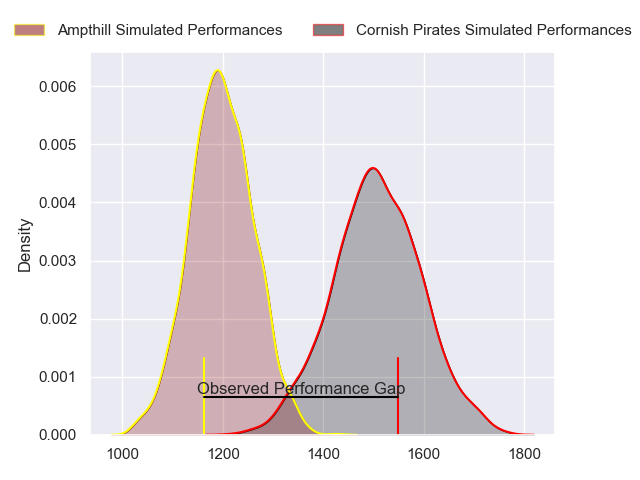
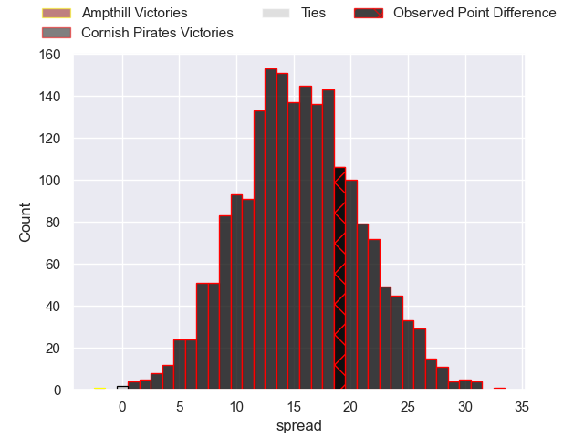
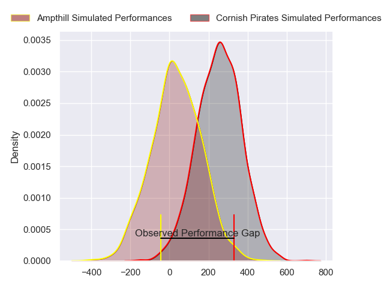
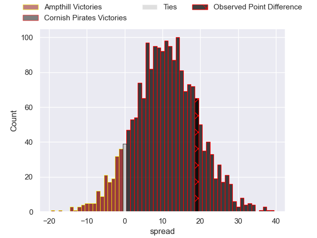

---  
layout: page  
title: Ampthill at Cornish Pirates; 14-33  
date: 2024-03-10 18:00:00 -0500  
categories: "RFU Championship 2023" match review  
---
# Ampthill at Cornish Pirates; 14-33

# Club Level Predictions

The first set of predictions treats a club as the smallest object, as the club develops its members, organizes a gameplan, and deploys its players as needed for each match. This club model has a prediction of 0.85, which translates to predicting Cornish Pirates to win by 15.4.

Our Over/Under is 42.5 - and combined with the spread above, we have a predicted scoreline of 13 to 29

Each club has a rating and a rating deviation (similar to a Glicko rating), and expected performances can be generated. This allows for simulated matches and spreads like the ones below.
## Projected Performances - Club Model

## Projected Spreads - Club Model

## Projected Results - Club Model

# Player Level Predictions - Version 2

Treating teams instead as an entity made up of the currently active players, I have ratings for each player in an altogether different system. These can be combined to form team ratings once teamsheets are announced, weighting starters a bit higher than the reserves. After the match is played, players can be weighted by their minutes on the field, allowing for an accurate measure of the team's composition. With these compiled team ratings, we can make predictions, measure inaccuracy, and update the individual player ratings.
## Prediction without Player Minutes: Cornish Pirates by 11.8

Cornish Pirates by 8.3 on a neutral pitch

## Projected Performances - Player Model

## Projected Spreads - Player Model

## Projected Results - Player Model

|   Away Minutes | Away Player                 |   Away Percentile |   Number |   Home Percentile | Home Player          |   Home Minutes |
|---------------:|:----------------------------|------------------:|---------:|------------------:|:---------------------|---------------:|
|             62 | Sam Crean                   |             53.92 |        1 |             79.85 | Lefty Zigiriadis     |             61 |
|             80 | Samson Adejimi              |              5.77 |        2 |             77.5  | Morgan Nelson        |             61 |
|             53 | James Johnston              |             52.71 |        3 |             79.01 | Marlen Walker        |             52 |
|             80 | Ollie Stonham               |             22.12 |        4 |             72.72 | Hugh Bokenham        |             80 |
|             67 | Iwan Shenton                |             24.04 |        5 |             17.43 | Will Britton         |             61 |
|             50 | Josh Smart                  |              6.88 |        6 |             50.28 | Alex Everett         |             80 |
|             80 | Toby Knight                 |             13.64 |        7 |             84.55 | Will Gibson          |             58 |
|             80 | Morgan Strong               |             33.33 |        8 |             76.16 | John Stevens         |             80 |
|             50 | Peter White                 |             82.37 |        9 |             60.79 | Alex Schwarz         |             54 |
|             72 | Gwyn Parks                  |             24.81 |       10 |             59.9  | Bruce Houston        |             80 |
|             80 | Tobias Elliott              |             35.89 |       11 |             35.45 | Matthew McNab        |             80 |
|             80 | Olly Hartley                |             18.55 |       12 |             57.82 | Joe Elderkin         |             80 |
|             80 | Francis Moore               |             25.7  |       13 |             69.21 | Ioan Evans           |             67 |
|             80 | Brandon Jackson-Richards    |             16.96 |       14 |             74.73 | Robin Wedlake        |             80 |
|             69 | Tomas Bacon                 |             45.54 |       15 |             79.28 | Will Trewin          |             72 |
|             18 | Jasper McGuire              |             45.8  |       16 |             76.03 | Jack Andrew          |             19 |
|             27 | Harvey Beaton               |             44.4  |       17 |            nan    | Rhys Williams        |             19 |
|             13 | Griff Evans                 |            nan    |       18 |             74.25 | Matt Johnson         |             28 |
|             30 | Izaiha Moore-Aiono          |             22.89 |       19 |             58.53 | Josh King            |             19 |
|              8 | Josh Barton                 |             21.05 |       20 |            nan    | David Douglas Bridge |             22 |
|             30 | Harri Williams              |            nan    |       21 |             64.11 | Ruaridh Dawson       |             26 |
|             11 | Fraser James Kevin Strachan |             80.12 |       22 |             61.82 | Arthur Relton        |             13 |
|            nan | nan                         |            nan    |       23 |             71.68 | Tom Pittman          |              8 |

