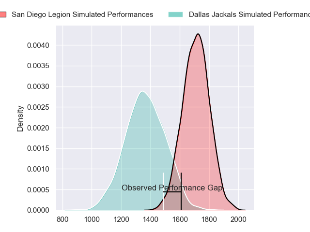
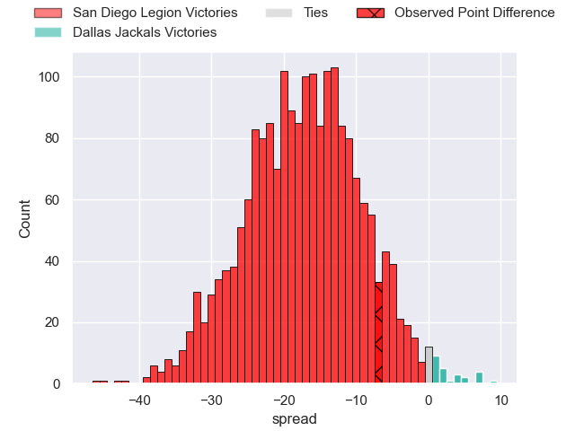
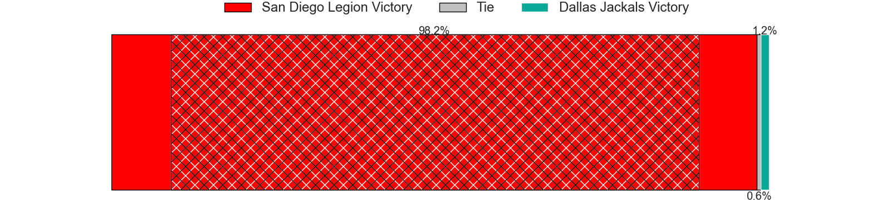

---  
layout: page  
title: San Diego Legion at Dallas Jackals; 30-23  
date: 2024-03-10 18:00:00 -0500  
categories: "Major League Rugby 2024" match review  
---
# San Diego Legion at Dallas Jackals; 30-23

# Club Level Predictions

The first set of predictions treats a club as the smallest object, as the club develops its members, organizes a gameplan, and deploys its players as needed for each match. This club model has a prediction of 0.13, which translates to predicting San Diego Legion to win by 17.2.

Our Over/Under is 51.5 - and combined with the spread above, we have a predicted scoreline of 34 to 17

Each club has a rating and a rating deviation (similar to a Glicko rating), and expected performances can be generated. This allows for simulated matches and spreads like the ones below.
## Projected Performances - Club Model

## Projected Spreads - Club Model

## Projected Results - Club Model

