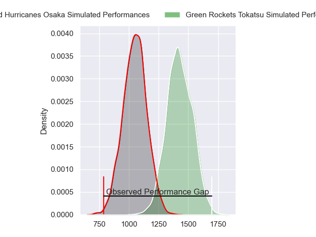
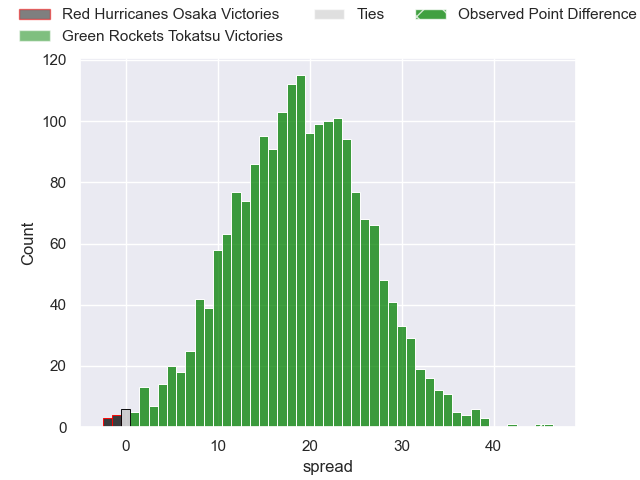
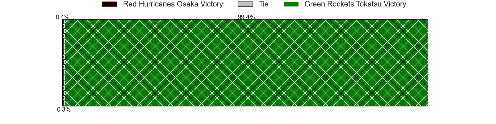
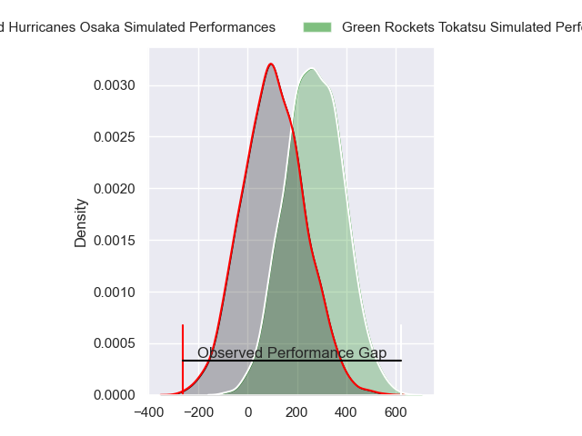
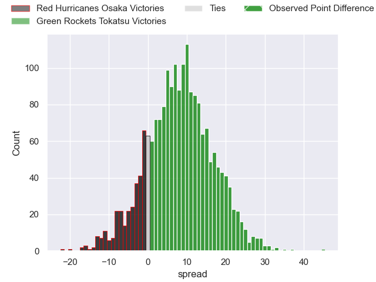
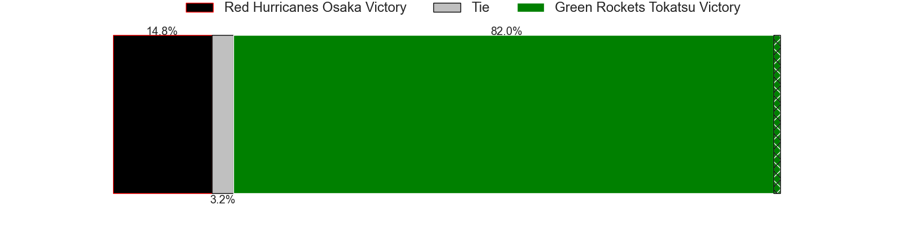

---  
layout: page  
title: Red Hurricanes Osaka at Green Rockets Tokatsu; 15-60  
date: 2024-03-10 18:00:00 -0500  
categories: "Japan Rugby League One D2 2023" match review  
---
# Red Hurricanes Osaka at Green Rockets Tokatsu; 15-60

# Club Level Predictions

The first set of predictions treats a club as the smallest object, as the club develops its members, organizes a gameplan, and deploys its players as needed for each match. This club model has a prediction of 0.887, which translates to predicting Green Rockets Tokatsu to win by 18.8.

Our Over/Under is 30.5 - and combined with the spread above, we have a predicted scoreline of 6 to 25

Each club has a rating and a rating deviation (similar to a Glicko rating), and expected performances can be generated. This allows for simulated matches and spreads like the ones below.
## Projected Performances - Club Model

## Projected Spreads - Club Model

## Projected Results - Club Model

# Player Level Predictions - Version 2

Treating teams instead as an entity made up of the currently active players, I have ratings for each player in an altogether different system. These can be combined to form team ratings once teamsheets are announced, weighting starters a bit higher than the reserves. After the match is played, players can be weighted by their minutes on the field, allowing for an accurate measure of the team's composition. With these compiled team ratings, we can make predictions, measure inaccuracy, and update the individual player ratings.
## Prediction without Player Minutes: Green Rockets Tokatsu by 8.8

Green Rockets Tokatsu by 5.5 on a neutral pitch

## Projected Performances - Player Model

## Projected Spreads - Player Model

## Projected Results - Player Model

|   Away Minutes | Away Player          |   Away Percentile |   Number |   Home Percentile | Home Player           |   Home Minutes |
|---------------:|:---------------------|------------------:|---------:|------------------:|:----------------------|---------------:|
|             53 | Hiromichi Sakamoto   |              7.65 |        1 |              2.15 | Sunao Takizawa        |             48 |
|             53 | Hisamitsu Shimada    |             37.69 |        2 |             97.5  | Ash Dixon             |             61 |
|             61 | Munekata Sashida     |             37.78 |        3 |             81.62 | Kanta Higashionna     |             27 |
|             80 | Michael Allardice    |             12.26 |        4 |             65.5  | Daiki Yamagiwa        |             80 |
|             47 | Tatsunari Fujita     |              9.38 |        5 |             95.79 | Sam Jeffries          |             70 |
|             80 | Toru Sugishita       |              8.79 |        6 |             61.44 | Mitieli Tuinakauvadra |             80 |
|             80 | Blake Gibson         |             82.41 |        7 |             72.49 | Ryoi Kamei            |             61 |
|             69 | Hiroki Hanada        |             29.2  |        8 |             73.72 | Aseri Masivou         |             80 |
|             61 | Toshihiro Yamamouchi |             36.31 |        9 |             92.95 | Nick Phipps           |             67 |
|             80 | Colin Bourke         |             58.4  |       10 |             89.97 | Taisetsu Kanai        |             61 |
|             80 | Kouki Shigeno        |             10.72 |       11 |              3.06 | Hiroyuki Miyajima     |             14 |
|             47 | Yonhi Kimu           |              5.94 |       12 |             60    | Christian Laui        |             80 |
|             80 | Benjamin Saunders    |             59.03 |       13 |              9.7  | Maritino Nemani       |             80 |
|             80 | Ryo Tsuruda          |             73.3  |       14 |             82.93 | Kenta Omata           |             80 |
|             69 | Kanta Yamamoto       |             17.35 |       15 |             12.53 | Tom Marshall          |             80 |
|             33 | Mifiposeti Paea      |             10.55 |       16 |            nan    | Masaki Obata          |             66 |
|             33 | Tom Jeffries         |             55.77 |       17 |             82.56 | Keisuke Kikuta        |             53 |
|             27 | Ryosei Kojima        |            nan    |       18 |             82.18 | Kosei Yamamoto        |             32 |
|             27 | Yo Sato              |            nan    |       19 |             60.65 | Tiaan Swanepoel       |             19 |
|             19 | Tatsuya Hamano       |            nan    |       20 |            nan    | Ren Osawa             |             19 |
|             19 | Hiroshi Kitajima     |            nan    |       21 |              4.96 | Yoshiya Hosoda        |             19 |
|             11 | Hibiki Noda          |             51.8  |       22 |            nan    | Fumiaki Tanaka        |             13 |
|             11 | Oh Ryong Tee         |             42.11 |       23 |             22.48 | Luke Porter           |             10 |

