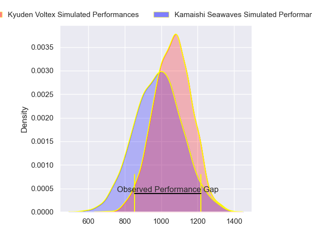
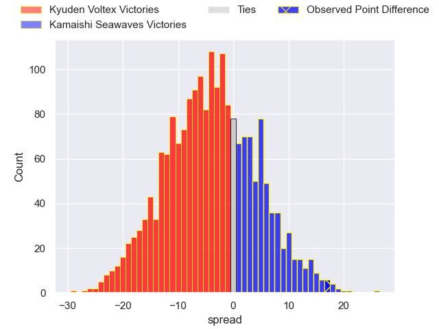
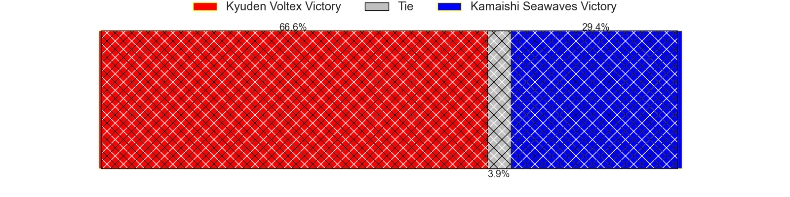
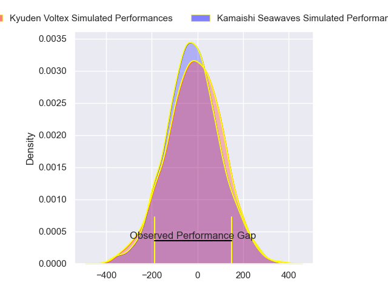
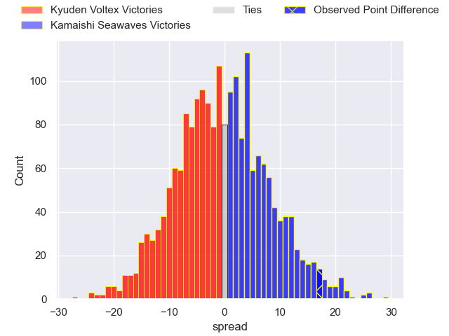
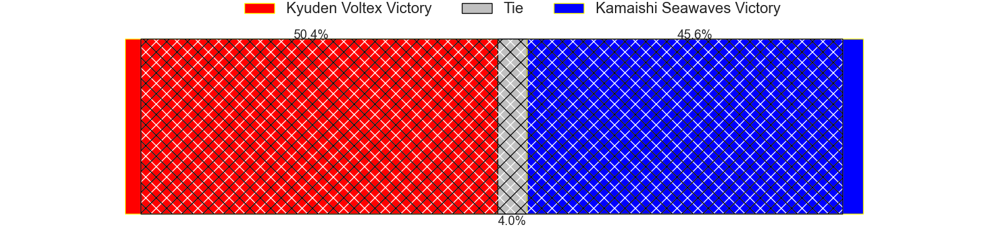

---  
layout: page  
title: Kyuden Voltex at Kamaishi Seawaves; 11-28  
date: 2024-03-10 18:00:00 -0500  
categories: "Japan Rugby League One D2 2023" match review  
---
# Kyuden Voltex at Kamaishi Seawaves; 11-28

# Club Level Predictions

The first set of predictions treats a club as the smallest object, as the club develops its members, organizes a gameplan, and deploys its players as needed for each match. This club model has a prediction of 0.401, which translates to predicting Kyuden Voltex to win by 3.7.

Our Over/Under is 65.5 - and combined with the spread above, we have a predicted scoreline of 35 to 31

Each club has a rating and a rating deviation (similar to a Glicko rating), and expected performances can be generated. This allows for simulated matches and spreads like the ones below.
## Projected Performances - Club Model

## Projected Spreads - Club Model

## Projected Results - Club Model

# Player Level Predictions - Version 2

Treating teams instead as an entity made up of the currently active players, I have ratings for each player in an altogether different system. These can be combined to form team ratings once teamsheets are announced, weighting starters a bit higher than the reserves. After the match is played, players can be weighted by their minutes on the field, allowing for an accurate measure of the team's composition. With these compiled team ratings, we can make predictions, measure inaccuracy, and update the individual player ratings.
## Prediction without Player Minutes: Kyuden Voltex by 0.4

Kyuden Voltex by 2.9 on a neutral pitch

## Projected Performances - Player Model

## Projected Spreads - Player Model

## Projected Results - Player Model

|   Away Minutes | Away Player            |   Away Percentile |   Number |   Home Percentile | Home Player      |   Home Minutes |
|---------------:|:-----------------------|------------------:|---------:|------------------:|:-----------------|---------------:|
|             52 | Samuel Nozomu Faialaga |             25.76 |        1 |             45.28 | Yusuke Yamada    |             53 |
|             52 | Kyungmun Wang          |              1.15 |        2 |              5.92 | Daiki Ito        |             53 |
|             40 | Yasuo Saruwatari       |              7.06 |        3 |             17.6  | Taiki Noguchi    |             53 |
|             52 | Masahiro Eriguchi      |             36.11 |        4 |             56.85 | Sergio Moreira   |             51 |
|             80 | Ray Tatafu             |             12.51 |        5 |             10.61 | Dallas Tatana    |             80 |
|             44 | Ken Nakashima          |             15.86 |        6 |             13.88 | Ben Nee Nee      |             80 |
|             80 | Colby Fainga'a         |              3.52 |        7 |             11.45 | Daisuke Musya    |             53 |
|             80 | Walker Alex Takuya     |             13.59 |        8 |             11.65 | Sam Henwood      |             80 |
|             52 | Yusaku Kanda           |             15.54 |        9 |             36.61 | Atsushi Minami   |             53 |
|             52 | Phil Burleigh          |             51.24 |       10 |             43.53 | Kazuki Ochi      |             80 |
|             80 | Ren Hagiwara           |             10.42 |       11 |             85.71 | Jamie Henry      |             80 |
|             80 | Charlie Worthington    |             27.86 |       12 |             15.36 | Kohei Ishigaki   |             62 |
|             80 | Sione Likuata          |             12.38 |       13 |             38.33 | Katsuro Hatamaka |             80 |
|             80 | Yasunari Isoda         |             16.97 |       14 |             27.39 | Ryuji Abe        |             61 |
|             68 | Makoto Kato            |              1.92 |       15 |              7.19 | Ryoma Nakamura   |             80 |
|             40 | Kosuke Oike            |            nan    |       16 |             18.2  | Seta Koroitamana |             29 |
|             36 | Akihito Yamada         |             97.53 |       17 |            nan    | Shoichiro Inada  |             27 |
|             28 | Kazuto Tokunaga        |            nan    |       18 |            nan    | Yuki Go          |             27 |
|             28 | Genki Nakamura         |            nan    |       19 |            nan    | Tomoyoshi Oikawa |             27 |
|             28 | Sean Robinson          |             11.2  |       20 |             26.87 | Ryota Kono       |             27 |
|             28 | Shunta Takenouchi      |             41.51 |       21 |              7.16 | Youhei Murakami  |             27 |
|             28 | Shinhichiro Matsushita |            nan    |       22 |              1.72 | Kodai Ono        |             19 |
|             12 | Masaya Kanado          |             36.31 |       23 |             14.76 | Mosese Tonga     |             18 |

