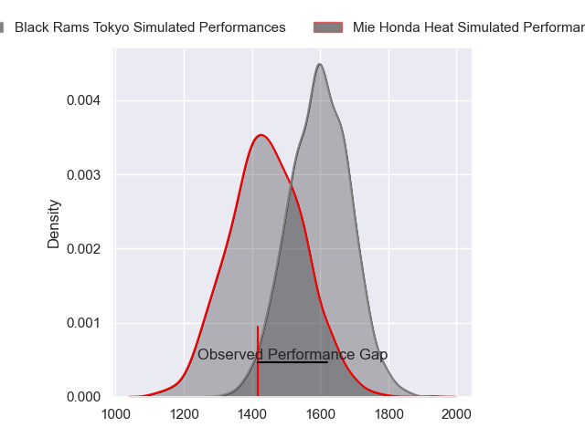
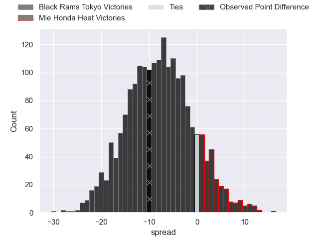
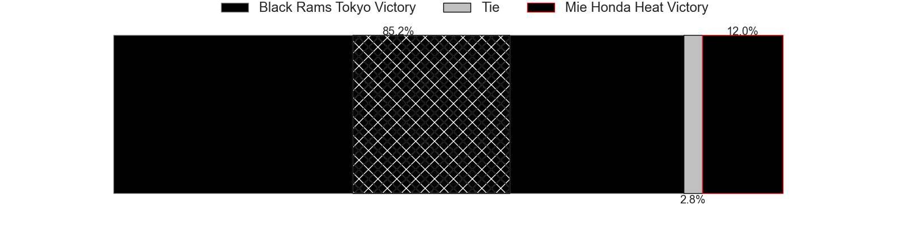
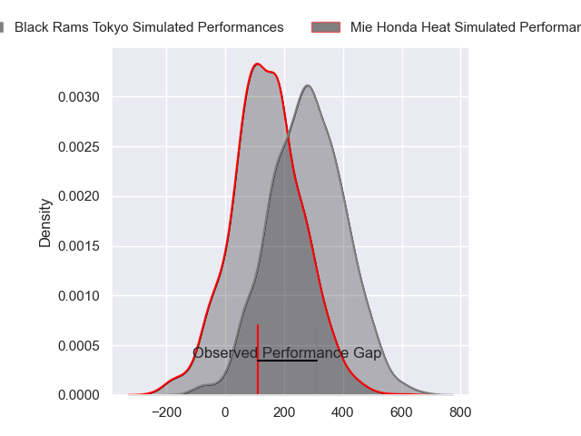
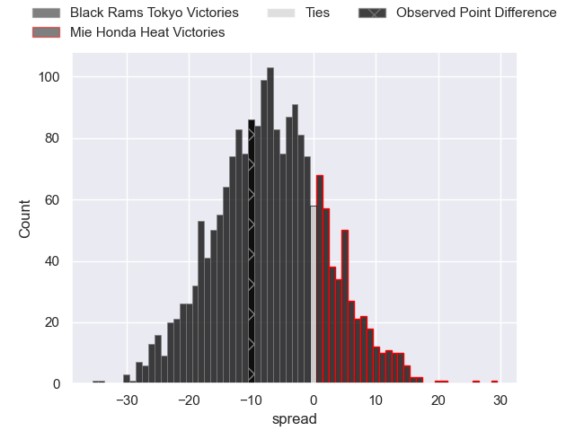

---  
layout: page  
title: Black Rams Tokyo at Mie Honda Heat; 24-14  
date: 2024-03-10 18:00:00 -0500  
categories: "Japan Rugby League One 2023" match review  
---
# Black Rams Tokyo at Mie Honda Heat; 24-14

# Club Level Predictions

The first set of predictions treats a club as the smallest object, as the club develops its members, organizes a gameplan, and deploys its players as needed for each match. This club model has a prediction of 0.288, which translates to predicting Black Rams Tokyo to win by 8.2.

Our Over/Under is 44.5 - and combined with the spread above, we have a predicted scoreline of 26 to 18

Each club has a rating and a rating deviation (similar to a Glicko rating), and expected performances can be generated. This allows for simulated matches and spreads like the ones below.
## Projected Performances - Club Model

## Projected Spreads - Club Model

## Projected Results - Club Model

# Player Level Predictions - Version 2

Treating teams instead as an entity made up of the currently active players, I have ratings for each player in an altogether different system. These can be combined to form team ratings once teamsheets are announced, weighting starters a bit higher than the reserves. After the match is played, players can be weighted by their minutes on the field, allowing for an accurate measure of the team's composition. With these compiled team ratings, we can make predictions, measure inaccuracy, and update the individual player ratings.
## Prediction without Player Minutes: Black Rams Tokyo by 7.3

Black Rams Tokyo by 10.3 on a neutral pitch

## Projected Performances - Player Model

## Projected Spreads - Player Model

## Projected Results - Player Model

|   Away Minutes | Away Player       |   Away Percentile |   Number |   Home Percentile | Home Player         |   Home Minutes |
|---------------:|:------------------|------------------:|---------:|------------------:|:--------------------|---------------:|
|             61 | Kazuma Nishi      |             68.1  |        1 |              3.08 | Tatsuhiko Tsurukawa |             52 |
|             40 | Hinata Takei      |             55.96 |        2 |              5.38 | Lee Seung Hyok      |             52 |
|             51 | Paddy Ryan        |             71.55 |        3 |             16.6  | Katsuyuki Hoshino   |             61 |
|             80 | Daiki Yanagawa    |             34.5  |        4 |             23.92 | Yoji Akiyama        |             52 |
|             61 | Josh Goodhue      |             41.35 |        5 |             90.26 | Franco Mostert      |             80 |
|             76 | Brodi McCurran    |             79.59 |        6 |              3.83 | Ryota Kobayashi     |             80 |
|             80 | Shuhei Matsuhashi |             74.41 |        7 |             49.38 | Kosuke Hattori      |             69 |
|             80 | Nathan Hughes     |             88.08 |        8 |             20.92 | Waimana Kapa        |             80 |
|             57 | Toshiya Takahashi |             71.58 |        9 |             36.93 | Takuro Hojo         |             80 |
|             51 | Ichigo Nakakusu   |             46.37 |       10 |             19.3  | Gwangtee Oh         |             80 |
|             80 | Siope Lolo Tavo   |             29.21 |       11 |             24.73 | Kanta Watanabe      |             80 |
|             66 | Hadleigh Parkes   |             99.39 |       12 |              4.24 | Clinton Knox        |             64 |
|             80 | Ryohei Isoda      |             61.58 |       13 |             94.91 | Tevita Li           |             61 |
|             80 | Daisuke Nishikawa |             43.11 |       14 |             15.21 | Haruhiko Uemura     |             80 |
|             80 | Matt McGahan      |             86.02 |       15 |             80.48 | Tom Banks           |             80 |
|             40 | Kazuhiro Koike    |            nan    |       16 |            nan    | Koki Hida           |             28 |
|             29 | Isaac Lucas       |             73.43 |       17 |             14.66 | Tetuhi Roberts      |             28 |
|             29 | Shohei Oyama      |             41.79 |       18 |            nan    | Takumi Fuji         |             28 |
|             23 | Syota Yamamoto    |             55.81 |       19 |             11.66 | Taiki Yoshioka      |             19 |
|             19 | Mike Stolberg     |              4.81 |       20 |            nan    | Kei Toma            |             11 |
|             19 | Takeo Makabe      |            nan    |       21 |              5.09 | Fraser Quirk        |             19 |
|             14 | Yuta Kurihara     |             29.21 |       22 |             64.16 | Mitch Hunt          |             16 |
|              4 | Otoya Kihara      |             35.52 |       23 |            nan    | nan                 |            nan |

