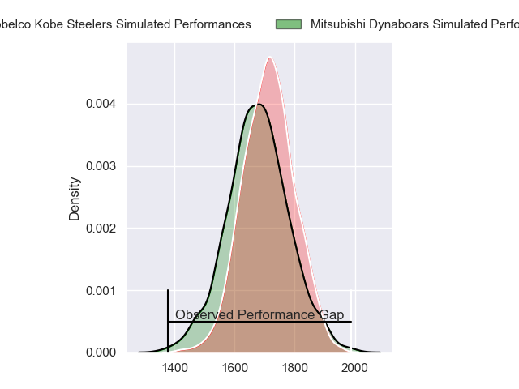
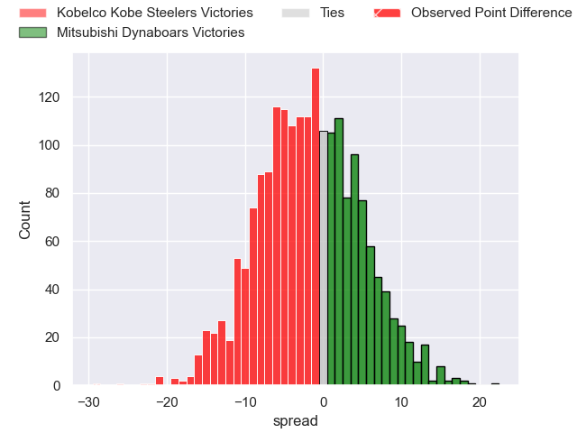
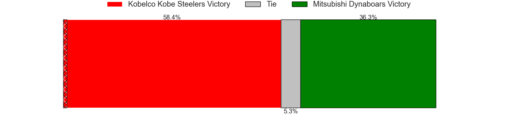
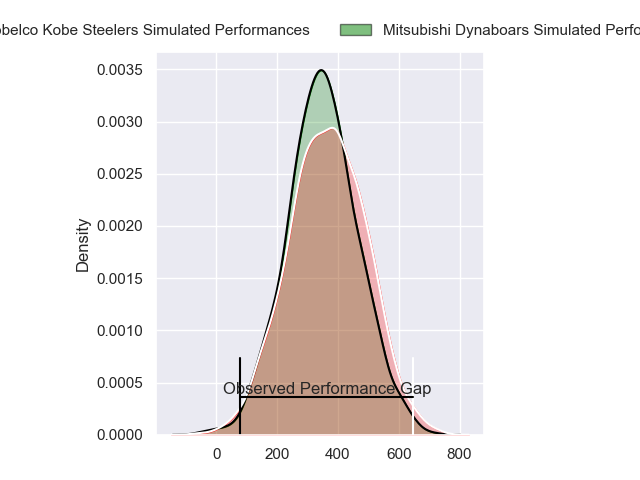
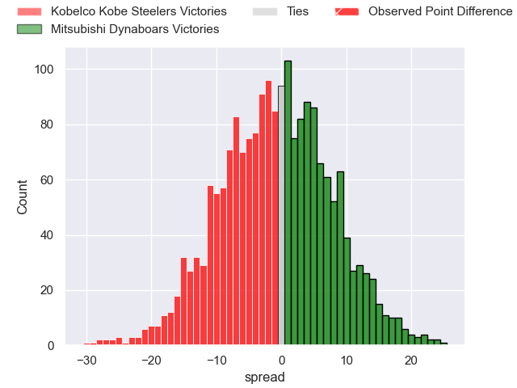
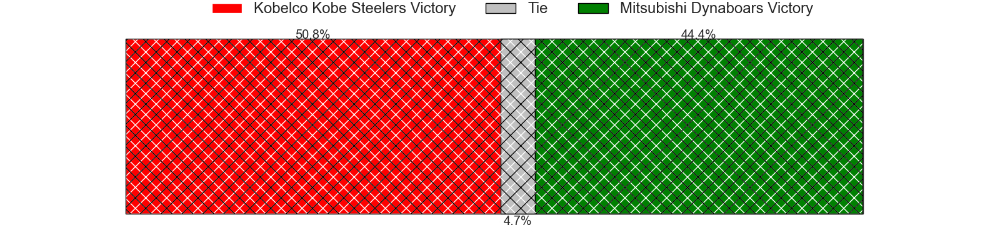

---  
layout: page  
title: Kobelco Kobe Steelers at Mitsubishi Dynaboars; 43-14  
date: 2024-03-10 18:00:00 -0500  
categories: "Japan Rugby League One 2023" match review  
---
# Kobelco Kobe Steelers at Mitsubishi Dynaboars; 43-14

# Club Level Predictions

The first set of predictions treats a club as the smallest object, as the club develops its members, organizes a gameplan, and deploys its players as needed for each match. This club model has a prediction of 0.449, which translates to predicting Kobelco Kobe Steelers to win by 1.8.

Our Over/Under is 87.5 - and combined with the spread above, we have a predicted scoreline of 45 to 43

Each club has a rating and a rating deviation (similar to a Glicko rating), and expected performances can be generated. This allows for simulated matches and spreads like the ones below.
## Projected Performances - Club Model

## Projected Spreads - Club Model

## Projected Results - Club Model

# Player Level Predictions - Version 2

Treating teams instead as an entity made up of the currently active players, I have ratings for each player in an altogether different system. These can be combined to form team ratings once teamsheets are announced, weighting starters a bit higher than the reserves. After the match is played, players can be weighted by their minutes on the field, allowing for an accurate measure of the team's composition. With these compiled team ratings, we can make predictions, measure inaccuracy, and update the individual player ratings.
## Prediction without Player Minutes: Mitsubishi Dynaboars by 2.0

Kobelco Kobe Steelers by 0.8 on a neutral pitch

## Projected Performances - Player Model

## Projected Spreads - Player Model

## Projected Results - Player Model

|   Away Minutes | Away Player              |   Away Percentile |   Number |   Home Percentile | Home Player         |   Home Minutes |
|---------------:|:-------------------------|------------------:|---------:|------------------:|:--------------------|---------------:|
|             53 | Shigure Takao            |             60.59 |        1 |             14.12 | Mototsugu Hachiya   |             80 |
|             65 | Kenta Matsuoka           |             63.36 |        2 |             78.82 | Yoshimitsu Yasue    |             48 |
|             29 | Koo Ji-won               |              2.57 |        3 |             43.54 | Kanzo Schinckel     |             36 |
|             59 | Waisake Raratubua        |             71.39 |        4 |             71.28 | Walt Steenkamp      |             80 |
|             80 | Brodie Retallick         |            100    |        5 |             11.44 | Epineri Uluiviti    |             40 |
|             67 | Takara Imamura           |             31.94 |        6 |             81.94 | Kyo Yoshida         |             80 |
|             80 | Ardie Savea              |             99.56 |        7 |             90.09 | Masataka Tsuruya    |             80 |
|             80 | Tiennan Costley          |             66.5  |        8 |             71.6  | Jackson Hemopo      |             59 |
|             62 | Atsushi Hiwasa           |             88.34 |        9 |             80.57 | Kota Iwamura        |             80 |
|             80 | Bryn Gatland             |             93.03 |       10 |             69.4  | James Grayson       |             79 |
|             80 | Kanta Matsunaga          |             71.11 |       11 |             76.91 | Honeti Taumoha'apai |             80 |
|             17 | Ngani Laumape            |             78.45 |       12 |             81.07 | Curtis Rona         |             53 |
|             80 | Seungsin Lee             |             14.05 |       13 |             55    | Joichiro Iwashita   |             53 |
|             80 | Rakuhei Yamashita        |             93.23 |       14 |             56.28 | Ben Paltridge       |             80 |
|             80 | Ryohei Yamanaka          |             65.47 |       15 |             65.71 | Satoshi Koizumi     |             80 |
|             50 | Michael Little           |             53.1  |       16 |             97.43 | Tomoaki Ishii       |              8 |
|             51 | Hiroshi Yamashita        |             94.96 |       17 |             41.24 | Daniel Linde        |             40 |
|             27 | Isileli Nakajima Vakauta |             82.86 |       18 |             12.37 | Hayato Hosoda       |             36 |
|             21 | Amanaki Saumaki          |             70.7  |       19 |             40.46 | Yuki Miyazato       |             32 |
|             18 | Daiki Nakajima           |             26.58 |       20 |             70.26 | Matt Vaega          |             27 |
|             15 | Takuya Kitade            |             79.77 |       21 |             52.5  | Tonishio Vaiahu     |             27 |
|             13 | Gerard Cowley-Tuioti     |             79.86 |       22 |             36.89 | Marino Mikaele-Tu'u |             21 |
|             13 | Timothy Lafaele          |             39.64 |       23 |             42.13 | Ryuta Nakamori      |              1 |

