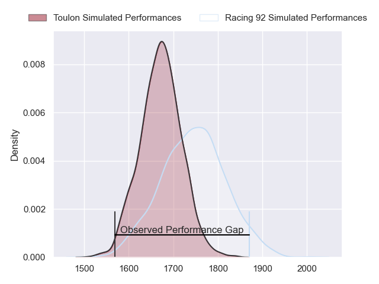
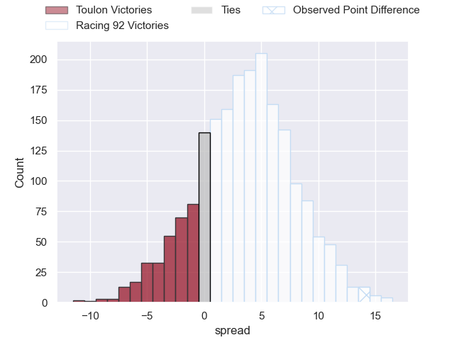
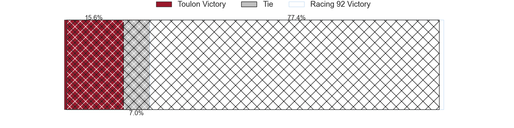
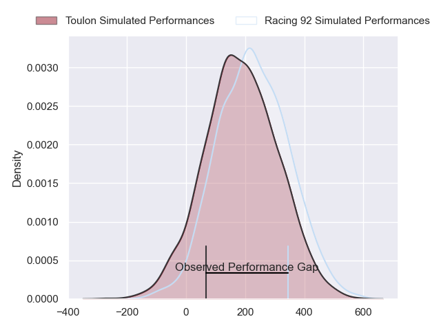
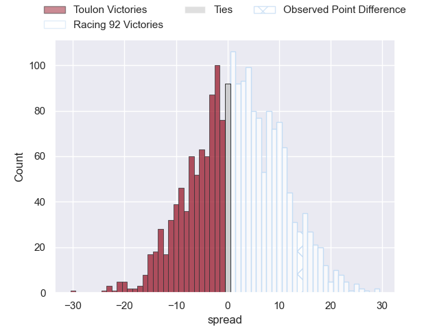
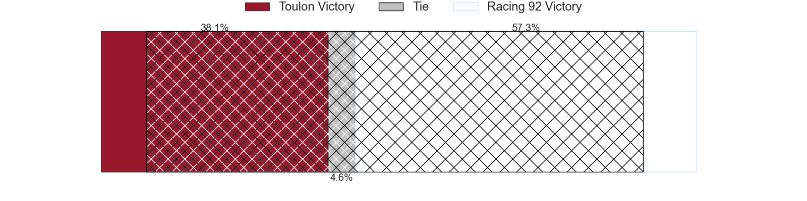

---  
layout: page  
title: Toulon at Racing 92; 6-20  
date: 2024-03-10 18:00:00 -0500  
categories: "Top 14 Orange 2023" match review  
---
# Toulon at Racing 92; 6-20

# Club Level Predictions

The first set of predictions treats a club as the smallest object, as the club develops its members, organizes a gameplan, and deploys its players as needed for each match. This club model has a prediction of 0.602, which translates to predicting Racing 92 to win by 3.6.

Our Over/Under is 50.5 - and combined with the spread above, we have a predicted scoreline of 23 to 27

Each club has a rating and a rating deviation (similar to a Glicko rating), and expected performances can be generated. This allows for simulated matches and spreads like the ones below.
## Projected Performances - Club Model

## Projected Spreads - Club Model

## Projected Results - Club Model

# Player Level Predictions - Version 2

Treating teams instead as an entity made up of the currently active players, I have ratings for each player in an altogether different system. These can be combined to form team ratings once teamsheets are announced, weighting starters a bit higher than the reserves. After the match is played, players can be weighted by their minutes on the field, allowing for an accurate measure of the team's composition. With these compiled team ratings, we can make predictions, measure inaccuracy, and update the individual player ratings.
## Prediction without Player Minutes: Racing 92 by 3.5

Toulon by 3.3 on a neutral pitch

## Projected Performances - Player Model

## Projected Spreads - Player Model

## Projected Results - Player Model

|   Away Minutes | Away Player       |   Away Percentile |   Number |   Home Percentile | Home Player        |   Home Minutes |
|---------------:|:------------------|------------------:|---------:|------------------:|:-------------------|---------------:|
|             47 | Bruce Devaux      |             11.57 |        1 |              9.51 | Hassane Kolingar   |             71 |
|             70 | Teddy Baubigny    |             34.04 |        2 |             90.58 | Camille Chat       |             51 |
|             70 | Beka Gigashvili   |             47.95 |        3 |             56.53 | Cedate Gomes Sa    |             58 |
|             62 | Matthias Halagahu |             27.16 |        4 |             76.2  | Boris Palu         |             53 |
|             80 | David Ribbans     |             78.25 |        5 |             26.56 | Fabien Sanconnie   |             71 |
|             80 | Selevasio Tolofua |             82.53 |        6 |              9.13 | Ibrahim Diallo     |             80 |
|             80 | Jules Coulon      |             33.03 |        7 |             43.86 | Maxime Baudonne    |             80 |
|             40 | Facundo Isa       |             85.16 |        8 |             78.83 | Kitione Kamikamica |             60 |
|             58 | Jules Danglot     |             65.56 |        9 |             22.2  | Clovis Le Bail     |             80 |
|             55 | Enzo Herve        |             76.19 |       10 |             36.34 | Tristan Tedder     |             80 |
|             80 | Gabin Villiere    |             83.26 |       11 |             13.57 | Wame Naituvi       |             76 |
|             55 | Mathieu Smaili    |             14.55 |       12 |             98.18 | Henry Chavancy     |             70 |
|             80 | Seta Tuicuvu      |             48.85 |       13 |              9.09 | Olivier Klemenczak |             80 |
|             80 | Gael Drean        |             32.71 |       14 |             94.42 | Christian Wade     |             80 |
|             80 | Melvyn Jaminet    |             67.23 |       15 |             26.51 | Max Spring         |             76 |
|             10 | Jack Singleton    |             90.96 |       16 |             15.77 | Janick Tarrit      |             29 |
|             33 | Dany Priso        |             88.34 |       17 |            nan    | Lino Julien        |             19 |
|             18 | Swan Rebbadj      |             70.19 |       18 |             78.73 | Cameron Woki       |             36 |
|             40 | Yannick Youyoutte |            nan    |       19 |             73.8  | Anthime Hemery     |             10 |
|             25 | Jeremy Sinzelle   |            nan    |       20 |             98.69 | Juan Imhoff        |              4 |
|             22 | Vasil Lobzhanidze |              9.96 |       21 |             15.03 | Francis Saili      |             10 |
|             25 | Maelan Rabut      |            nan    |       22 |              7.77 | Henry Arundell     |              4 |
|             10 | Emerick Setiano   |             91.7  |       23 |            nan    | Gia Kharaishvili   |             21 |

