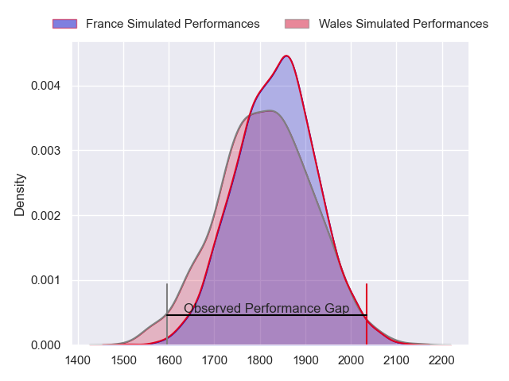
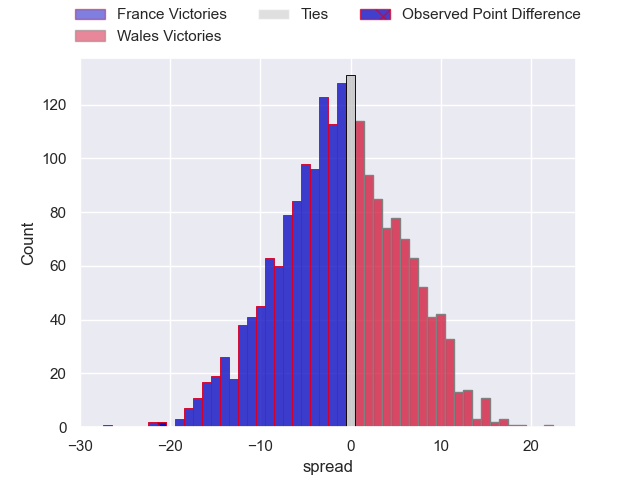
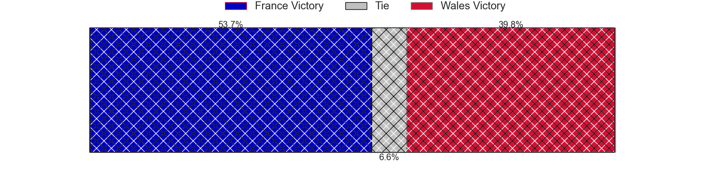
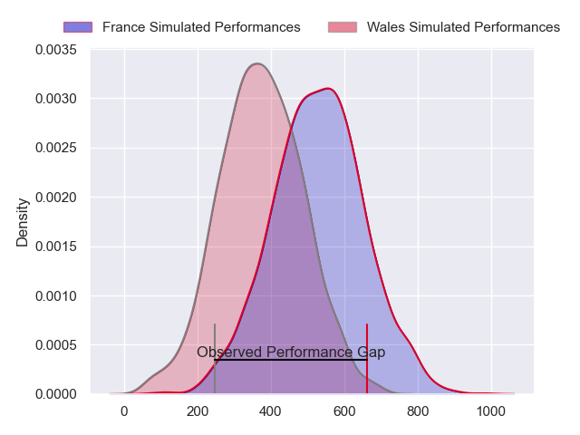
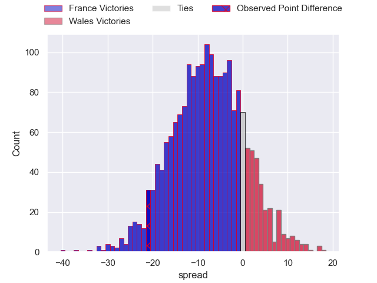
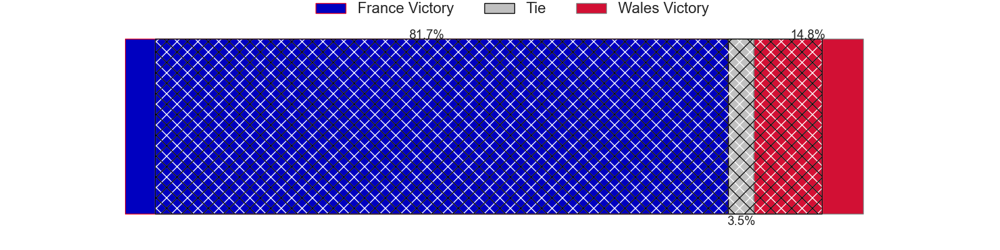

---  
layout: page  
title: France at Wales; 45-24  
date: 2024-03-10 18:00:00 -0500  
categories: "Six Nations Championship 2024" match review  
---
# France at Wales; 45-24

# Club Level Predictions

The first set of predictions treats a club as the smallest object, as the club develops its members, organizes a gameplan, and deploys its players as needed for each match. This club model has a prediction of 0.471, which translates to predicting France to win by 1.1.

Our Over/Under is 40.5 - and combined with the spread above, we have a predicted scoreline of 21 to 20

Each club has a rating and a rating deviation (similar to a Glicko rating), and expected performances can be generated. This allows for simulated matches and spreads like the ones below.
## Projected Performances - Club Model

## Projected Spreads - Club Model

## Projected Results - Club Model

# Player Level Predictions - Version 2

Treating teams instead as an entity made up of the currently active players, I have ratings for each player in an altogether different system. These can be combined to form team ratings once teamsheets are announced, weighting starters a bit higher than the reserves. After the match is played, players can be weighted by their minutes on the field, allowing for an accurate measure of the team's composition. With these compiled team ratings, we can make predictions, measure inaccuracy, and update the individual player ratings.
## Prediction without Player Minutes: France by 8.5

France by 12.6 on a neutral pitch

## Projected Performances - Player Model

## Projected Spreads - Player Model

## Projected Results - Player Model

|   Away Minutes | Away Player           |   Away Percentile |   Number |   Home Percentile | Home Player       |   Home Minutes |
|---------------:|:----------------------|------------------:|---------:|------------------:|:------------------|---------------:|
|             52 | Cyril Baille          |             95.6  |        1 |             56.28 | Gareth Thomas     |             71 |
|             52 | Julien Marchand       |             98.47 |        2 |             88.74 | Elliot Dee        |             71 |
|             52 | Uini Atonio           |             99.82 |        3 |             21.81 | Keiron Assiratti  |             45 |
|             81 | Thibaud Flament       |             90.7  |        4 |             19.19 | Will Rowlands     |             71 |
|             52 | Emmanuel Meafou       |             84.03 |        5 |             93.09 | Adam Beard        |             81 |
|             71 | Francois Cros         |             98.24 |        6 |             91.96 | Dafydd Jenkins    |             81 |
|             63 | Charles Ollivon       |             97.36 |        7 |             90.86 | Tommy Reffell     |             57 |
|             81 | Gregory Alldritt      |             99.03 |        8 |             82.52 | Aaron Wainwright  |             81 |
|             71 | Nolann Le Garrec      |             75.05 |        9 |             82.41 | Tomos Williams    |             57 |
|             81 | Thomas Ramos          |             94.53 |       10 |             36.07 | Sam Costelow      |             57 |
|             81 | Louis Bielle-Biarrey  |             75.83 |       11 |             23.31 | Rio Dyer          |             81 |
|             73 | Nicolas Depoortere    |             40.12 |       12 |             97.26 | Owen Watkin       |             81 |
|             81 | Gael Fickou           |             95.71 |       13 |             26.43 | Joe Roberts       |             61 |
|             81 | Damian Penaud         |             94.63 |       14 |             64.12 | Josh Adams        |             81 |
|             81 | Leo Barre             |             79.38 |       15 |             50.12 | Cameron Winnett   |             81 |
|             29 | Peato Mauvaka         |             92.75 |       16 |            nan    | Evan Lloyd        |             10 |
|             29 | Sebastien Taofifenua  |             15.77 |       17 |             74.43 | Corey Domachowski |             10 |
|             29 | Georges-Henri Colombe |              3.94 |       18 |             96.7  | Dillon Lewis      |             36 |
|             29 | Romain Taofifenua     |             48.03 |       19 |             11.67 | Alex Mann         |             24 |
|             18 | Alexandre Roumat      |             95.87 |       20 |             29.13 | Mackenzie Martin  |             10 |
|             10 | Paul Boudehent        |             12.78 |       21 |             34.76 | Gareth Davies     |             24 |
|             10 | Maxime Lucu           |             99.39 |       22 |              7.46 | Ioan Lloyd        |             24 |
|              8 | Yoram Moefana         |             82.71 |       23 |             70.35 | Mason Grady       |             20 |

