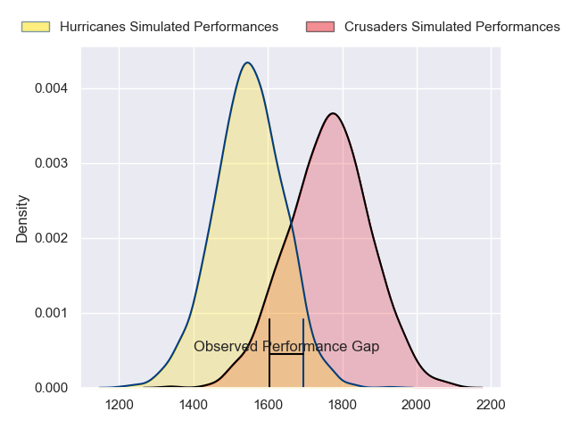
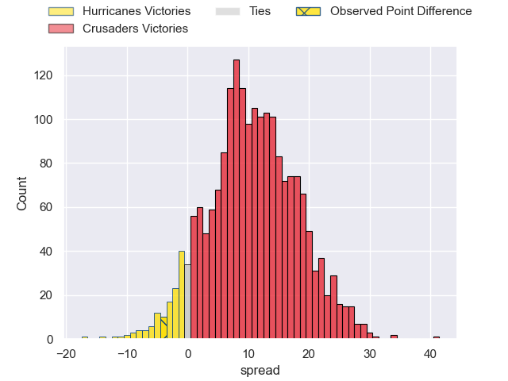
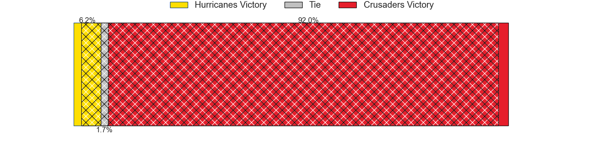
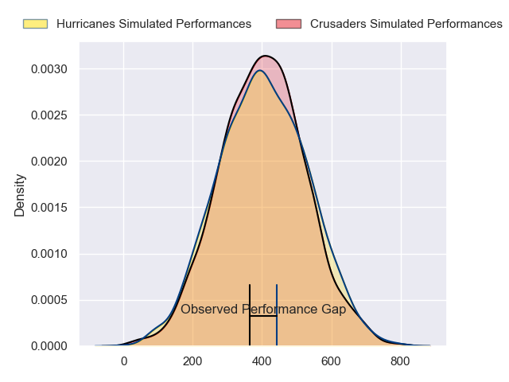
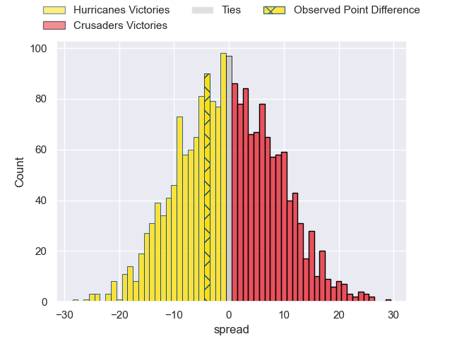

---  
layout: page  
title: Hurricanes at Crusaders; 14-10  
date: 2024-03-15 18:00:00 -0500  
categories: "Super Rugby Pacific 2024" match review  
---
# Hurricanes at Crusaders; 14-10

# Club Level Predictions

The first set of predictions treats a club as the smallest object, as the club develops its members, organizes a gameplan, and deploys its players as needed for each match. This club model has a prediction of 0.772, which translates to predicting Crusaders to win by 11.1.

Our Over/Under is 48.5 - and combined with the spread above, we have a predicted scoreline of 19 to 30

Each club has a rating and a rating deviation (similar to a Glicko rating), and expected performances can be generated. This allows for simulated matches and spreads like the ones below.
## Projected Performances - Club Model

## Projected Spreads - Club Model

## Projected Results - Club Model

# Player Level Predictions - Version 2

Treating teams instead as an entity made up of the currently active players, I have ratings for each player in an altogether different system. These can be combined to form team ratings once teamsheets are announced, weighting starters a bit higher than the reserves. After the match is played, players can be weighted by their minutes on the field, allowing for an accurate measure of the team's composition. With these compiled team ratings, we can make predictions, measure inaccuracy, and update the individual player ratings.
## Prediction without Player Minutes: Crusaders by 0.3

Hurricanes by 3.9 on a neutral pitch

## Projected Performances - Player Model

## Projected Spreads - Player Model

## Projected Results - Player Model

|   Away Minutes | Away Player          |   Away Percentile |   Number |   Home Percentile | Home Player       |   Home Minutes |
|---------------:|:---------------------|------------------:|---------:|------------------:|:------------------|---------------:|
|             60 | Xavier Numia         |             94.96 |        1 |              6.16 | George Bower      |             60 |
|             74 | Asafo Aumua          |             95.96 |        2 |             11.35 | George Bell       |             81 |
|             55 | Tyrel Lomax          |             93.19 |        3 |              1.4  | Fletcher Newell   |             40 |
|             53 | James Tucker         |             88.58 |        4 |             78.61 | Quinten Strange   |             53 |
|             81 | Isaia Walker-Leawere |             96.39 |        5 |             17.07 | Zach Gallagher    |             81 |
|             81 | Devan Flanders       |             85.91 |        6 |             31    | Dom Gardiner      |             53 |
|             81 | Peter Lakai          |             92.9  |        7 |             58.29 | Tom Christie      |             81 |
|             60 | Brayden Iose         |              1.7  |        8 |             68.13 | Cullen Grace      |             81 |
|             71 | Cam Roigard          |             54.15 |        9 |             91.08 | Willi Heinz       |             60 |
|             81 | Brett Cameron        |             14.54 |       10 |             11.03 | Riley Hohepa      |             81 |
|             81 | Kini Naholo          |             95.51 |       11 |             32.49 | Macca Springer    |             60 |
|             61 | Riley Higgins        |             84.97 |       12 |             95.64 | David Havili      |             81 |
|             81 | Billy Proctor        |             91.15 |       13 |             65.33 | Levi Aumua        |             50 |
|             81 | Joshua Moorby        |             79.76 |       14 |             76.04 | Sevu Reece        |             81 |
|             61 | Ruben Love           |             92.53 |       15 |             11.81 | Chay Fihaki       |             81 |
|              7 | James O'Reilly       |             26.15 |       16 |            nan    | Ioane Moananu     |              0 |
|             21 | Pouri Rakete-Stones  |             86.75 |       17 |            nan    | Finlay Brewis     |             21 |
|             26 | Pasilio Tosi         |             62.03 |       18 |             79.66 | Owen Franks       |             41 |
|             28 | Justin Sangster      |             72    |       19 |            nan    | Jamie Hannah      |             28 |
|             21 | Du'Plessis Kirifi    |             90.76 |       20 |            nan    | Tahlor Cahill     |             28 |
|             10 | TJ Perenara          |            nan    |       21 |             92.53 | Mitchell Drummond |             21 |
|             20 | Peter Umaga-Jensen   |             40.73 |       22 |             98.3  | Ryan Crotty       |             31 |
|             20 | Salesi Rayasi        |             85.34 |       23 |             56.61 | Dallas McLeod     |             21 |

