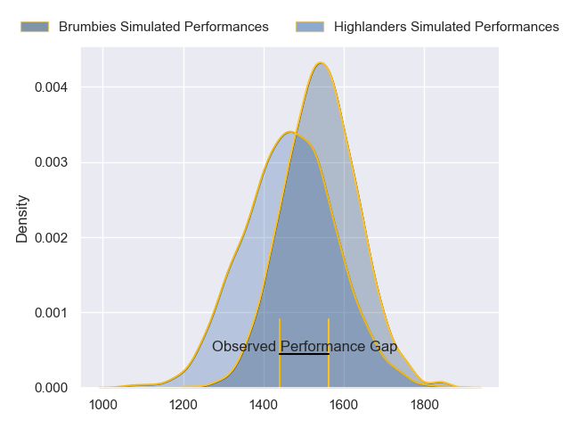
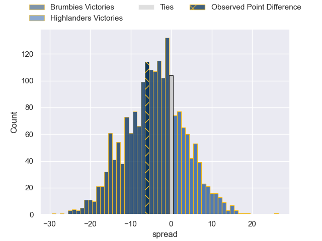
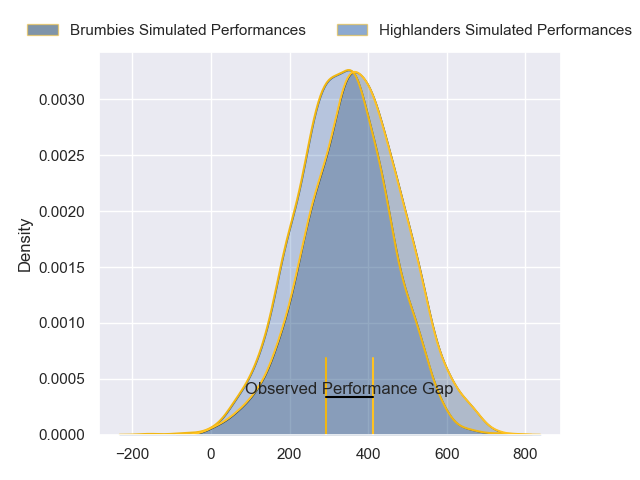
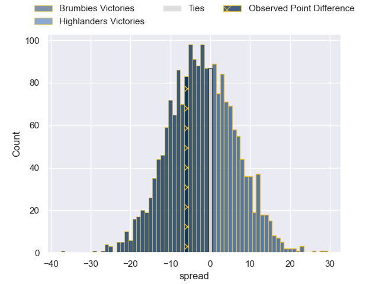

---  
layout: page  
title: Brumbies at Highlanders; 27-21  
date: 2024-03-15 18:00:00 -0500  
categories: "Super Rugby Pacific 2024" match review  
---
# Brumbies at Highlanders; 27-21

# Club Level Predictions

The first set of predictions treats a club as the smallest object, as the club develops its members, organizes a gameplan, and deploys its players as needed for each match. This club model has a prediction of 0.391, which translates to predicting Brumbies to win by 4.0.

Our Over/Under is 48.5 - and combined with the spread above, we have a predicted scoreline of 26 to 22

Each club has a rating and a rating deviation (similar to a Glicko rating), and expected performances can be generated. This allows for simulated matches and spreads like the ones below.
## Projected Performances - Club Model

## Projected Spreads - Club Model

## Projected Results - Club Model

# Player Level Predictions - Version 2

Treating teams instead as an entity made up of the currently active players, I have ratings for each player in an altogether different system. These can be combined to form team ratings once teamsheets are announced, weighting starters a bit higher than the reserves. After the match is played, players can be weighted by their minutes on the field, allowing for an accurate measure of the team's composition. With these compiled team ratings, we can make predictions, measure inaccuracy, and update the individual player ratings.
## Prediction without Player Minutes: Brumbies by 1.7

Brumbies by 6.3 on a neutral pitch

## Projected Performances - Player Model

## Projected Spreads - Player Model

## Projected Results - Player Model

|   Away Minutes | Away Player      |   Away Percentile |   Number |   Home Percentile | Home Player                   |   Home Minutes |
|---------------:|:-----------------|------------------:|---------:|------------------:|:------------------------------|---------------:|
|             34 | Blake Schoupp    |             45.71 |        1 |             68.47 | Ethan de Groot                |             10 |
|             54 | Billy Pollard    |             53.46 |        2 |             43.27 | Jack Taylor                   |             49 |
|             54 | Sefo Kautai      |             19.22 |        3 |             46.74 | Saula Ma'u                    |             40 |
|             81 | Nick Frost       |             41.83 |        4 |             68.63 | Fabian Holland                |             81 |
|             60 | Cadeyrn Neville  |             98.2  |        5 |             50.96 | Max Hicks                     |             40 |
|             81 | Tom Hooper       |             63.7  |        6 |             86.25 | Tom Sanders                   |             55 |
|             54 | Jahrome Brown    |             84.89 |        7 |             67.76 | Billy Harmon                  |             81 |
|             81 | Rob Valetini     |             95.38 |        8 |             36.5  | Nikora Broughton              |             81 |
|             67 | Ryan Lonergan    |             74.9  |        9 |             62.45 | Folau Fakatava                |             64 |
|             81 | Noah Lolesio     |             76.44 |       10 |             50.88 | Cameron Millar                |             49 |
|             81 | Corey Toole      |             28.34 |       11 |             49.45 | Martin Bogado                 |             49 |
|             81 | Tamati Tua       |             35.88 |       12 |             33.33 | Sam Gilbert                   |             81 |
|             35 | Len Ikitau       |             77.94 |       13 |             40    | Tanielu Tele'a                |             81 |
|             71 | Andy Muirhead    |             92.56 |       14 |             28.67 | Timoci Tavatavanawai          |             81 |
|             81 | Tom Wright       |             51.57 |       15 |             96.39 | Jacob Ratumaitavuki-Kneepkens |             81 |
|             27 | Lachlan Lonergan |              7.5  |       16 |             33.46 | Henry Bell                    |             32 |
|             47 | James Slipper    |             91.51 |       17 |             95.24 | Ayden Johnstone               |             71 |
|             27 | Rhys Van Nek     |             62.5  |       18 |             36.66 | Jermaine Ainsley              |             41 |
|             21 | Darcy Swain      |             32.69 |       19 |            nan    | Oliver Haig                   |             41 |
|             27 | Rory Scott       |             54.9  |       20 |             18.71 | Sean Withy                    |             26 |
|             14 | Harrison Goddard |             12.24 |       21 |             12.66 | James Arscott                 |             17 |
|             10 | Declan Meredith  |            nan    |       22 |            nan    | Ajay Faleafaga                |             32 |
|             46 | Ollie Sapsford   |             80.48 |       23 |             49.02 | Connor Garden-Bachop          |             32 |

