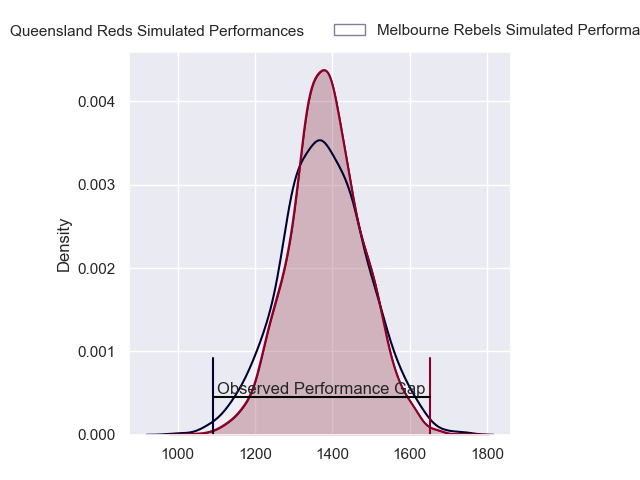
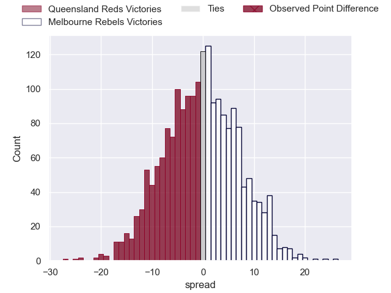
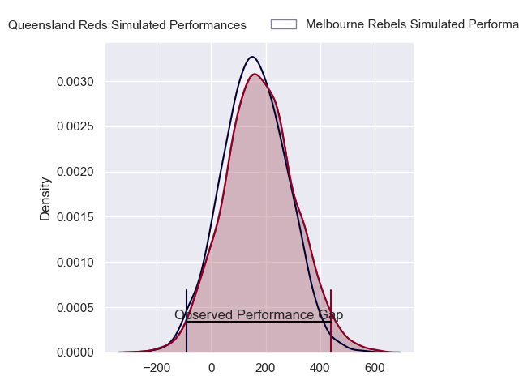
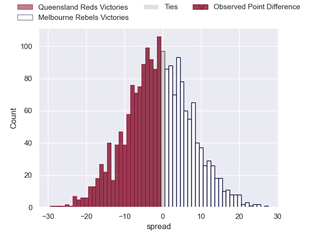
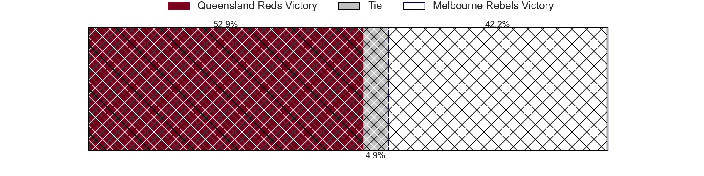

---  
layout: page  
title: Queensland Reds at Melbourne Rebels; 53-26  
date: 2024-03-15 18:00:00 -0500  
categories: "Super Rugby Pacific 2024" match review  
---
# Queensland Reds at Melbourne Rebels; 53-26

# Club Level Predictions

The first set of predictions treats a club as the smallest object, as the club develops its members, organizes a gameplan, and deploys its players as needed for each match. This club model has a prediction of 0.488, which translates to predicting Queensland Reds to win by 0.4.

Our Over/Under is 59.5 - and combined with the spread above, we have a predicted scoreline of 30 to 30

Each club has a rating and a rating deviation (similar to a Glicko rating), and expected performances can be generated. This allows for simulated matches and spreads like the ones below.
## Projected Performances - Club Model

## Projected Spreads - Club Model

## Projected Results - Club Model

# Player Level Predictions - Version 2

Treating teams instead as an entity made up of the currently active players, I have ratings for each player in an altogether different system. These can be combined to form team ratings once teamsheets are announced, weighting starters a bit higher than the reserves. After the match is played, players can be weighted by their minutes on the field, allowing for an accurate measure of the team's composition. With these compiled team ratings, we can make predictions, measure inaccuracy, and update the individual player ratings.
## Prediction without Player Minutes: Melbourne Rebels by 0.7

Queensland Reds by 2.9 on a neutral pitch

## Projected Performances - Player Model

## Projected Spreads - Player Model

## Projected Results - Player Model

|   Away Minutes | Away Player               |   Away Percentile |   Number |   Home Percentile | Home Player          |   Home Minutes |
|---------------:|:--------------------------|------------------:|---------:|------------------:|:---------------------|---------------:|
|             54 | Peni Ravai Kovekalou      |             65.3  |        1 |             76.49 | Matt Gibbon          |             33 |
|             52 | Matt Faessler             |             77.88 |        2 |             34.42 | Jordan Uelese        |             54 |
|             56 | Zane Nonggorr             |             78.26 |        3 |             97.85 | Taniela Tupou        |             33 |
|             82 | Seru Uru                  |             69.35 |        4 |             57.93 | Josh Canham          |             41 |
|             66 | Ryan Smith                |             46.63 |        5 |              7.81 | Lukhan Salakaia-Loto |             82 |
|             82 | Liam Wright               |             96.84 |        6 |             23.56 | Josh Kemeny          |             41 |
|             82 | Fraser McReight           |             94.81 |        7 |             22.1  | Vaiolini Ekuasi      |             60 |
|             72 | Harry Wilson              |             70.07 |        8 |             13.63 | Rob Leota            |             69 |
|             72 | Tate McDermott            |             85.27 |        9 |             95.02 | Ryan Louwrens        |             82 |
|             60 | Harry McLaughlin-Phillips |             59.65 |       10 |             51.63 | Carter Gordon        |             82 |
|             82 | Mac Grealy                |             80.96 |       11 |             13.89 | Glen Vaihu           |             82 |
|             62 | Isaac Henry               |             35.39 |       12 |             40.24 | Nick Jooste          |             62 |
|             82 | Josh Flook                |             45.7  |       13 |             40.85 | David Feliuai        |             82 |
|             82 | Suliasi Vunivalu          |             51.86 |       14 |             38.95 | Lachie Anderson      |             82 |
|             82 | Jock Campbell             |             69.4  |       15 |             79.52 | Andrew Kellaway      |             82 |
|             30 | Josh Nasser               |            nan    |       16 |            nan    | Ethan Dobbins        |             28 |
|             28 | George Blake              |             48.32 |       17 |            nan    | Isaac Aedo Kailea    |             49 |
|             26 | Jeff Toomaga-Allen        |             94.03 |       18 |             35.07 | Sam Talakai          |             49 |
|             16 | Cormac Daly               |            nan    |       19 |             62.02 | Tuaina Taii Tualima  |             41 |
|             10 | John Bryant               |            nan    |       20 |            nan    | Maciu Nabolakasi     |             22 |
|             10 | Kalani Thomas             |             64.32 |       21 |             43.87 | Angelo Smith         |             41 |
|             22 | Tom Lynagh                |             75.94 |       22 |             32.53 | Jake Strachan        |             20 |
|             20 | Jordan Petaia             |             87.47 |       23 |             65.77 | James Tuttle         |             13 |

