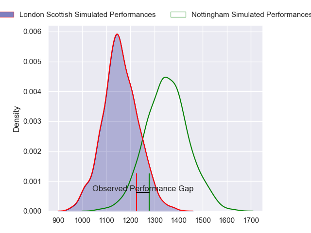
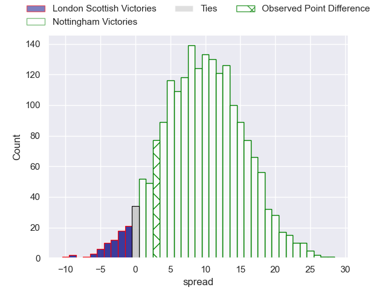
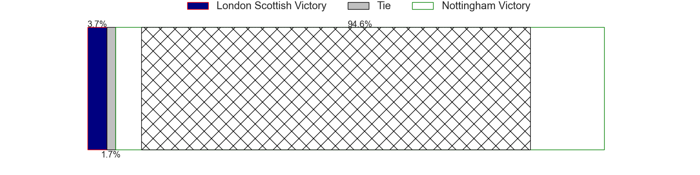
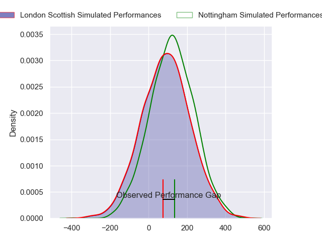
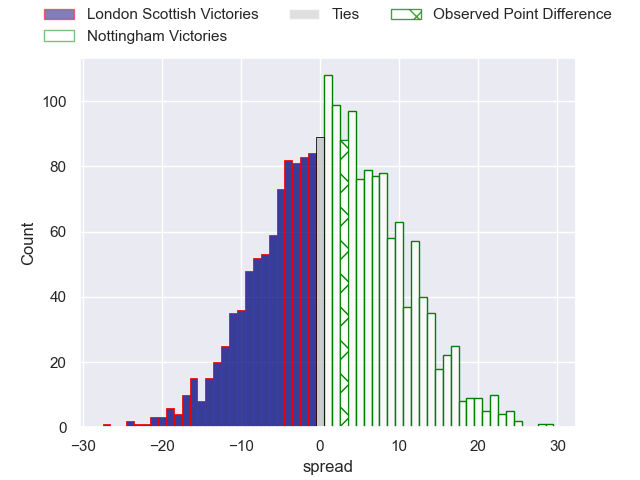

---  
layout: page  
title: London Scottish at Nottingham; 28-31  
date: 2024-03-15 18:00:00 -0500  
categories: "RFU Championship 2023" match review  
---
# London Scottish at Nottingham; 28-31

# Club Level Predictions

The first set of predictions treats a club as the smallest object, as the club develops its members, organizes a gameplan, and deploys its players as needed for each match. This club model has a prediction of 0.748, which translates to predicting Nottingham to win by 9.7.

Our Over/Under is 41.5 - and combined with the spread above, we have a predicted scoreline of 16 to 26

Each club has a rating and a rating deviation (similar to a Glicko rating), and expected performances can be generated. This allows for simulated matches and spreads like the ones below.
## Projected Performances - Club Model

## Projected Spreads - Club Model

## Projected Results - Club Model

# Player Level Predictions - Version 2

Treating teams instead as an entity made up of the currently active players, I have ratings for each player in an altogether different system. These can be combined to form team ratings once teamsheets are announced, weighting starters a bit higher than the reserves. After the match is played, players can be weighted by their minutes on the field, allowing for an accurate measure of the team's composition. With these compiled team ratings, we can make predictions, measure inaccuracy, and update the individual player ratings.
## Prediction without Player Minutes: Nottingham by 3.2

London Scottish by 0.2 on a neutral pitch

## Projected Performances - Player Model

## Projected Spreads - Player Model

## Projected Results - Player Model

|   Away Minutes | Away Player           |   Away Percentile |   Number |   Home Percentile | Home Player               |   Home Minutes |
|---------------:|:----------------------|------------------:|---------:|------------------:|:--------------------------|---------------:|
|             59 | Tom Osborne           |             32.28 |        1 |             57.18 | Kai Owen                  |             44 |
|             65 | Jack Musk             |             59.23 |        2 |             34.62 | Jack Dickinson            |             48 |
|             54 | Rhys Charalambous     |             43.75 |        3 |             69.78 | Xavier Valentine          |             48 |
|             59 | Matt Wilkinson        |             22.6  |        4 |             49.64 | Jack Shine                |             48 |
|             80 | Bailey Ransom         |             37.38 |        5 |             63.7  | Iosefa Danny Wayne Fiaola |             80 |
|             80 | Matas Jurevicius      |             17.14 |        6 |             61.78 | Kayde Sylvester           |             59 |
|             54 | Lewis Barrett         |             19.39 |        7 |             71.82 | Nathan Tweedy             |             40 |
|             65 | Archie White          |             26.76 |        8 |             58.88 | Richard Clift             |             80 |
|             65 | Jonny Law             |             17.43 |        9 |             26.97 | Micheal Stronge           |             69 |
|             80 | Alexander Lloyd-Seed  |             50.63 |       10 |             54.39 | Matthew Arden             |             80 |
|             65 | Noah Ferdinand        |              1.2  |       11 |             69.37 | Ryan Olowofela            |             80 |
|             80 | Bryn Bradley          |             44.24 |       12 |             15.76 | Javiah Pohe               |             80 |
|             80 | William Talbot-Davies |             60.97 |       13 |              3.39 | Jack Stapley              |             80 |
|             80 | Luke Mehson           |             27.24 |       14 |             33.48 | David Williams            |             80 |
|             80 | Will Brown            |             76.63 |       15 |             42.65 | Jordan Olowofela          |             40 |
|             26 | William Hobson        |             67.82 |       16 |             15.52 | Marcus Alexander Ramage   |             40 |
|             26 | Charlie Ingall        |             61.33 |       17 |             48.82 | Sam Green                 |             40 |
|             21 | George Cave           |              4.1  |       18 |             61.66 | Archie Van der Flier      |             36 |
|             21 | Harry Browne          |             59.01 |       19 |             24.44 | Jake Bridges              |             32 |
|             15 | Austin Wallis         |             12.31 |       20 |              3.12 | Sebastien Ferreira        |             32 |
|             15 | Tom Marshall          |             25.3  |       21 |             83.65 | Harry Clayton             |             32 |
|             15 | Kade Bird             |            nan    |       22 |              7.06 | Scott Hall                |             21 |
|             15 | Harry Sheppard        |            nan    |       23 |             26.76 | Will Yarnell              |             11 |

