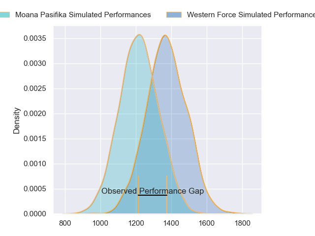
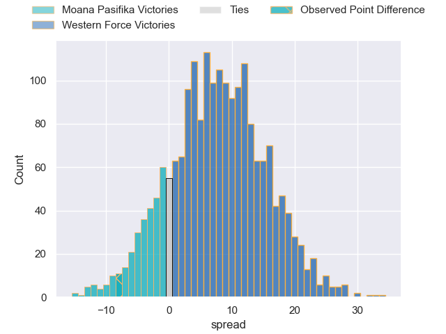
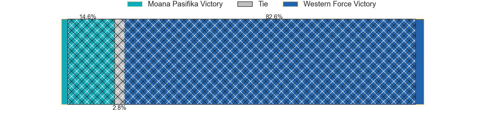
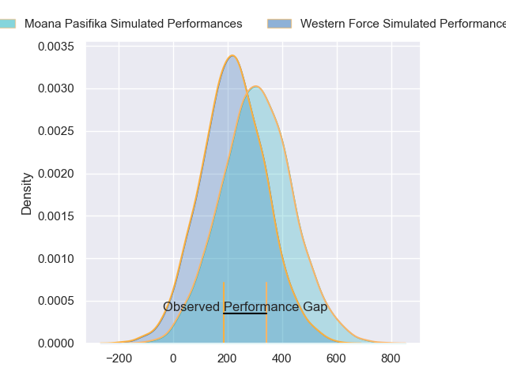
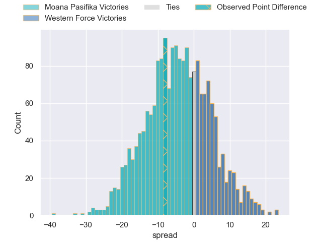

---  
layout: page  
title: Moana Pasifika at Western Force; 22-14  
date: 2024-03-15 18:00:00 -0500  
categories: "Super Rugby Pacific 2024" match review  
---
# Moana Pasifika at Western Force; 22-14

# Club Level Predictions

The first set of predictions treats a club as the smallest object, as the club develops its members, organizes a gameplan, and deploys its players as needed for each match. This club model has a prediction of 0.696, which translates to predicting Western Force to win by 7.6.

Our Over/Under is 38.5 - and combined with the spread above, we have a predicted scoreline of 15 to 23

Each club has a rating and a rating deviation (similar to a Glicko rating), and expected performances can be generated. This allows for simulated matches and spreads like the ones below.
## Projected Performances - Club Model

## Projected Spreads - Club Model

## Projected Results - Club Model

# Player Level Predictions - Version 2

Treating teams instead as an entity made up of the currently active players, I have ratings for each player in an altogether different system. These can be combined to form team ratings once teamsheets are announced, weighting starters a bit higher than the reserves. After the match is played, players can be weighted by their minutes on the field, allowing for an accurate measure of the team's composition. With these compiled team ratings, we can make predictions, measure inaccuracy, and update the individual player ratings.
## Prediction without Player Minutes: Moana Pasifika by 6.8

Moana Pasifika by 10.8 on a neutral pitch

## Projected Performances - Player Model

## Projected Spreads - Player Model

## Projected Results - Player Model

|   Away Minutes | Away Player           |   Away Percentile |   Number |   Home Percentile | Home Player           |   Home Minutes |
|---------------:|:----------------------|------------------:|---------:|------------------:|:----------------------|---------------:|
|             71 | Abraham Pole          |             45.99 |        1 |             27.89 | Ryan Coxon            |             62 |
|             47 | Sama Malolo           |             76.73 |        2 |             54.81 | Tom Horton            |             71 |
|             47 | Sekope Kepu           |             88.81 |        3 |              7.74 | Santiago Medrano      |             59 |
|             19 | Tom Savage            |             94.35 |        4 |             93.39 | Tom Franklin          |             80 |
|             80 | Allan Craig           |             30.05 |        5 |             19.59 | Jeremy Williams       |             71 |
|             80 | Jacob Norris          |             91.88 |        6 |              6.09 | Tim Anstee            |             80 |
|             80 | Sione Havili Talitui  |             93.35 |        7 |             14.66 | Carlo Tizzano         |             71 |
|             71 | Lotu Inisi            |             27.01 |        8 |             61.31 | Will Harris           |             52 |
|             80 | Ere Enari             |              3.73 |        9 |             43.57 | Issak Fines-Leleiwasa |             62 |
|             80 | Christian Leali'ifano |             86.47 |       10 |             56.39 | Ben Donaldson         |             80 |
|             80 | Kyren Taumoefolau     |             58.64 |       11 |             77.9  | Chase Tiatia          |             72 |
|             22 | Julian Savea          |             98.79 |       12 |             81.82 | Hamish Stewart        |             80 |
|             55 | Henry Taefu           |             25.82 |       13 |              9.45 | Bayley Kuenzle        |             80 |
|             80 | Nigel Ah Wong         |             88.07 |       14 |             52.84 | Harry Potter          |             80 |
|             71 | Danny Toala           |             16.14 |       15 |             10.6  | Max Burey             |             80 |
|             33 | Samiuela Moli         |              6.73 |       16 |             27.88 | Feleti Kaitu'u        |              9 |
|              9 | Sateki Latu           |            nan    |       17 |            nan    | Josh Bartlett         |             18 |
|             33 | Sione Mafileo         |             70.52 |       18 |            nan    | Tiaan Tauakipulu      |             21 |
|             61 | Ola Tauelangi         |            nan    |       19 |             27.52 | Lopeti Faifua         |              9 |
|              9 | Irie Papuni           |            nan    |       20 |            nan    | Reed Prinsep          |             28 |
|              0 | Melani Matavao        |            nan    |       21 |              6.2  | Ollie Callan          |              9 |
|             34 | William Havili        |             33.83 |       22 |            nan    | Ian Prior             |             18 |
|             58 | Pepesana Patafilo     |             82.49 |       23 |            nan    | George Poolman        |              8 |

