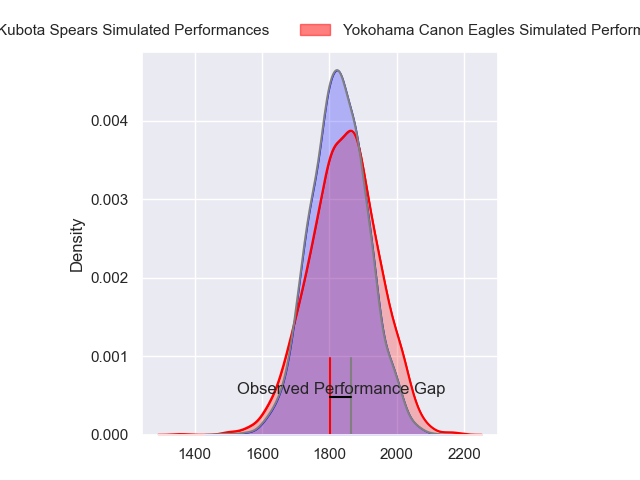
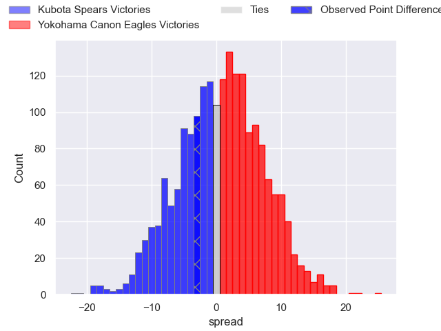
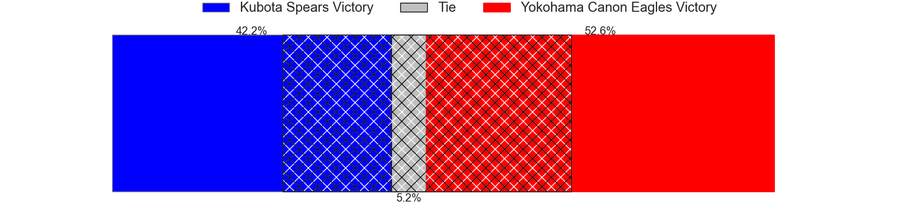
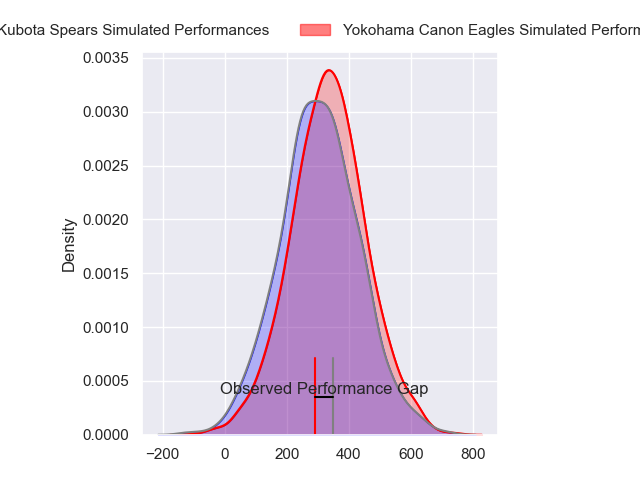
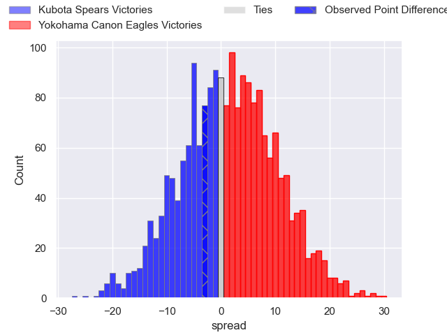
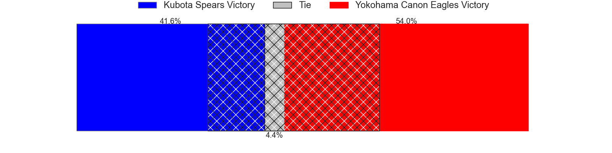

---  
layout: page  
title: Kubota Spears at Yokohama Canon Eagles; 29-26  
date: 2024-03-15 18:00:00 -0500  
categories: "Japan Rugby League One 2023" match review  
---
# Kubota Spears at Yokohama Canon Eagles; 29-26

# Club Level Predictions

The first set of predictions treats a club as the smallest object, as the club develops its members, organizes a gameplan, and deploys its players as needed for each match. This club model has a prediction of 0.517, which translates to predicting Yokohama Canon Eagles to win by 0.6.

Our Over/Under is 51.5 - and combined with the spread above, we have a predicted scoreline of 25 to 26

Each club has a rating and a rating deviation (similar to a Glicko rating), and expected performances can be generated. This allows for simulated matches and spreads like the ones below.
## Projected Performances - Club Model

## Projected Spreads - Club Model

## Projected Results - Club Model

# Player Level Predictions - Version 2

Treating teams instead as an entity made up of the currently active players, I have ratings for each player in an altogether different system. These can be combined to form team ratings once teamsheets are announced, weighting starters a bit higher than the reserves. After the match is played, players can be weighted by their minutes on the field, allowing for an accurate measure of the team's composition. With these compiled team ratings, we can make predictions, measure inaccuracy, and update the individual player ratings.
## Prediction without Player Minutes: Yokohama Canon Eagles by 2.2

Kubota Spears by 0.9 on a neutral pitch

## Projected Performances - Player Model

## Projected Spreads - Player Model

## Projected Results - Player Model

|   Away Minutes | Away Player         |   Away Percentile |   Number |   Home Percentile | Home Player              |   Home Minutes |
|---------------:|:--------------------|------------------:|---------:|------------------:|:-------------------------|---------------:|
|             47 | Kota Kaishi         |             85.82 |        1 |             95.62 | Takato Okabe             |             65 |
|             47 | Schalk Erasmus      |             58.08 |        2 |             70.58 | Yusuke Niwai             |             63 |
|             40 | Opeti Helu          |             68.94 |        3 |              4.29 | Tatsuro Sugimoto         |             50 |
|             47 | Uwe Helu            |             88.34 |        4 |             81.37 | Max Douglas              |             80 |
|             80 | David Bulbring      |             78.37 |        5 |             54.81 | Matt Philip              |             65 |
|             80 | Lappies Labuschagne |             90.42 |        6 |             87.49 | Kobus Van Dyk            |             80 |
|             80 | Takeo Suenaga       |             84.22 |        7 |             75.87 | Naoto Shimada            |             80 |
|             59 | Faulua Makisi       |             80.78 |        8 |             91    | Amanaki Mafi             |             62 |
|             80 | Shinobu Fujiwara    |             40.87 |        9 |             69.09 | Toshiki Amano            |             80 |
|             80 | Tomoki Kishioka     |             54.89 |       10 |             67.17 | Yu Tamura                |             80 |
|             80 | Suryung Kim         |             74.84 |       11 |             27.02 | Masayoshi Takezawa       |             78 |
|             80 | Harumichi Tatekawa  |             67.88 |       12 |             92.97 | Yusuke Kajimura          |             78 |
|             59 | Rikus Pretorius     |             46.06 |       13 |             76.73 | Rohan Janse van Rensburg |             80 |
|             80 | Koga Nezuka         |             84.35 |       14 |             93.11 | Viliame Takayawa         |             80 |
|             80 | Yuhei Shimada       |             24.58 |       15 |             97.35 | Jumpei Ogura             |             80 |
|             40 | Kengo Kitagawa      |             88.62 |       16 |             59.61 | Ryosuke Iwaihara         |             30 |
|             33 | JD Schickerling     |              3.85 |       17 |             63.26 | Sione Halasili           |             18 |
|             33 | Hayate Era          |            nan    |       18 |             83.46 | Shunta Nakamura          |             17 |
|             33 | Yota Kaminori       |             49.91 |       19 |             51.4  | Chang Ho Ahn             |             15 |
|             21 | Finau Tupa          |             75.08 |       20 |              4.93 | Liaki Moli               |             15 |
|             21 | Halatoa Vailea      |             71.66 |       21 |             77.13 | Inoke Burua              |              2 |
|            nan | nan                 |            nan    |       22 |             95.39 | SP Marais                |              2 |

