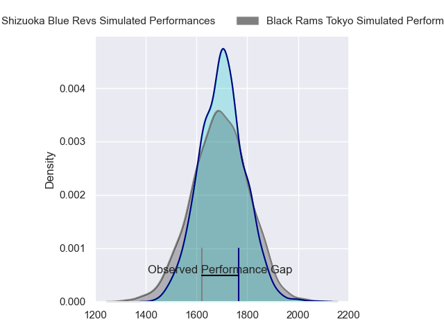
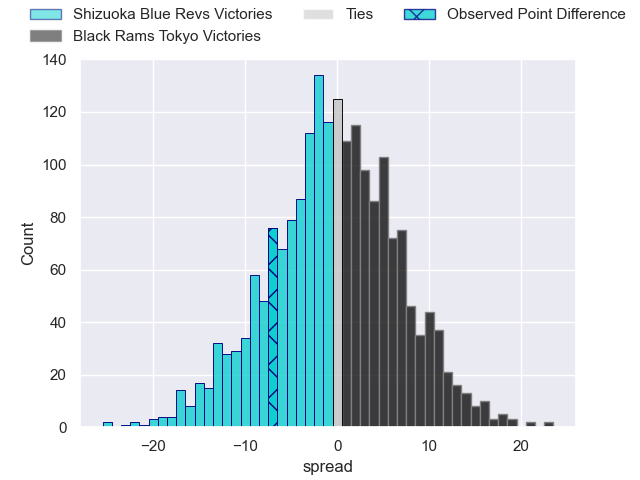
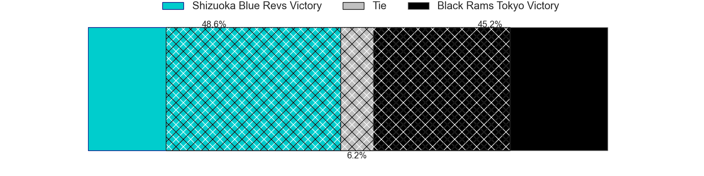
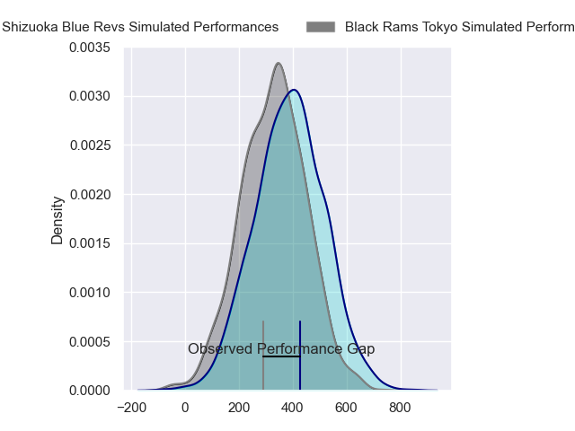
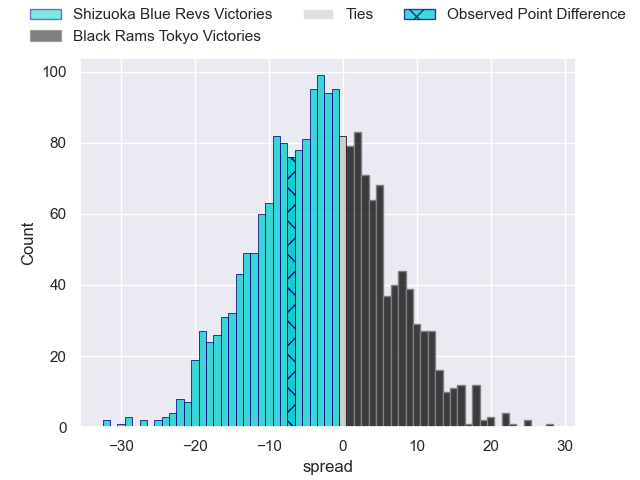
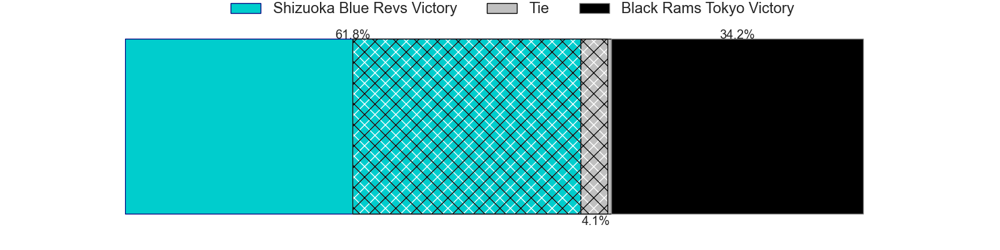

---  
layout: page  
title: Shizuoka Blue Revs at Black Rams Tokyo; 36-29  
date: 2024-03-16 18:00:00 -0500  
categories: "Japan Rugby League One 2023" match review  
---
# Shizuoka Blue Revs at Black Rams Tokyo; 36-29

# Club Level Predictions

The first set of predictions treats a club as the smallest object, as the club develops its members, organizes a gameplan, and deploys its players as needed for each match. This club model has a prediction of 0.488, which translates to predicting Shizuoka Blue Revs to win by 0.4.

Our Over/Under is 52.5 - and combined with the spread above, we have a predicted scoreline of 27 to 26

Each club has a rating and a rating deviation (similar to a Glicko rating), and expected performances can be generated. This allows for simulated matches and spreads like the ones below.
## Projected Performances - Club Model

## Projected Spreads - Club Model

## Projected Results - Club Model

# Player Level Predictions - Version 2

Treating teams instead as an entity made up of the currently active players, I have ratings for each player in an altogether different system. These can be combined to form team ratings once teamsheets are announced, weighting starters a bit higher than the reserves. After the match is played, players can be weighted by their minutes on the field, allowing for an accurate measure of the team's composition. With these compiled team ratings, we can make predictions, measure inaccuracy, and update the individual player ratings.
## Prediction without Player Minutes: Shizuoka Blue Revs by 0.7

Shizuoka Blue Revs by 3.9 on a neutral pitch

## Projected Performances - Player Model

## Projected Spreads - Player Model

## Projected Results - Player Model

|   Away Minutes | Away Player        |   Away Percentile |   Number |   Home Percentile | Home Player       |   Home Minutes |
|---------------:|:-------------------|------------------:|---------:|------------------:|:------------------|---------------:|
|             63 | Takayoshi Mohara   |             26.31 |        1 |             68.1  | Kazuma Nishi      |             52 |
|             63 | Takeshi Hino       |             96.92 |        2 |             76.15 | Ko Sato           |             80 |
|             74 | Heiichiro Ito      |             89.65 |        3 |             71.55 | Paddy Ryan        |             56 |
|             80 | Eishin Kuwano      |             85.58 |        4 |             41.35 | Josh Goodhue      |             80 |
|             80 | Murray Douglas     |             94.59 |        5 |             71.39 | Talau Fakatava    |             80 |
|             80 | Yuya Odo           |             95.15 |        6 |             34.5  | Daiki Yanagawa    |             46 |
|             74 | Richard Goh Jones  |             51.3  |        7 |             74.41 | Shuhei Matsuhashi |             80 |
|             48 | Malgene Ilaua      |             57.66 |        8 |             88.08 | Nathan Hughes     |             56 |
|             66 | Bryn Hall          |             97.1  |        9 |             55.81 | Syota Yamamoto    |             71 |
|             74 | Kenta Iemura       |             67.92 |       10 |             46.37 | Ichigo Nakakusu   |             60 |
|             80 | Malo Tuitama       |             78.88 |       11 |             69.15 | Netani Vakayalia  |             80 |
|             56 | Viliami Tahitu'a   |             74.3  |       12 |             99.39 | Hadleigh Parkes   |             37 |
|             80 | Charles Piutau     |             84.73 |       13 |             61.58 | Ryohei Isoda      |             80 |
|             80 | Kakeru Okumura     |             25.93 |       14 |             43.11 | Daisuke Nishikawa |             80 |
|             80 | Futo Yamaguchi     |             67.71 |       15 |             86.02 | Matt McGahan      |             80 |
|             32 | Shoji Takuma       |             35.4  |       16 |             73.43 | Isaac Lucas       |             43 |
|             24 | Sam Greene         |              4.76 |       17 |             79.59 | Brodi McCurran    |             34 |
|             17 | Kenta Yamashita    |            nan    |       18 |            nan    | Takeo Makabe      |             28 |
|             17 | Richmond Tongatama |            nan    |       19 |             41.79 | Shohei Oyama      |             24 |
|             14 | Yuki Yatomi        |             66.6  |       20 |              4.81 | Mike Stolberg     |             24 |
|              6 | Riki Sugihara      |            nan    |       21 |             29.21 | Yuta Kurihara     |             20 |
|              6 | Keagan Faria       |             46.06 |       22 |             71.58 | Toshiya Takahashi |              9 |
|              6 | Sean Vete          |            nan    |       23 |            nan    | nan               |            nan |

