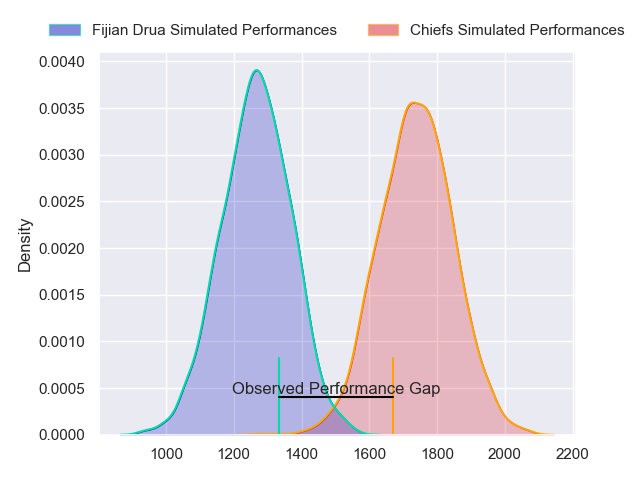
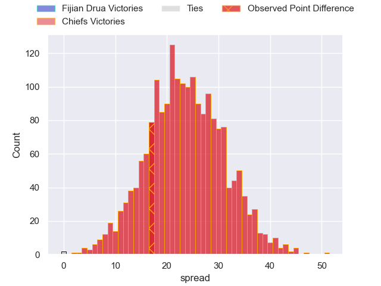
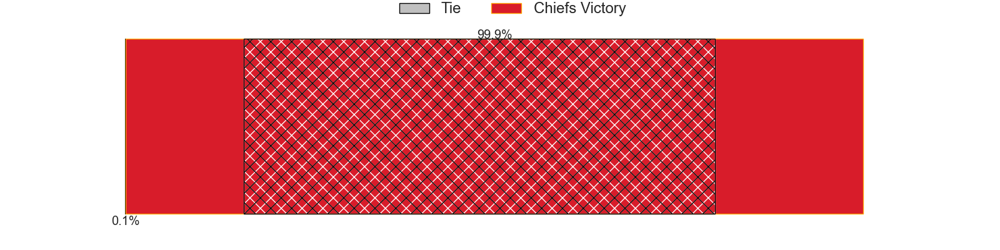
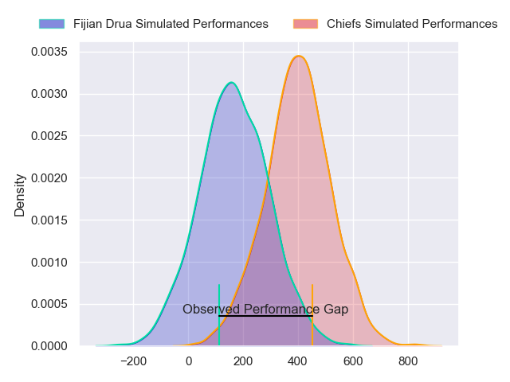
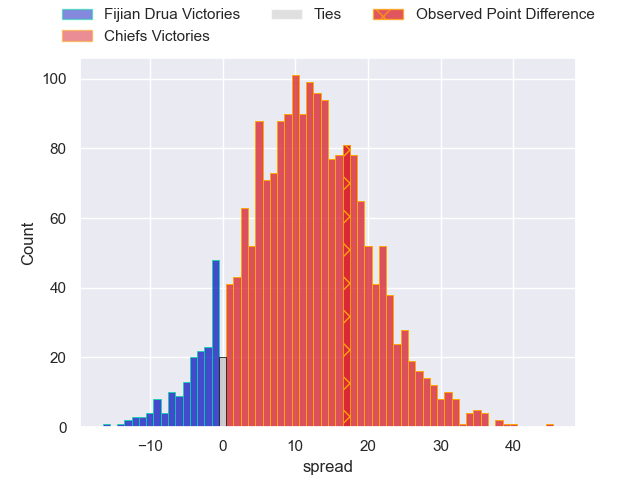
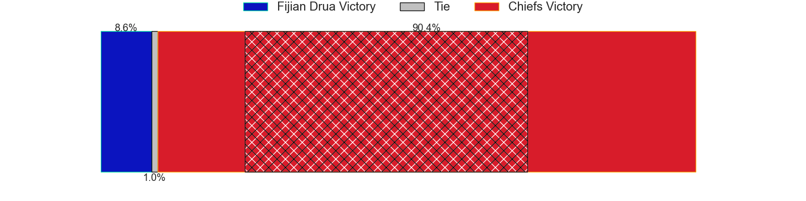

---  
layout: page  
title: Fijian Drua at Chiefs; 29-46  
date: 2024-03-16 18:00:00 -0500  
categories: "Super Rugby Pacific 2024" match review  
---
# Fijian Drua at Chiefs; 29-46

# Club Level Predictions

The first set of predictions treats a club as the smallest object, as the club develops its members, organizes a gameplan, and deploys its players as needed for each match. This club model has a prediction of 0.929, which translates to predicting Chiefs to win by 23.5.

Our Over/Under is 47.5 - and combined with the spread above, we have a predicted scoreline of 12 to 35

Each club has a rating and a rating deviation (similar to a Glicko rating), and expected performances can be generated. This allows for simulated matches and spreads like the ones below.
## Projected Performances - Club Model

## Projected Spreads - Club Model

## Projected Results - Club Model

# Player Level Predictions - Version 2

Treating teams instead as an entity made up of the currently active players, I have ratings for each player in an altogether different system. These can be combined to form team ratings once teamsheets are announced, weighting starters a bit higher than the reserves. After the match is played, players can be weighted by their minutes on the field, allowing for an accurate measure of the team's composition. With these compiled team ratings, we can make predictions, measure inaccuracy, and update the individual player ratings.
## Prediction without Player Minutes: Chiefs by 13.3

Chiefs by 8.7 on a neutral pitch

## Projected Performances - Player Model

## Projected Spreads - Player Model

## Projected Results - Player Model

|   Away Minutes | Away Player             |   Away Percentile |   Number |   Home Percentile | Home Player          |   Home Minutes |
|---------------:|:------------------------|------------------:|---------:|------------------:|:---------------------|---------------:|
|             64 | Haereiti Hetet          |             92.35 |        1 |             97.76 | Aidan Ross           |             53 |
|             56 | Mesu Dolokoto           |             38.46 |        2 |             91.35 | Samisoni Taukei'aho  |             58 |
|             52 | Jone Koroiduadua        |             54.38 |        3 |             21.08 | Reuben O'Neill       |             53 |
|             81 | Mesake Vocevoce         |             64.3  |        4 |             19.35 | Manaaki Selby-Rickit |             63 |
|             81 | Ratu Rotuisolia         |             43.75 |        5 |             28.73 | Jimmy Tupou          |             81 |
|             63 | Etonia Waqa             |             63.36 |        6 |             90.98 | Samipeni Finau       |             81 |
|             81 | Vilive Miramira         |             75.42 |        7 |             45.66 | Kaylum Boshier       |             74 |
|             59 | Meli Derenalagi         |             46.47 |        8 |             89.05 | Luke Jacobson        |             81 |
|             50 | Simione Kuruvoli        |             46.68 |        9 |             66.39 | Cortez Ratima        |             56 |
|             81 | Isaiah Armstrong-Ravula |             55.14 |       10 |             96.49 | Damian McKenzie      |             81 |
|             58 | Iliesa Junior Ratuva    |             47.37 |       11 |             31.84 | Etene Nanai-Seturo   |             81 |
|             40 | Michael Naitokani       |             37.82 |       12 |             57.21 | Rameka Poihipi       |             56 |
|             81 | Iosefo Masi             |             76.97 |       13 |             90.55 | Anton Lienert-Brown  |             64 |
|             81 | Selestino Ravutaumada   |             85.67 |       14 |             68.71 | Daniel Rona          |             81 |
|             81 | Ilaisa Droasese         |             72.77 |       15 |             91.81 | Shaun Stevenson      |             81 |
|             25 | Zuriel Togiatama        |             32.12 |       16 |             79.23 | Bradley Slater       |             23 |
|             17 | Emosi Tuqiri            |             59.51 |       17 |             79.57 | Ollie Norris         |             28 |
|             29 | Samu Tawake             |              5.13 |       18 |             79.94 | George Dyer          |             28 |
|             18 | Te Ahiwaru Cirikidaveta |             57.57 |       19 |             80.53 | Josh Lord            |             18 |
|             22 | Elia Canakaivata        |             55.02 |       20 |            nan    | Tom Florence         |              7 |
|             31 | Peni Matawalu           |             56.85 |       21 |             45.44 | Xavier Roe           |             25 |
|             41 | Kemu Valetini           |            nan    |       22 |            nan    | Josh Jacomb          |             17 |
|             23 | Taniela Rakuro          |             43.54 |       23 |             85.94 | Quinn Tupaea         |             25 |

