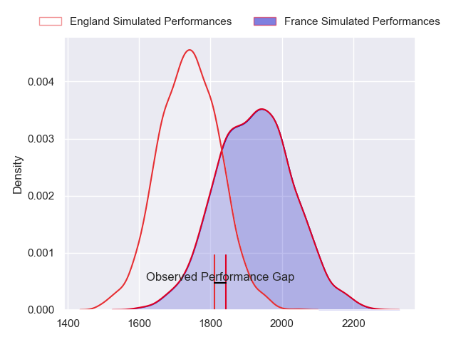
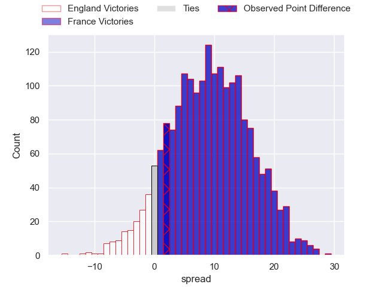
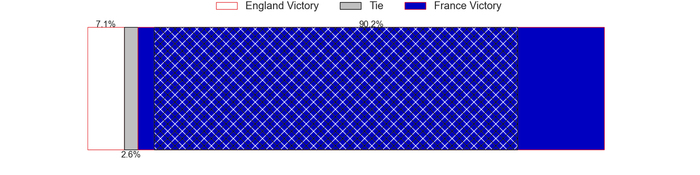
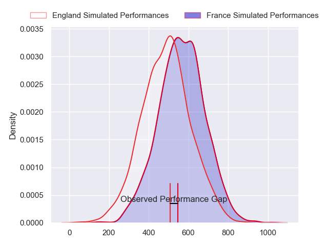
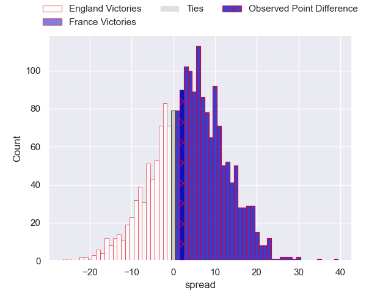
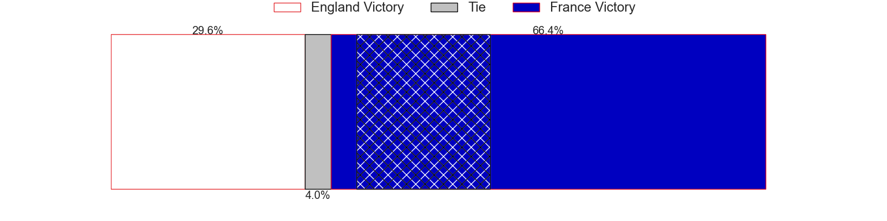

---  
layout: page  
title: England at France; 31-33  
date: 2024-03-16 18:00:00 -0500  
categories: "Six Nations Championship 2024" match review  
---
# England at France; 31-33

# Club Level Predictions

The first set of predictions treats a club as the smallest object, as the club develops its members, organizes a gameplan, and deploys its players as needed for each match. This club model has a prediction of 0.735, which translates to predicting France to win by 9.1.

Our Over/Under is 47.5 - and combined with the spread above, we have a predicted scoreline of 19 to 28

Each club has a rating and a rating deviation (similar to a Glicko rating), and expected performances can be generated. This allows for simulated matches and spreads like the ones below.
## Projected Performances - Club Model

## Projected Spreads - Club Model

## Projected Results - Club Model

# Player Level Predictions - Version 2

Treating teams instead as an entity made up of the currently active players, I have ratings for each player in an altogether different system. These can be combined to form team ratings once teamsheets are announced, weighting starters a bit higher than the reserves. After the match is played, players can be weighted by their minutes on the field, allowing for an accurate measure of the team's composition. With these compiled team ratings, we can make predictions, measure inaccuracy, and update the individual player ratings.
## Prediction without Player Minutes: France by 6.3

France by 2.5 on a neutral pitch

## Projected Performances - Player Model

## Projected Spreads - Player Model

## Projected Results - Player Model

|   Away Minutes | Away Player    |   Away Percentile |   Number |   Home Percentile | Home Player           |   Home Minutes |
|---------------:|:---------------|------------------:|---------:|------------------:|:----------------------|---------------:|
|             50 | Ellis Genge    |             48.39 |        1 |             94.99 | Cyril Baille          |             48 |
|             50 | Jamie George   |             98.45 |        2 |             98.25 | Julien Marchand       |             48 |
|             50 | Dan Cole       |             37.71 |        3 |             99.62 | Uini Atonio           |             62 |
|             80 | Maro Itoje     |             95.39 |        4 |             89.81 | Thibaud Flament       |             80 |
|             80 | George Martin  |             91.14 |        5 |             82.89 | Emmanuel Meafou       |             48 |
|             55 | Ollie Chessum  |             78.88 |        6 |             97.94 | Francois Cros         |             80 |
|             67 | Sam Underhill  |             90.61 |        7 |             97.28 | Charles Ollivon       |             62 |
|             80 | Ben Earl       |             96.91 |        8 |             99.75 | Gregory Alldritt      |             70 |
|             70 | Alex Mitchell  |             94.8  |        9 |             78.79 | Nolann Le Garrec      |             67 |
|             80 | George Ford    |             92.39 |       10 |             93.4  | Thomas Ramos          |             80 |
|             80 | Elliot Daly    |             83.05 |       11 |             75.75 | Louis Bielle-Biarrey  |             80 |
|             80 | Ollie Lawrence |             80.44 |       12 |             36.09 | Nicolas Depoortere    |             60 |
|             60 | Henry Slade    |             97.57 |       13 |             96.72 | Gael Fickou           |             80 |
|             80 | Tommy Freeman  |             97.12 |       14 |             94.35 | Damian Penaud         |             80 |
|              8 | George Furbank |             95.33 |       15 |             76.41 | Leo Barre             |             80 |
|             30 | Theo Dan       |             52.43 |       16 |             92.82 | Peato Mauvaka         |             32 |
|             30 | Joe Marler     |             98.3  |       17 |             13.99 | Sebastien Taofifenua  |             32 |
|             30 | Will Stuart    |             21.27 |       18 |              5.48 | Georges-Henri Colombe |             18 |
|             25 | Ethan Roots    |             73.54 |       19 |             45.39 | Romain Taofifenua     |             32 |
|             13 | Alex Dombrandt |             82.47 |       20 |             94.81 | Alexandre Roumat      |             18 |
|             10 | Danny Care     |            100    |       21 |             13.75 | Paul Boudehent        |             10 |
|             72 | Marcus Smith   |             83.76 |       22 |             99.17 | Maxime Lucu           |             13 |
|             20 | Manu Tuilagi   |             97.45 |       23 |             76.67 | Yoram Moefana         |             20 |

