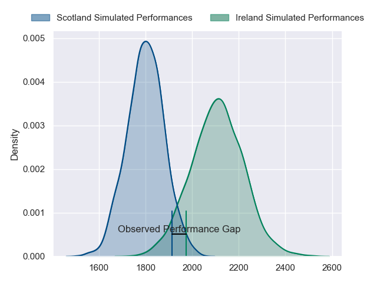
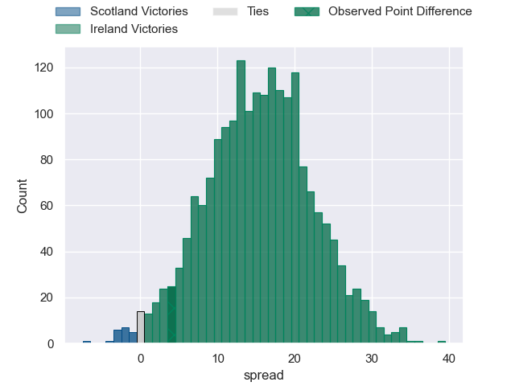
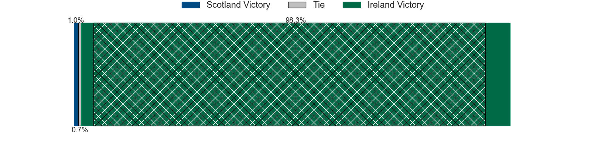
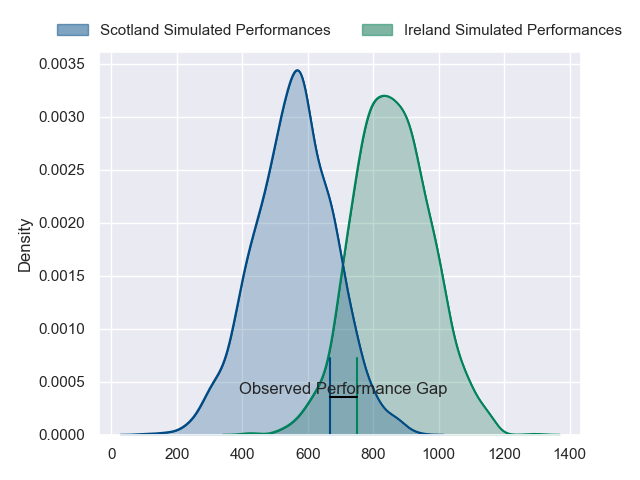
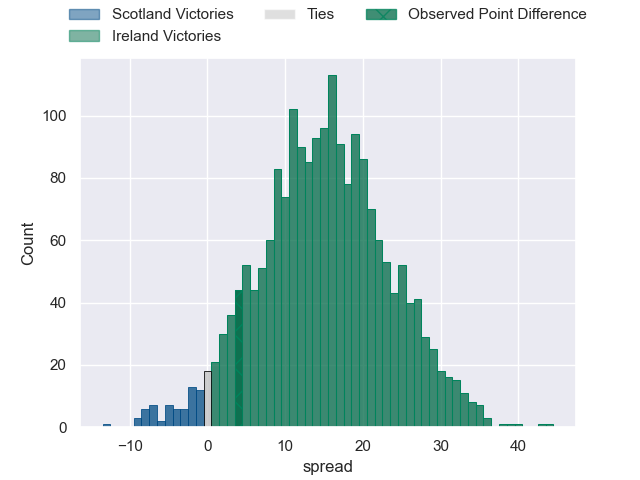
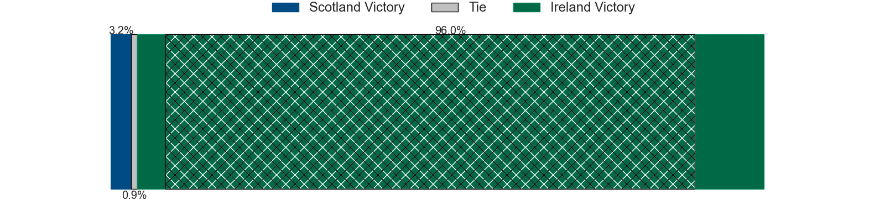

---  
layout: page  
title: Scotland at Ireland; 13-17  
date: 2024-03-16 18:00:00 -0500  
categories: "Six Nations Championship 2024" match review  
---
# Scotland at Ireland; 13-17

# Club Level Predictions

The first set of predictions treats a club as the smallest object, as the club develops its members, organizes a gameplan, and deploys its players as needed for each match. This club model has a prediction of 0.85, which translates to predicting Ireland to win by 15.6.

Our Over/Under is 42.5 - and combined with the spread above, we have a predicted scoreline of 14 to 29

Each club has a rating and a rating deviation (similar to a Glicko rating), and expected performances can be generated. This allows for simulated matches and spreads like the ones below.
## Projected Performances - Club Model

## Projected Spreads - Club Model

## Projected Results - Club Model

# Player Level Predictions - Version 2

Treating teams instead as an entity made up of the currently active players, I have ratings for each player in an altogether different system. These can be combined to form team ratings once teamsheets are announced, weighting starters a bit higher than the reserves. After the match is played, players can be weighted by their minutes on the field, allowing for an accurate measure of the team's composition. With these compiled team ratings, we can make predictions, measure inaccuracy, and update the individual player ratings.
## Prediction without Player Minutes: Ireland by 18.0

Ireland by 14.3 on a neutral pitch

## Projected Performances - Player Model

## Projected Spreads - Player Model

## Projected Results - Player Model

|   Away Minutes | Away Player         |   Away Percentile |   Number |   Home Percentile | Home Player         |   Home Minutes |
|---------------:|:--------------------|------------------:|---------:|------------------:|:--------------------|---------------:|
|             49 | Pierre Schoeman     |             93.28 |        1 |             93.1  | Andrew Porter       |             68 |
|             57 | George Turner       |             99.62 |        2 |             75.38 | Dan Sheehan         |             56 |
|             71 | Zander Fagerson     |             99.16 |        3 |             98.04 | Tadhg Furlong       |             52 |
|             80 | Grant Gilchrist     |             95.19 |        4 |             82.45 | Joe McCarthy        |             56 |
|             71 | Scott Cummings      |             97.12 |        5 |             99.28 | Tadhg Beirne        |             80 |
|             72 | Andy Christie       |             24.8  |        6 |             97.75 | Peter O'Mahony      |             65 |
|             62 | Rory Darge          |             77.56 |        7 |             98.99 | Josh van der Flier  |             80 |
|             80 | Jack Dempsey        |             48.42 |        8 |             96.84 | Caelan Doris        |             80 |
|             62 | Ben White           |             78.42 |        9 |             97.3  | Jamison Gibson-Park |             70 |
|             80 | Finn Russell        |             99.75 |       10 |             46.62 | Jack Crowley        |             80 |
|             80 | Duhan van der Merwe |             84.57 |       11 |            100    | James Lowe          |             80 |
|             62 | Stafford McDowall   |             92.73 |       12 |             99.15 | Bundee Aki          |             80 |
|             80 | Huw Jones           |             41.09 |       13 |             91.88 | Robbie Henshaw      |             80 |
|             80 | Kyle Steyn          |             97.26 |       14 |             90.48 | Calvin Nash         |             57 |
|             67 | Blair Kinghorn      |             99.76 |       15 |             87.95 | Jordan Larmour      |             68 |
|             31 | Ewan Ashman         |             88.27 |       16 |             91.54 | Ronan Kelleher      |             24 |
|             31 | Rory Sutherland     |             33.4  |       17 |             92.91 | Cian Healy          |             12 |
|              9 | Javan Sebastian     |             69.96 |       18 |             96.83 | Finlay Bealham      |             28 |
|              9 | Sam Skinner         |             84.74 |       19 |             88.28 | Ryan Baird          |             24 |
|             18 | Matt Fagerson       |             96.17 |       20 |             98.3  | Jack Conan          |             15 |
|             18 | George Horne        |             99.38 |       21 |             97.72 | Conor Murray        |             10 |
|             18 | Cameron Redpath     |             51.03 |       22 |             88    | Harry Byrne         |             12 |
|             13 | Kyle Rowe           |             77.24 |       23 |             98.67 | Garry Ringrose      |             23 |

