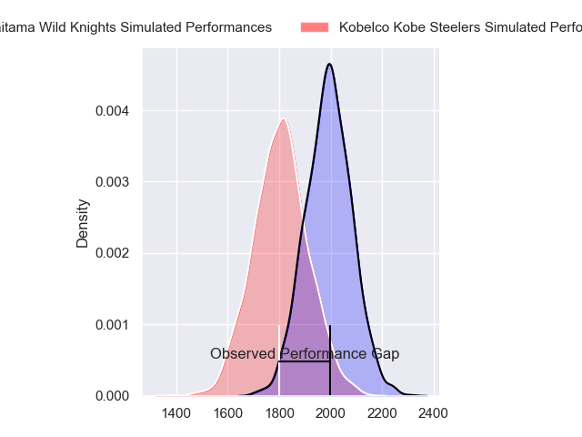
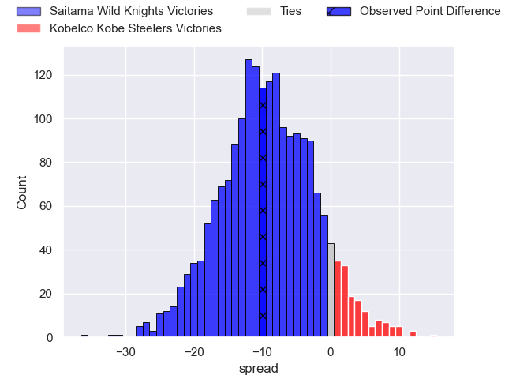
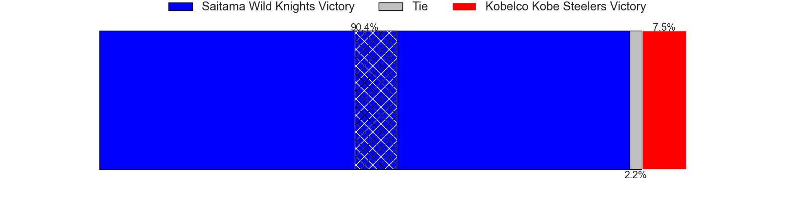
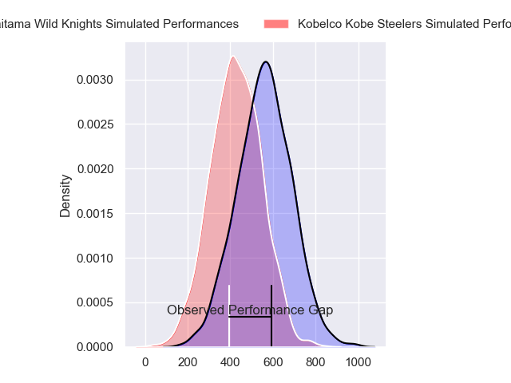
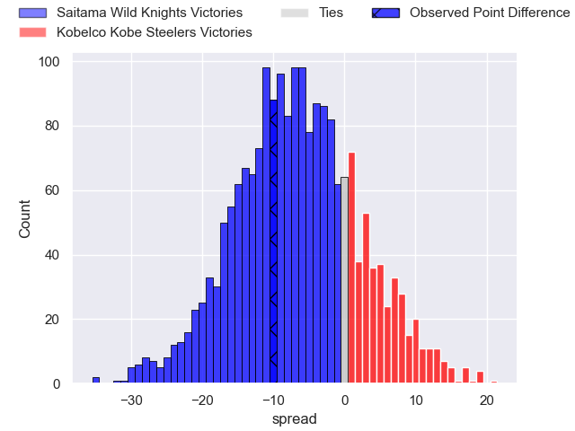
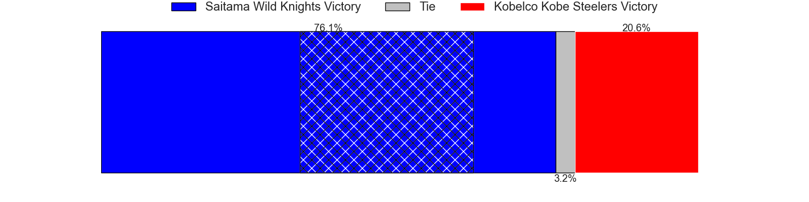

---  
layout: page  
title: Saitama Wild Knights at Kobelco Kobe Steelers; 28-18  
date: 2024-03-16 18:00:00 -0500  
categories: "Japan Rugby League One 2023" match review  
---
# Saitama Wild Knights at Kobelco Kobe Steelers; 28-18

# Club Level Predictions

The first set of predictions treats a club as the smallest object, as the club develops its members, organizes a gameplan, and deploys its players as needed for each match. This club model has a prediction of 0.262, which translates to predicting Saitama Wild Knights to win by 9.3.

Our Over/Under is 46.5 - and combined with the spread above, we have a predicted scoreline of 28 to 19

Each club has a rating and a rating deviation (similar to a Glicko rating), and expected performances can be generated. This allows for simulated matches and spreads like the ones below.
## Projected Performances - Club Model

## Projected Spreads - Club Model

## Projected Results - Club Model

# Player Level Predictions - Version 2

Treating teams instead as an entity made up of the currently active players, I have ratings for each player in an altogether different system. These can be combined to form team ratings once teamsheets are announced, weighting starters a bit higher than the reserves. After the match is played, players can be weighted by their minutes on the field, allowing for an accurate measure of the team's composition. With these compiled team ratings, we can make predictions, measure inaccuracy, and update the individual player ratings.
## Prediction without Player Minutes: Saitama Wild Knights by 5.2

Saitama Wild Knights by 8.5 on a neutral pitch

## Projected Performances - Player Model

## Projected Spreads - Player Model

## Projected Results - Player Model

|   Away Minutes | Away Player       |   Away Percentile |   Number |   Home Percentile | Home Player              |   Home Minutes |
|---------------:|:------------------|------------------:|---------:|------------------:|:-------------------------|---------------:|
|             67 | Craig Millar      |             62.95 |        1 |             69.66 | Shigure Takao            |             51 |
|             51 | Atsushi Sakate    |             86.02 |        2 |             69.9  | Kenta Matsuoka           |             62 |
|             59 | Asaeli Ai Valu    |             96.88 |        3 |             95.75 | Hiroshi Yamashita        |             62 |
|             51 | Mark Abbott       |             18.81 |        4 |             79.25 | Waisake Raratubua        |             58 |
|             80 | Lood de Jager     |             95.51 |        5 |            100    | Brodie Retallick         |             80 |
|             75 | Itsuki Onishi     |             91.64 |        6 |             66.67 | Amanaki Saumaki          |             71 |
|             80 | Lachlan Boshier   |             98.4  |        7 |             99.54 | Ardie Savea              |             80 |
|             80 | Jack Cornelsen    |             93.83 |        8 |             71.36 | Tiennan Costley          |             80 |
|             57 | Keisuke Uchida    |             97.92 |        9 |             90.85 | Atsushi Hiwasa           |             67 |
|             80 | Rikiya Matsuda    |             98.22 |       10 |             92.89 | Bryn Gatland             |             80 |
|             51 | Marika Koroibete  |             94.13 |       11 |             78.07 | Kanta Matsunaga          |             80 |
|             80 | Damian de Allende |             99.27 |       12 |             58.81 | Michael Little           |             58 |
|             80 | Dylan Riley       |             98.3  |       13 |             12.64 | Seungsin Lee             |             80 |
|             80 | Tomoki Osada      |             61.35 |       14 |             94.68 | Rakuhei Yamashita        |             67 |
|             80 | Kyohei Yamasawa   |             71.99 |       15 |             70.52 | Ryohei Yamanaka          |             80 |
|             29 | Liam Mitchell     |             53.4  |       16 |             82.61 | Isileli Nakajima Vakauta |             29 |
|             29 | Shota Horie       |             93.2  |       17 |             79.49 | Gerard Cowley-Tuioti     |             22 |
|             29 | Takuya Yamasawa   |             93.37 |       18 |             38.15 | Timothy Lafaele          |             22 |
|             23 | Taiki Koyama      |             93.97 |       19 |            nan    | Takayuki Watanabe        |             18 |
|             21 | Sho Furuhata      |            nan    |       20 |             79.42 | Takuya Kitade            |             18 |
|             13 | Daniel Perez      |             39.51 |       21 |             25.57 | Daiki Nakajima           |             13 |
|              5 | Masaki Tani       |            nan    |       22 |             15.28 | Junta Hamano             |             13 |
|            nan | nan               |            nan    |       23 |             52.12 | Takara Imamura           |              9 |

