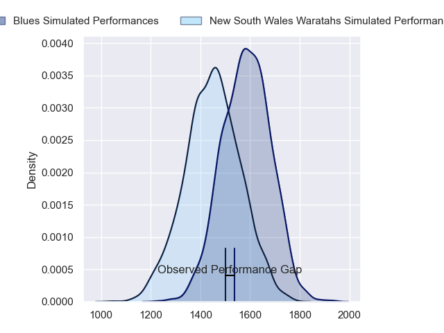
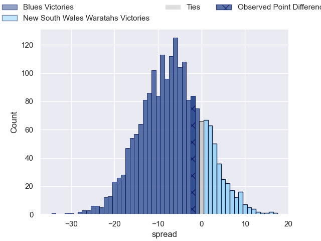
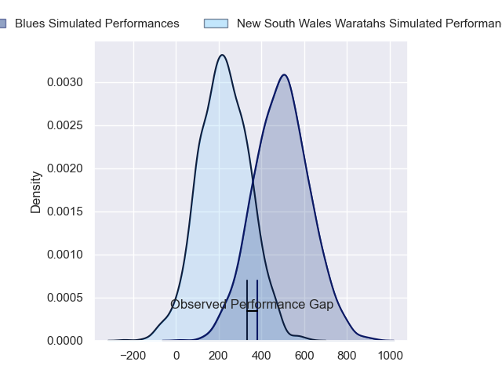
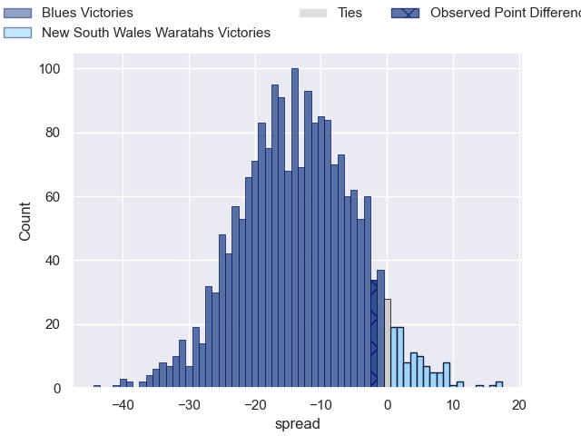
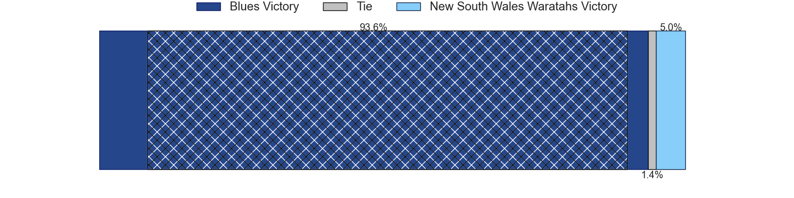

---  
layout: page  
title: Blues at New South Wales Waratahs; 12-10  
date: 2024-03-16 18:00:00 -0500  
categories: "Super Rugby Pacific 2024" match review  
---
# Blues at New South Wales Waratahs; 12-10

# Club Level Predictions

The first set of predictions treats a club as the smallest object, as the club develops its members, organizes a gameplan, and deploys its players as needed for each match. This club model has a prediction of 0.314, which translates to predicting Blues to win by 7.1.

Our Over/Under is 50.5 - and combined with the spread above, we have a predicted scoreline of 29 to 22

Each club has a rating and a rating deviation (similar to a Glicko rating), and expected performances can be generated. This allows for simulated matches and spreads like the ones below.
## Projected Performances - Club Model

## Projected Spreads - Club Model

## Projected Results - Club Model

# Player Level Predictions - Version 2

Treating teams instead as an entity made up of the currently active players, I have ratings for each player in an altogether different system. These can be combined to form team ratings once teamsheets are announced, weighting starters a bit higher than the reserves. After the match is played, players can be weighted by their minutes on the field, allowing for an accurate measure of the team's composition. With these compiled team ratings, we can make predictions, measure inaccuracy, and update the individual player ratings.
## Prediction without Player Minutes: Blues by 13.1

Blues by 17.4 on a neutral pitch

## Projected Performances - Player Model

## Projected Spreads - Player Model

## Projected Results - Player Model

|   Away Minutes | Away Player        |   Away Percentile |   Number |   Home Percentile | Home Player              |   Home Minutes |
|---------------:|:-------------------|------------------:|---------:|------------------:|:-------------------------|---------------:|
|             49 | Ofa Tu'ungafasi    |             97.95 |        1 |             94.22 | Hayden Thompson-Stringer |             30 |
|             60 | Kurt Eklund        |             89.81 |        2 |             63.27 | Julian Heaven            |             74 |
|             49 | Marcel Renata      |             50.37 |        3 |             77.15 | Harry Johnson-Holmes     |             60 |
|             80 | Josh Beehre        |             72.48 |        4 |             50.84 | Jed Holloway             |             60 |
|             80 | Laghlan McWhannell |             93.27 |        5 |             38.58 | Fergus Lee-Warner        |             50 |
|             67 | Akira Ioane        |             93.46 |        6 |             57.72 | Ned Hanigan              |             80 |
|             54 | Dalton Papalii     |             98.42 |        7 |             80.83 | Charlie Gamble           |             80 |
|             80 | Hoskins Sotutu     |             86.37 |        8 |             72.99 | Langi Gleeson            |             60 |
|             80 | Finlay Christie    |             61    |        9 |             92.32 | Jake Gordon              |             72 |
|             80 | Stephen Perofeta   |             93.98 |       10 |             52.38 | Tane Edmed               |             80 |
|             80 | Caleb Clarke       |             19.15 |       11 |             80.74 | Dylan Pietsch            |             80 |
|             65 | Bryce Heem         |             97.45 |       12 |             88.24 | Joey Walton              |             80 |
|              3 | Rieko Ioane        |             69.45 |       13 |             64.24 | Izaia Perese             |             78 |
|             80 | Mark Tele'a        |             43.22 |       14 |             66.96 | Triston Reilly           |             80 |
|             80 | Zarn Sullivan      |             77.59 |       15 |             54.46 | Mark Nawaqanitawase      |             80 |
|             20 | Soane Vikena       |             74.04 |       16 |            nan    | Jay Fonokalafi           |              6 |
|             31 | Josh Fusitu'a      |             49.72 |       17 |             91.32 | Angus Bell               |             50 |
|             31 | Angus Ta'avao      |             95.71 |       18 |             32    | Tom Ross                 |             20 |
|             13 | Cameron Suafoa     |             61.06 |       19 |              5.53 | Miles Amatosero          |             20 |
|             26 | Anton Segner       |             50.62 |       20 |             28.49 | Hugh Sinclair            |             30 |
|              0 | Sam Nock           |             75.1  |       21 |             25.48 | Lachlan Swinton          |             20 |
|             77 | Harry Plummer      |             88.85 |       22 |            nan    | Jack Grant               |              8 |
|             15 | Cole Forbes        |             48.43 |       23 |             45.45 | Harry Wilson             |              2 |

