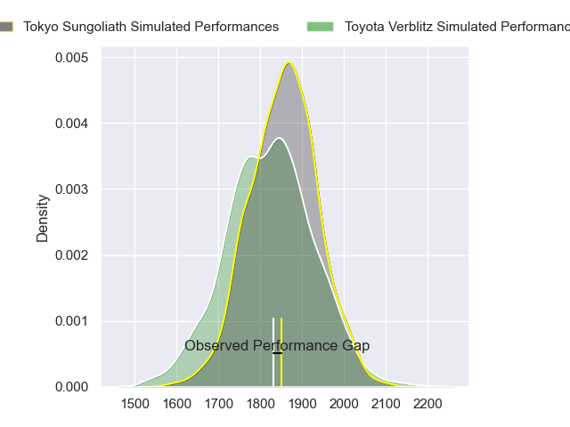
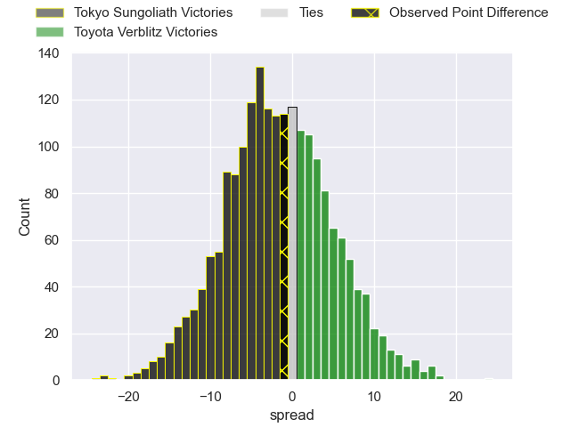
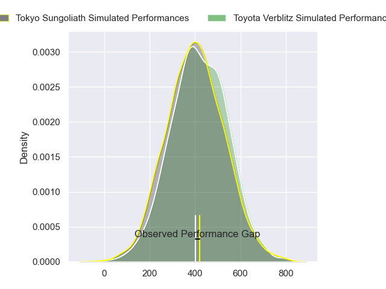
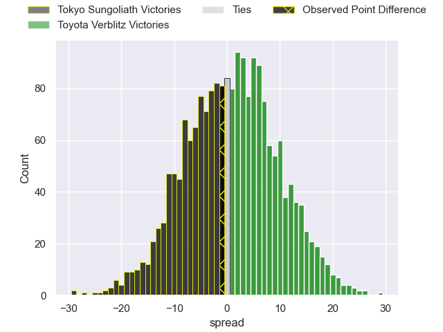

---  
layout: page  
title: Tokyo Sungoliath at Toyota Verblitz; 39-38  
date: 2024-03-16 18:00:00 -0500  
categories: "Japan Rugby League One 2023" match review  
---
# Tokyo Sungoliath at Toyota Verblitz; 39-38

# Club Level Predictions

The first set of predictions treats a club as the smallest object, as the club develops its members, organizes a gameplan, and deploys its players as needed for each match. This club model has a prediction of 0.456, which translates to predicting Tokyo Sungoliath to win by 1.6.

Our Over/Under is 55.5 - and combined with the spread above, we have a predicted scoreline of 28 to 27

Each club has a rating and a rating deviation (similar to a Glicko rating), and expected performances can be generated. This allows for simulated matches and spreads like the ones below.
## Projected Performances - Club Model

## Projected Spreads - Club Model

## Projected Results - Club Model

# Player Level Predictions - Version 2

Treating teams instead as an entity made up of the currently active players, I have ratings for each player in an altogether different system. These can be combined to form team ratings once teamsheets are announced, weighting starters a bit higher than the reserves. After the match is played, players can be weighted by their minutes on the field, allowing for an accurate measure of the team's composition. With these compiled team ratings, we can make predictions, measure inaccuracy, and update the individual player ratings.
## Prediction without Player Minutes: Toyota Verblitz by 2.8

Tokyo Sungoliath by 0.5 on a neutral pitch

## Projected Performances - Player Model

## Projected Spreads - Player Model

## Projected Results - Player Model

|   Away Minutes | Away Player         |   Away Percentile |   Number |   Home Percentile | Home Player         |   Home Minutes |
|---------------:|:--------------------|------------------:|---------:|------------------:|:--------------------|---------------:|
|             40 | Kenta Kobayashi     |             63.52 |        1 |             90.74 | Shogo Miura         |             58 |
|             68 | Kosuke Horikoshi    |             69.51 |        2 |             94.37 | Yoshikatsu Hikosaka |             64 |
|             47 | Shinnosuke Kakinaga |             83.93 |        3 |             85.92 | Genki Sudo          |             58 |
|             71 | Sam Jeffries        |             95.63 |        4 |             34.83 | Josh Dickson        |             80 |
|             80 | Harry Hockings      |             98.67 |        5 |             67.96 | Daichi Akiyama      |             58 |
|             80 | Kanji Shimokawa     |             72.74 |        6 |             86.94 | Isaiah Mapusua      |             80 |
|             40 | Kai Yamamoto        |             54.18 |        7 |             11.68 | Will Tupou          |             68 |
|             47 | Hendrik Tui         |             62.72 |        8 |             61.98 | Kazuki Himeno       |             80 |
|             52 | Yutaka Nagare       |             84.62 |        9 |             96.67 | Aaron Smith         |             80 |
|             80 | Mikiya Takamoto     |             65.99 |       10 |             99.49 | Beauden Barrett     |             80 |
|             80 | Taiga Ozaki         |             73.64 |       11 |             47.73 | Vatiliai Tuidraki   |             80 |
|             61 | Ryoto Nakamura      |             96.11 |       12 |             85.42 | Charlie Lawrence    |             80 |
|             80 | Isaiah Punivai      |             39.85 |       13 |              0.61 | Siosaia Fifita      |             80 |
|             80 | Seiya Ozaki         |             91.92 |       14 |             50.39 | Yuichiro Wada       |             60 |
|             80 | Kotaro Matsushima   |             93.86 |       15 |             76.9  | Taichi Takahashi    |             80 |
|             45 | Yukio Morikawa      |             91.12 |       16 |             45.27 | Yusuke Kizu         |             27 |
|             45 | Sota Oketani        |             62.31 |       17 |            nan    | Gaku Shimizu        |             27 |
|             38 | Kan Nakano          |             54.82 |       18 |             82.77 | Ryoma Nishimura     |             27 |
|             38 | Sione Lavemai       |             72.21 |       19 |            nan    | Shuhei Yamaguchi    |             25 |
|             33 | Naoto Saito         |             26.2  |       20 |            nan    | Ryusei Kato         |             21 |
|             24 | Joe Kamana          |              5.59 |       21 |             61.17 | Ryusei Koike        |             17 |
|             17 | Kienori Go          |            nan    |       22 |            nan    | nan                 |            nan |
|             14 | Ryuga Hashimoto     |             49.26 |       23 |            nan    | nan                 |            nan |

