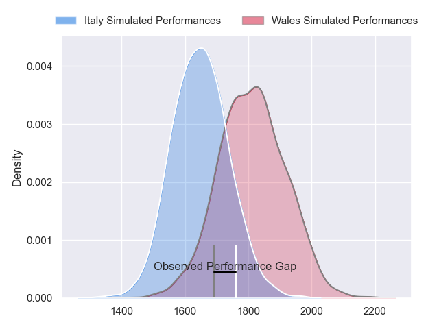
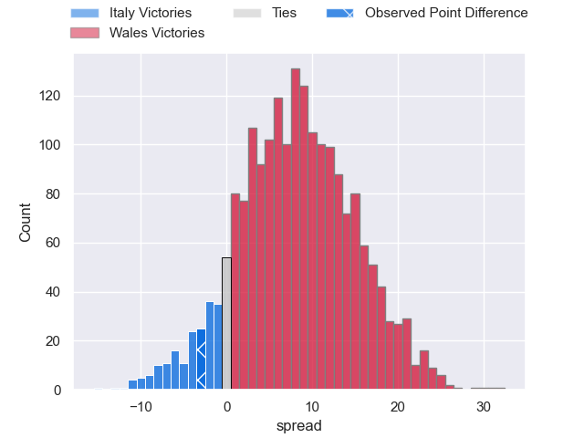
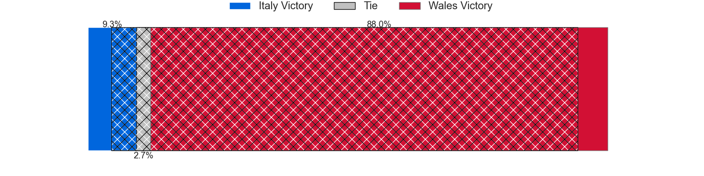
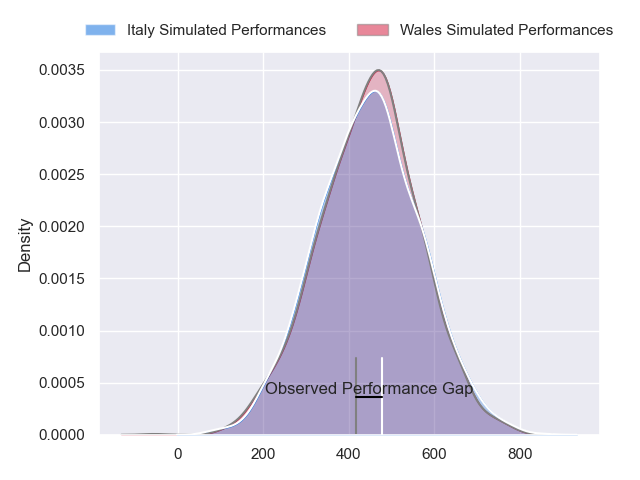
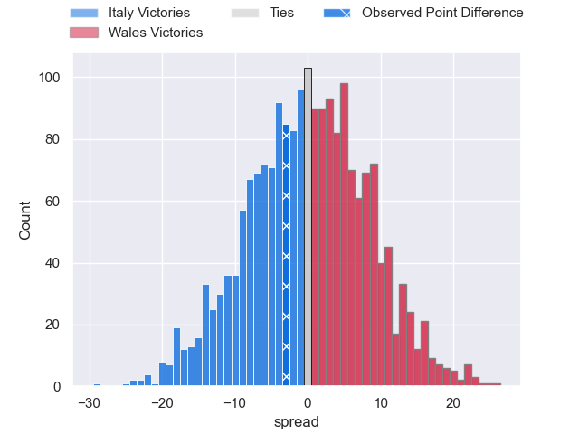

---  
layout: page  
title: Italy at Wales; 24-21  
date: 2024-03-16 18:00:00 -0500  
categories: "Six Nations Championship 2024" match review  
---
# Italy at Wales; 24-21

# Club Level Predictions

The first set of predictions treats a club as the smallest object, as the club develops its members, organizes a gameplan, and deploys its players as needed for each match. This club model has a prediction of 0.713, which translates to predicting Wales to win by 8.2.

Our Over/Under is 41.5 - and combined with the spread above, we have a predicted scoreline of 17 to 25

Each club has a rating and a rating deviation (similar to a Glicko rating), and expected performances can be generated. This allows for simulated matches and spreads like the ones below.
## Projected Performances - Club Model

## Projected Spreads - Club Model

## Projected Results - Club Model

# Player Level Predictions - Version 2

Treating teams instead as an entity made up of the currently active players, I have ratings for each player in an altogether different system. These can be combined to form team ratings once teamsheets are announced, weighting starters a bit higher than the reserves. After the match is played, players can be weighted by their minutes on the field, allowing for an accurate measure of the team's composition. With these compiled team ratings, we can make predictions, measure inaccuracy, and update the individual player ratings.
## Prediction without Player Minutes: Wales by 1.3

Italy by 2.8 on a neutral pitch

## Projected Performances - Player Model

## Projected Spreads - Player Model

## Projected Results - Player Model

|   Away Minutes | Away Player        |   Away Percentile |   Number |   Home Percentile | Home Player      |   Home Minutes |
|---------------:|:-------------------|------------------:|---------:|------------------:|:-----------------|---------------:|
|             58 | Danilo Fischetti   |             73.63 |        1 |             52.55 | Gareth Thomas    |             74 |
|             47 | Giacomo Nicotera   |             98.64 |        2 |             87.38 | Elliot Dee       |             74 |
|             51 | Simone Ferrari     |             96.12 |        3 |             95.46 | Dillon Lewis     |             74 |
|             76 | Niccolo Cannone    |             64.32 |        4 |             91.26 | Dafydd Jenkins   |             82 |
|             82 | Federico Ruzza     |             96.84 |        5 |             92.72 | Adam Beard       |             52 |
|             61 | Sebastian Negri    |             87.51 |        6 |              9.74 | Alex Mann        |             58 |
|             82 | Michele Lamaro     |             96.33 |        7 |             87.29 | Tommy Reffell    |             82 |
|             51 | Lorenzo Cannone    |             90.86 |        8 |             81.23 | Aaron Wainwright |             82 |
|             51 | Stephen Varney     |             42.41 |        9 |             81.08 | Tomos Williams   |             63 |
|             82 | Paolo Garbisi      |             82.23 |       10 |             37.06 | Sam Costelow     |             74 |
|             76 | Monty Ioane        |             99    |       11 |             20.16 | Rio Dyer         |             82 |
|             82 | Tommaso Menoncello |             87.61 |       12 |             98.54 | Nick Tompkins    |             49 |
|             82 | Juan Ignacio Brex  |             94.05 |       13 |             99.51 | George North     |             80 |
|             82 | Louis Lynagh       |             79.96 |       14 |             60.13 | Josh Adams       |             82 |
|             82 | Lorenzo Pani       |             40.54 |       15 |             43.98 | Cameron Winnett  |             82 |
|             35 | Gianmarco Lucchesi |             79.22 |       16 |            nan    | Evan Lloyd       |              8 |
|             24 | Mirco Spagnolo     |            nan    |       17 |             62.67 | Kemsley Mathias  |              8 |
|             31 | Giosue Zilocchi    |             60.87 |       18 |              9.45 | Harri O'Connor   |              8 |
|              6 | Riccardo Favretto  |             28.98 |       19 |             25.24 | Will Rowlands    |             30 |
|             31 | Ross Vintcent      |             68.15 |       20 |             29.63 | Mackenzie Martin |             24 |
|             21 | Manuel Zuliani     |             67.7  |       21 |             70.06 | Kieran Hardy     |             19 |
|             31 | Martin Page-Relo   |             77.75 |       22 |              9.34 | Ioan Lloyd       |              8 |
|              6 | Leonardo Marin     |             62.94 |       23 |             77.52 | Mason Grady      |             33 |

